# 再也不用求前端了！这个开源免费的 Skill 让你一秒拥有顶级 UI 设计能力

作者: 芋道源码

公众号: 芋道源码

>

👉 **这是一个或许对你有用的社群**

🐱 一对一交流/面试小册/简历优化/求职解惑，欢迎加入「**[芋道快速开发平台](http://mp.weixin.qq.com/s?__biz=MzUzMTA2NTU2Ng==&mid=2247576728&idx=1&sn=1298645b025eb51d9078e8c3de7b3c17&chksm=fa4bd329cd3c5a3fd63e455cf39507d3611a7b040be1381fd5ecfc0a7ce3867575fda4b7313d&scene=21#wechat_redirect)**」知识星球。下面是星球提供的部分资料：

- [《项目实战（视频）》](http://mp.weixin.qq.com/s?__biz=MzUzMTA2NTU2Ng==&mid=2247576728&idx=1&sn=1298645b025eb51d9078e8c3de7b3c17&chksm=fa4bd329cd3c5a3fd63e455cf39507d3611a7b040be1381fd5ecfc0a7ce3867575fda4b7313d&scene=21#wechat_redirect)：从书中学，往事上**“练”**
- [《互联网高频面试题》](http://mp.weixin.qq.com/s?__biz=MzUzMTA2NTU2Ng==&mid=2247576728&idx=1&sn=1298645b025eb51d9078e8c3de7b3c17&chksm=fa4bd329cd3c5a3fd63e455cf39507d3611a7b040be1381fd5ecfc0a7ce3867575fda4b7313d&scene=21#wechat_redirect)：面朝简历学习，春暖花开
- [《架构 x 系统设计》](http://mp.weixin.qq.com/s?__biz=MzUzMTA2NTU2Ng==&mid=2247576728&idx=1&sn=1298645b025eb51d9078e8c3de7b3c17&chksm=fa4bd329cd3c5a3fd63e455cf39507d3611a7b040be1381fd5ecfc0a7ce3867575fda4b7313d&scene=21#wechat_redirect)：摧枯拉朽，掌控面试高频场景题
- [《精进 Java 学习指南》](http://mp.weixin.qq.com/s?__biz=MzUzMTA2NTU2Ng==&mid=2247576728&idx=1&sn=1298645b025eb51d9078e8c3de7b3c17&chksm=fa4bd329cd3c5a3fd63e455cf39507d3611a7b040be1381fd5ecfc0a7ce3867575fda4b7313d&scene=21#wechat_redirect)：系统学习，互联网主流技术栈
- [《必读 Java 源码专栏》](http://mp.weixin.qq.com/s?__biz=MzUzMTA2NTU2Ng==&mid=2247576728&idx=1&sn=1298645b025eb51d9078e8c3de7b3c17&chksm=fa4bd329cd3c5a3fd63e455cf39507d3611a7b040be1381fd5ecfc0a7ce3867575fda4b7313d&scene=21#wechat_redirect)：知其然，知其所以然

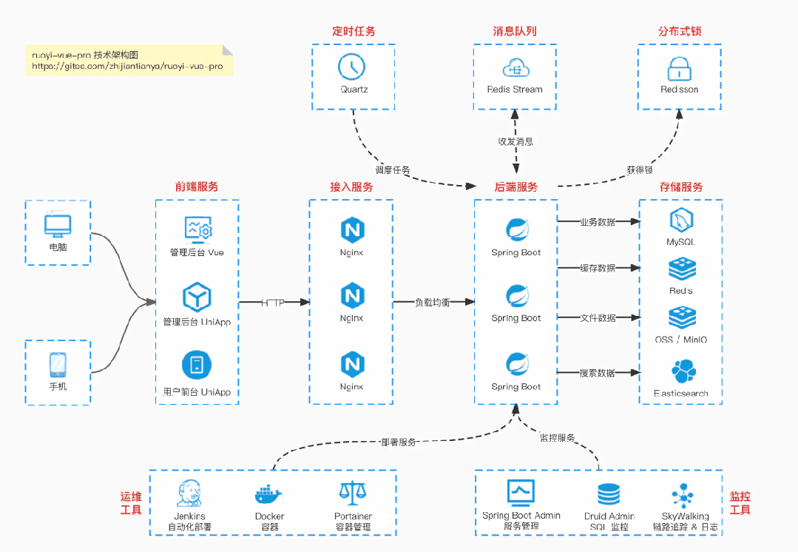

>

👉**这是一个或许对你有用的开源项目**

国产Star破10w的开源项目，前端包括管理后台、微信小程序，后端支持单体、微服务架构

RBAC权限、数据权限、SaaS多租户、**商城**、支付、工作流、大屏报表、**ERP、CRM**、**AI大模型、IoT物联网**等功能：

- 多模块：https://gitee.com/zhijiantianya/ruoyi-vue-pro
- 微服务：https://gitee.com/zhijiantianya/yudao-cloud
- 视频教程：https://doc.iocoder.cn

【国内首批】支持 JDK17/21+SpringBoot3、JDK8/11+Spring Boot2双版本

- [AI 写的页面，都长一个味儿](https://mp.weixin.qq.com/s?__biz=MzUzMTA2NTU2Ng==&mid=2247487551&idx=1&sn=18f64ba49f3f0f9d8be9d1fdef8857d9&chksm=fa496f8ecd3ee698f4954c00efb80fe955ec9198fff3ef4011e331aa37f55a6a17bc8c0335a8&scene=21&token=899450012&lang=zh_CN#wechat_redirect)
- [ui-ux-pro-max 真正在做的事：给 AI 装一脚刹车](https://mp.weixin.qq.com/s?__biz=MzUzMTA2NTU2Ng==&mid=2247487551&idx=1&sn=18f64ba49f3f0f9d8be9d1fdef8857d9&chksm=fa496f8ecd3ee698f4954c00efb80fe955ec9198fff3ef4011e331aa37f55a6a17bc8c0335a8&scene=21&token=899450012&lang=zh_CN#wechat_redirect)
- [直接看效果：四个行业能拉到多开](https://mp.weixin.qq.com/s?__biz=MzUzMTA2NTU2Ng==&mid=2247487551&idx=1&sn=18f64ba49f3f0f9d8be9d1fdef8857d9&chksm=fa496f8ecd3ee698f4954c00efb80fe955ec9198fff3ef4011e331aa37f55a6a17bc8c0335a8&scene=21&token=899450012&lang=zh_CN#wechat_redirect)
- [凭什么拉得开：161 条行业规则 + 反向 AVOID 清单](https://mp.weixin.qq.com/s?__biz=MzUzMTA2NTU2Ng==&mid=2247487551&idx=1&sn=18f64ba49f3f0f9d8be9d1fdef8857d9&chksm=fa496f8ecd3ee698f4954c00efb80fe955ec9198fff3ef4011e331aa37f55a6a17bc8c0335a8&scene=21&token=899450012&lang=zh_CN#wechat_redirect)
- [Design System Generator：一句话生成一套设计系统](https://mp.weixin.qq.com/s?__biz=MzUzMTA2NTU2Ng==&mid=2247487551&idx=1&sn=18f64ba49f3f0f9d8be9d1fdef8857d9&chksm=fa496f8ecd3ee698f4954c00efb80fe955ec9198fff3ef4011e331aa37f55a6a17bc8c0335a8&scene=21&token=899450012&lang=zh_CN#wechat_redirect)
- [安装：Claude Code、Cursor、Windsurf 都能接](https://mp.weixin.qq.com/s?__biz=MzUzMTA2NTU2Ng==&mid=2247487551&idx=1&sn=18f64ba49f3f0f9d8be9d1fdef8857d9&chksm=fa496f8ecd3ee698f4954c00efb80fe955ec9198fff3ef4011e331aa37f55a6a17bc8c0335a8&scene=21&token=899450012&lang=zh_CN#wechat_redirect)
- [风格持久化：别让设计每次重开都漂](https://mp.weixin.qq.com/s?__biz=MzUzMTA2NTU2Ng==&mid=2247487551&idx=1&sn=18f64ba49f3f0f9d8be9d1fdef8857d9&chksm=fa496f8ecd3ee698f4954c00efb80fe955ec9198fff3ef4011e331aa37f55a6a17bc8c0335a8&scene=21&token=899450012&lang=zh_CN#wechat_redirect)
- [适合谁：缺设计资源的小团队最赚](https://mp.weixin.qq.com/s?__biz=MzUzMTA2NTU2Ng==&mid=2247487551&idx=1&sn=18f64ba49f3f0f9d8be9d1fdef8857d9&chksm=fa496f8ecd3ee698f4954c00efb80fe955ec9198fff3ef4011e331aa37f55a6a17bc8c0335a8&scene=21&token=899450012&lang=zh_CN#wechat_redirect)
- [最后说句实话](https://mp.weixin.qq.com/s?__biz=MzUzMTA2NTU2Ng==&mid=2247487551&idx=1&sn=18f64ba49f3f0f9d8be9d1fdef8857d9&chksm=fa496f8ecd3ee698f4954c00efb80fe955ec9198fff3ef4011e331aa37f55a6a17bc8c0335a8&scene=21&token=899450012&lang=zh_CN#wechat_redirect)

---

## [AI 写的页面，都长一个味儿](https://mp.weixin.qq.com/s?__biz=MzUzMTA2NTU2Ng==&mid=2247576728&idx=1&sn=1298645b025eb51d9078e8c3de7b3c17&scene=21#wechat_redirect)

紫粉渐变 Hero、毛玻璃卡片、Bento Grid 拼图、Inter 字体配大圆角——你看一百个 AI 生成的网站，会发现它们像一百张双胞胎。

这不是巧合。各家大模型在 Web 设计样本上**有大量重叠的训练源** ——SaaS Landing Page、Y Combinator 项目首页、Dribbble 热门作品都是公开抓取的高频对象。再叠上 RLHF 阶段类似的"现代审美"偏好微调，AI 学到的「美」基本就是这堆样本的平均值。

结果就是：

- 你让它做**金融产品** ，它给你紫渐变；
- 你让它做**医疗诊所** ，它还是紫渐变；
- 你让它做**赛博朋克游戏官网** ，它居然能给你拼出一个紫渐变 + 毛玻璃。

不是 AI 丑，是 AI 不懂**行业之间的审美差异** 。

>

基于 Spring Boot + MyBatis Plus + Vue & Element 实现的后台管理系统 + 用户小程序，支持 RBAC 动态权限、多租户、数据权限、工作流、三方登录、支付、短信、商城等功能

- 项目地址：https://github.com/YunaiV/ruoyi-vue-pro
- 视频教程：https://doc.iocoder.cn/video/

## [ui-ux-pro-max 真正在做的事：给 AI 装一脚刹车](https://mp.weixin.qq.com/s?__biz=MzUzMTA2NTU2Ng==&mid=2247576728&idx=1&sn=1298645b025eb51d9078e8c3de7b3c17&scene=21#wechat_redirect)

市面上帮 AI 写前端的工具不少：v0、bolt.new、Cursor Composer、Figma MCP。它们的共同点是都在教 AI **生成什么** ——生成更多组件、更多页面、更多 variant。

**ui-ux-pro-max-skill** 选了一条反着的路：不教生成什么，教**别生成什么** 。

它给 AI 装了一份 161 条的行业规则库。每个行业不仅有「推荐配色 / 字体 / 风格」，还有一份关键的 **AVOID 清单** ——金融禁紫粉渐变，医疗禁高对比警告色，儿童禁哥特黑，B 端 Dashboard 禁糖果圆角。AI 写代码前**先排除掉雷区** ，再选剩下的方案。

定位反转之后，差异就出来了：v0 是给你「一个还行的样板」，ui-ux-pro-max 是给 AI「一份这个行业不能这么做的清单」。前者解决「能不能跑」，后者解决「跑出来像不像这一行的产品」。

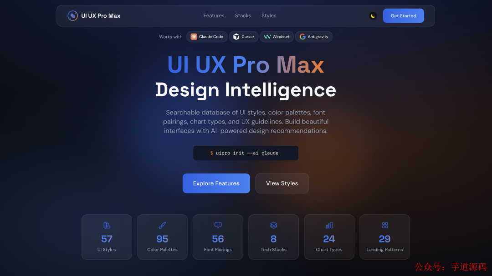

>

基于 Spring Cloud Alibaba + Gateway + Nacos + RocketMQ + Vue & Element 实现的后台管理系统 + 用户小程序，支持 RBAC 动态权限、多租户、数据权限、工作流、三方登录、支付、短信、商城等功能

- 项目地址：https://github.com/YunaiV/yudao-cloud
- 视频教程：https://doc.iocoder.cn/video/

## [直接看效果：四个行业能拉到多开](https://mp.weixin.qq.com/s?__biz=MzUzMTA2NTU2Ng==&mid=2247576728&idx=1&sn=1298645b025eb51d9078e8c3de7b3c17&scene=21#wechat_redirect)

评价一个「设计智能」类工具好不好用，只看一个问题：**不同行业做出来的视觉，能不能明显区分开？** 如果金融、游戏、医疗、音乐最后都是紫色渐变 + 毛玻璃，那就是文字游戏。

直接放四张 v2.0 跑出来的对比：

**金融仪表盘** ——深色底、冷色数据色，无渐变、无圆胖卡片。看起来像「正在工作的工具」，不像「在卖产品的网站」：


**游戏平台** ——反过来允许赛博朋克、霓虹、高饱和、玻璃质感叠图层，因为这是行业规则里**明确推荐** 的：

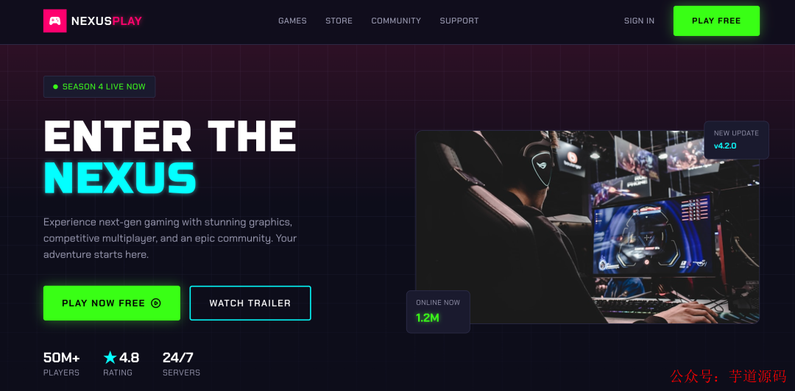

**音乐网站** ——编辑感排版、放大的视觉锚点、带留白的内容区。靠近 Spotify / Apple Music 的审美范式：

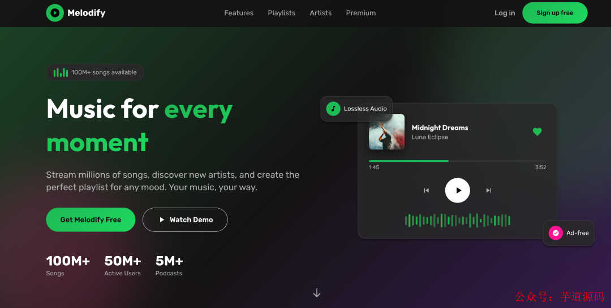

**诊所门户** ——柔和低对比、圆润元素、冷静的医疗蓝。规则在 prompt 阶段就把刺眼警告色压住了：

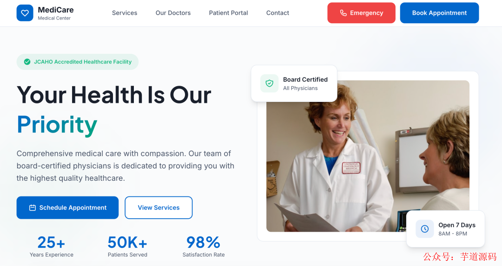

四张拉一起看，**不是同一个模板换色号** ——结构、风格、字体、配色逻辑全部不同。这才是「行业差异」做到位的样子。

## [凭什么拉得开：161 条行业规则 + 反向 AVOID 清单](https://mp.weixin.qq.com/s?__biz=MzUzMTA2NTU2Ng==&mid=2247576728&idx=1&sn=1298645b025eb51d9078e8c3de7b3c17&scene=21#wechat_redirect)

很多工具说自己有多少多少条规则，打开一看其实就是凑字数。这个项目的 161 条是真的在做行业拆解，覆盖范围挺全：

| 行业 | 覆盖示例 |
| 科技 / SaaS | 微 SaaS、开发者工具、AI 平台、网络安全 |
| 金融 | 加密货币、银行、保险、个人财务 |
| 医疗 | 诊所、牙科、心理健康、宠物医院 |
| 电商 | 普通、奢侈品、订阅盒子、外卖 |
| 服务业 | 美容、餐饮、酒店、法律、家政 |
| 创意 | 作品集、摄影、音乐、游戏 |
| 生活方式 | 习惯追踪、冥想、食谱、日记 |
| 新兴技术 | Web3、空间计算、量子计算 |

每条规则都包含：推荐的页面结构、首选 UI 风格、配色情绪、字体个性、关键交互、**反向 AVOID 清单** 。

### [AVOID 清单：被低估的那一半](https://mp.weixin.qq.com/s?__biz=MzUzMTA2NTU2Ng==&mid=2247576728&idx=1&sn=1298645b025eb51d9078e8c3de7b3c17&scene=21#wechat_redirect)

正向推荐——「金融用蓝、医疗用青、游戏用霓虹」——大部分设计模板都能告诉你。**真正稀缺的是反向清单** ：哪些组合放进这个行业是雷。挑几个典型：

- **金融产品 AVOID** ：紫粉渐变、卡通图标、过度圆角。原因：用户会觉得不靠谱，转化率掉。
- **医疗诊所 AVOID** ：高饱和警告红、突然弹窗、强动效。原因：医疗场景需要让用户放松，不是让 TA 紧张。
- **儿童 / 教育产品 AVOID** ：哥特黑、赛博朋克、深色模式。原因：家长决策，他们不会让孩子用看起来像 hacker 终端的产品。
- **B 端 Dashboard AVOID** ：糖果色、卡通圆角、双行大标题。原因：B 端用户来读数，不是来看 landing page。
- **奢侈品电商 AVOID** ：促销红、降价标签、紧迫倒计时。原因：奢侈品的转化路径是慢决策，不是冲动消费。

这就是为什么同一个「写一个产品落地页」的 prompt，加上 ui-ux-pro-max 之后会差出一个量级的视觉效果——**不是它生成得更好，是它把雷区全屏蔽掉了** 。

#### [67 种 UI 风格 + 配色字体](https://mp.weixin.qq.com/s?__biz=MzUzMTA2NTU2Ng==&mid=2247576728&idx=1&sn=1298645b025eb51d9078e8c3de7b3c17&scene=21#wechat_redirect)

风格库分三类：通用 49 种 + 落地页专属 8 种 + 数据看板专属 10 种。挑几个有代表性的：

- **Glassmorphism（磨砂玻璃）** ：现代 SaaS、金融看板。背景模糊 + 半透明卡片，层次感强。滥用会导致对比度不够，规则里有 WCAG AA 检查。
- **Claymorphism（黏土风）** ：教育类、儿童产品。圆角 + 柔和阴影 + 饱和色。
- **Neubrutalism** ：Gen Z 品牌、初创公司。厚边框 + 高对比 + 平面阴影，Figma 官网走的就是类似路子。
- **Bento Box Grid** ：产品功能展示、个人主页。大小不一的卡片拼接，Apple 在用。
- **AI-Native UI** ：AI 产品、聊天机器人。强调信息流动感和状态反馈。

每种风格都标了「最适合什么场景」，AI 不是在风格里抽奖，是按行业匹配。配色 161 套、字体组合 57 套（全 Google Fonts，附导入链接），都按同样的逻辑接入。

## [Design System Generator：一句话生成一套设计系统](https://mp.weixin.qq.com/s?__biz=MzUzMTA2NTU2Ng==&mid=2247576728&idx=1&sn=1298645b025eb51d9078e8c3de7b3c17&scene=21#wechat_redirect)

v2.0 最值得讲的部分叫 **Design System Generator** 。整个流程拆开就是一次「行业匹配 + 反向排除 + 设计系统输出」的并行执行。

举个开发者熟悉的场景：你跟 AI 说「给我们的数据分析 SaaS 做一个控制台」，Skill 在后台并行跑 5 个搜索：

1. 在 161 个行业分类里匹配「SaaS / 数据分析」；
2. 推荐 UI 风格（Glassmorphism）；
3. 选配色（冷色主色 + 中性灰底 + 高对比数据色）；
4. 匹配字体（Inter + JetBrains Mono）；
5. 生成结构（侧边栏 → 顶部 → KPI 卡片 → 图表 → 数据表）。

5 个结果走推理引擎，BM25 排序，输出一份完整设计系统描述。整个过程在 AI 回复你之前跑完，你基本感觉不到延迟。

输出格式是这样：

```text
+----------------------------------------------------------------------------------------+
|  TARGET: Acme Analytics - RECOMMENDED DESIGN SYSTEM                                    |
+----------------------------------------------------------------------------------------+
|  PATTERN: Sidebar Nav + Data Grid                                                      |
|     Sections: Sidebar → Top Bar → KPI Cards → Charts → Data Table                      |
|                                                                                        |
|  STYLE: Glassmorphism (Dashboard-tuned)                                                |
|     Keywords: Subtle blur, layered depth, data-forward, modern SaaS feel              |
|                                                                                        |
|  COLORS:                                                                               |
|     Primary:    #4F46E5 (Indigo)                                                       |
|     Secondary:  #06B6D4 (Cyan)                                                         |
|     Success:    #10B981 (Emerald)                                                      |
|     Warning:    [#F59E0B] (Amber)                                                        |
|     Danger:     [#EF4444] (Rose)                                                         |
|                                                                                        |
|  TYPOGRAPHY: Inter (UI) / JetBrains Mono (numbers & code)                              |
|                                                                                        |
|  AVOID: Childish rounded cards, cartoon icons, saturated pastels, AI purple gradients  |
+----------------------------------------------------------------------------------------+

```text

注意最后一行 **AVOID** ——这是这份输出最值钱的部分。AI 拿到之后，写代码会先看 AVOID 再选方案。换成医疗场景，AVOID 会变成「高饱和警告色 / 突然弹窗」；换成儿童产品，会变成「哥特黑 / 赛博朋克」。

## [安装：Claude Code、Cursor、Windsurf 都能接](https://mp.weixin.qq.com/s?__biz=MzUzMTA2NTU2Ng==&mid=2247576728&idx=1&sn=1298645b025eb51d9078e8c3de7b3c17&scene=21#wechat_redirect)

**方法一：Claude Marketplace（Claude Code 专属）**

```text
/plugin marketplace add nextlevelbuilder/ui-ux-pro-max-skill
/plugin install ui-ux-pro-max@ui-ux-pro-max-skill

```text

**方法二：CLI（推荐，全平台通用）**

```text
npm install -g uipro-cli

```text

然后在项目目录初始化：

```text
uipro init --ai claude      # Claude Code
uipro init --ai cursor      # Cursor
uipro init --ai windsurf    # Windsurf
uipro init --ai copilot     # GitHub Copilot
uipro init --ai gemini      # Gemini CLI
uipro init --ai all         # 全部平台

```text

全局安装也行，装一次所有项目复用：

```text
uipro init --ai claude --global

```text

目前支持 17 个平台，依赖只要 Python 3.x。

## [风格持久化：别让设计每次重开都漂](https://mp.weixin.qq.com/s?__biz=MzUzMTA2NTU2Ng==&mid=2247576728&idx=1&sn=1298645b025eb51d9078e8c3de7b3c17&scene=21#wechat_redirect)

很多人忽略一个细节：**AI 默认没记忆** 。每次开新对话，上次生成的设计系统就丢了——风格一漂，整个项目视觉就开始糊。三个开发者一起跑 AI，三天后页面像三个项目。

这个 Skill 提供了「Master + 覆盖」的持久化方案：

```text
# 生成并保存全局设计系统
python3 .claude/skills/ui-ux-pro-max/scripts/search.py "SaaS dashboard" --design-system --persist -p "MyApp"

# 给特定页面生成差异覆盖
python3 .claude/skills/ui-ux-pro-max/scripts/search.py "checkout page" --design-system --persist -p "MyApp" --page "checkout"

```text

执行完之后项目目录多出这样的结构：

```text
design-system/
├── MASTER.md           # 全局设计系统（颜色、字体、组件规范）
└── pages/
    └── checkout.md     # 结账页面的覆盖规则

```text

新开对话时告诉 AI 先读 `design-system/MASTER.md`，当前页面有覆盖就优先用覆盖文件。这样**不管开多少次新对话，视觉风格都能稳住** 。这一点对长期项目特别重要——它把"AI 写的"变成了"按你设计系统写的"。

## [适合谁：缺设计资源的小团队最赚](https://mp.weixin.qq.com/s?__biz=MzUzMTA2NTU2Ng==&mid=2247576728&idx=1&sn=1298645b025eb51d9078e8c3de7b3c17&scene=21#wechat_redirect)

**最适合的三类人** ：

- **独立开发者 / 小团队** ：没专职设计师但又不想产品看起来太素。
- **AI 快速出原型的人** ：需要一个能直接用的视觉规范。
- **写代码可以但对颜色排版没感觉的人** ：收益感最明显。

**已经有设计规范的团队也能用** ——别把这工具当替代品，当成「**带行业 AVOID 清单的规范分发器** 」就对了。

具体做法是把自己的 Design Token 和组件规范写进 `design-system/MASTER.md`（替换默认的预设），让 AI 每次对话先读 MASTER。这一来你的品牌色、字体、间距、组件不会被 AI 改飞，二来 ui-ux-pro-max 的 161 条**行业 AVOID 规则** 仍然在底下生效——AI 不会因为你公司的设计 token 没明确禁紫渐变，就给你做出一个紫渐变的金融页面出来。

**不太适合的场景** ：

- 需要深度品牌定制（奢侈品、艺术、强 IP 类）——预设模板不够用，得设计师手搓。
- UI 细节要求极高的项目——AI 出的结果还是要设计师过一遍。
- 完全照搬竞品视觉——这种场景不需要决策辅助，直接抄。

## [最后说句实话](https://mp.weixin.qq.com/s?__biz=MzUzMTA2NTU2Ng==&mid=2247576728&idx=1&sn=1298645b025eb51d9078e8c3de7b3c17&scene=21#wechat_redirect)

ui-ux-pro-max-skill 的真正价值，不是它教 AI 写出更花哨的页面，而是它**让 AI 在不同行业里写得不一样** 。

这个差异看起来微妙，长期效益却很大。独立开发者最痛的不是"做不出来"，是"做出来一看就是独立开发者做的"——同质化、模板感、AI 味儿。这工具卡的就是这一刀。

它替代不了真正的设计师。但对很多开发者来说，它能把页面从「能跑但寒酸」拉到「至少看起来像这一行的产品」。

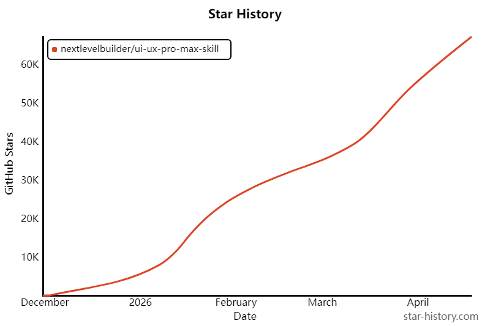

MIT 协议，免费用。GitHub 地址：https://github.com/nextlevelbuilder/ui-ux-pro-max-skill

---

欢迎加入我的知识星球，全面提升技术能力。

👉 加入方式，**“**长按**”或“**扫描**”下方二维码噢**：

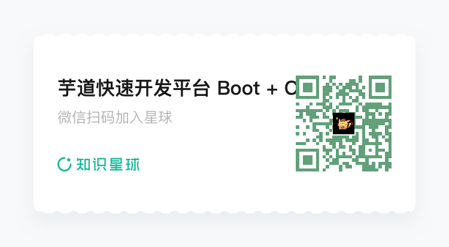

星球的**内容包括**：项目实战、面试招聘、源码解析、学习路线。

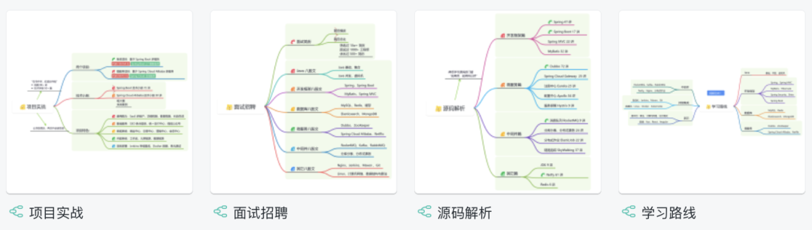

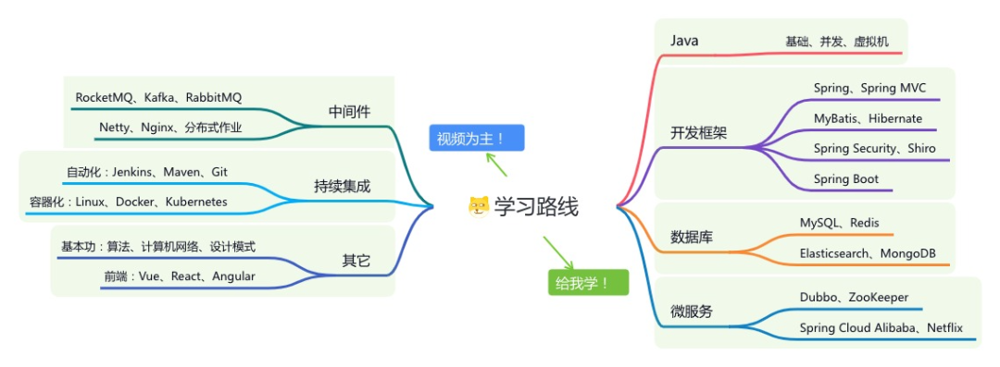

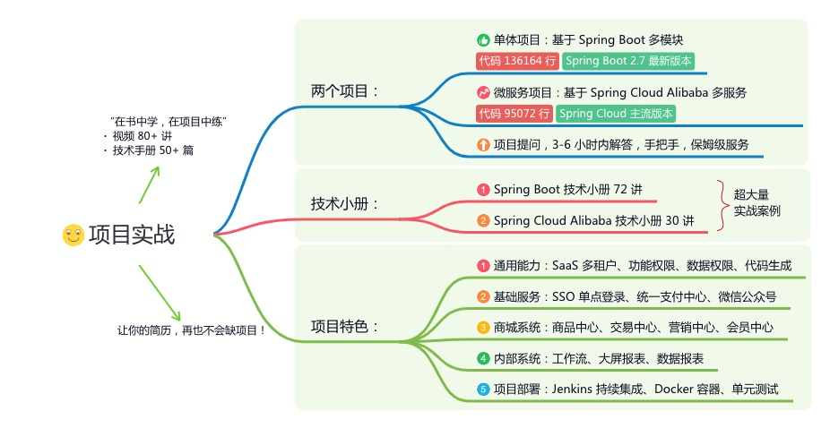

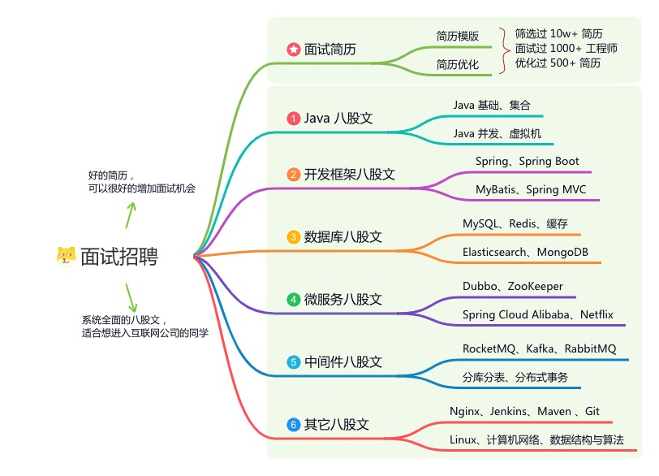

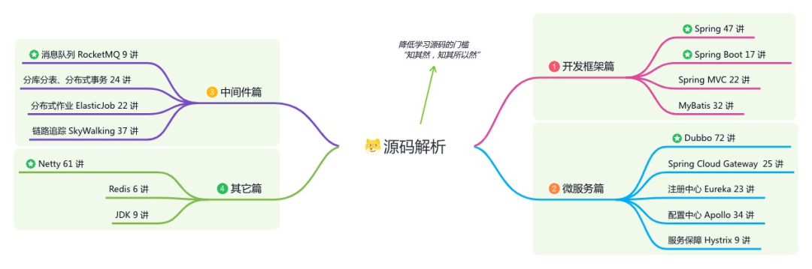

```text

**文章有帮助的话，在看，转发吧。**

**谢谢支持哟 (*^__^*）**

```text

预览时标签不可点阅读原文

原文链接: [https://mp.weixin.qq.com/s/4Lb1Q3IyR1O7QRXPJJROhA](https://mp.weixin.qq.com/s/4Lb1Q3IyR1O7QRXPJJROhA)
