# Claude code云端部署 & 魔改sdk实现http流式调用保姆级教程

作者: 阿里云开发者

公众号: 阿里云开发者


阿里妹导读

文章内容基于作者个人技术实践与独立思考，旨在分享经验，仅代表个人观点。

一、背景

在 OpenClaw、Claude Code 等产品出现之前，开发同学实现一个 Agent 的基本思路是：基于 LLM 实现一个 Loop 调用，配合 MCP 或代码层面自定义的工具来完成 ReactAgent；或者利用 Spring AI、LangGraph 等框架，配置工具、设计提示词，就可以实现一个能完成基本检索类任务的助理。我们之前也是这么做的，甚至将 Loop 处理逻辑和上下文处理做成了通用性调用——对这个 Loop 赋予不同的提示词和工具，就能产出不同的垂域助理。

但随着 Harness Engineering 概念的提出，对一个稳定好用的 Agent 的设计要求明显变高了。如果是自行开发的 ReactAgent 架构，还需要补充更多的约束层工具、任务完成的 Evaluation 机制、上下文切换到干净的子 Agent 等设计。而利用 Spring AI、LangGraph 等框架则更难去适配最新的 Agent 设计理念。

因此，当下最快实现一个 Harness Engineering 工程的路径是：部署现有的产品 → 提供调用能力 → 在应用层和端上做封装及扩展。

本文将围绕以 Claude Code 作为通用助理底层能力的实践过程，就以下几个核心问题展开：

1.如何将一个本地化的闭源产品部署到云端——且由于网络限制，有些服务器或沙箱中并不支持 brew install 等在线安装方式。

2.云端部署后以什么方式对外提供服务——CLI 方式显然不可取：一是非流式的，用户等待时间较长；二是 Claude Code 的 CLI 命令产出的是终端图形化界面，并非可供程序消费的结构化结果。

3.多用户场景下的隔离问题——Claude Code 是一个单实例、记忆与配置长期文件化的系统，云上部署后不同用户的提问、记忆、配置可能相互串扰，如何解决？

实现效果

1.云端部署且隔离好（沙箱）claude code

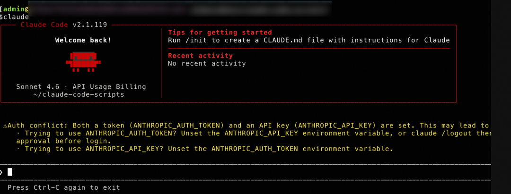

2.提供出http接口可远程调用云上的claude code实例

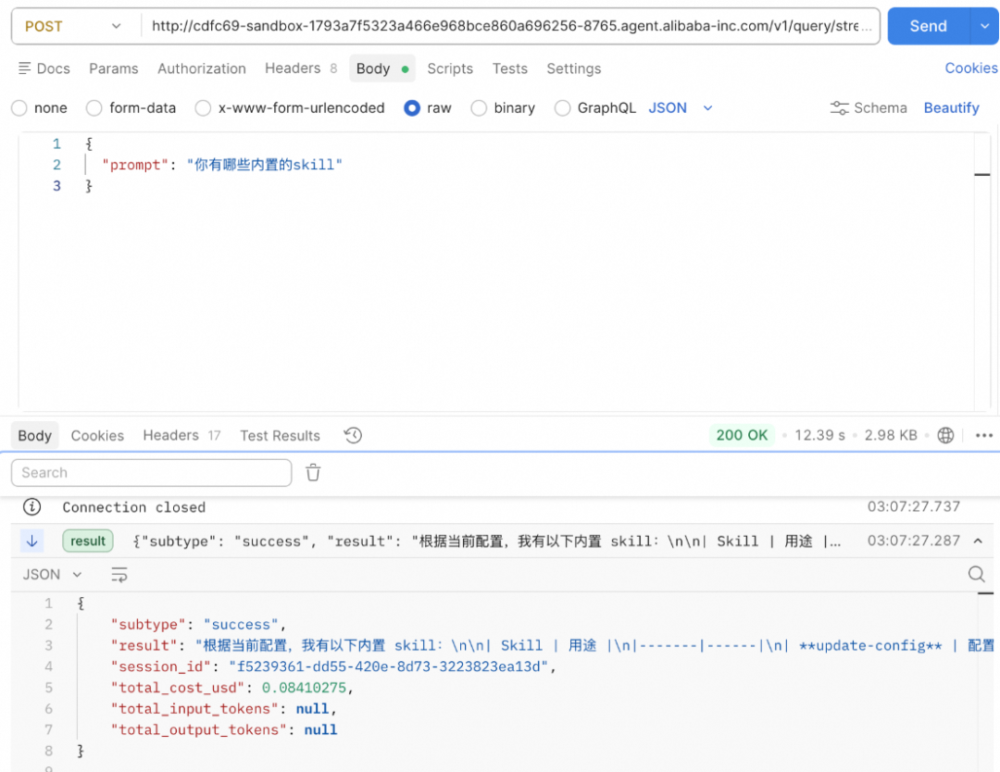

3.同时可查看魔改后的claude code提供出的所有远程http接口：quer、session、hook、多agent等等配置也都支持

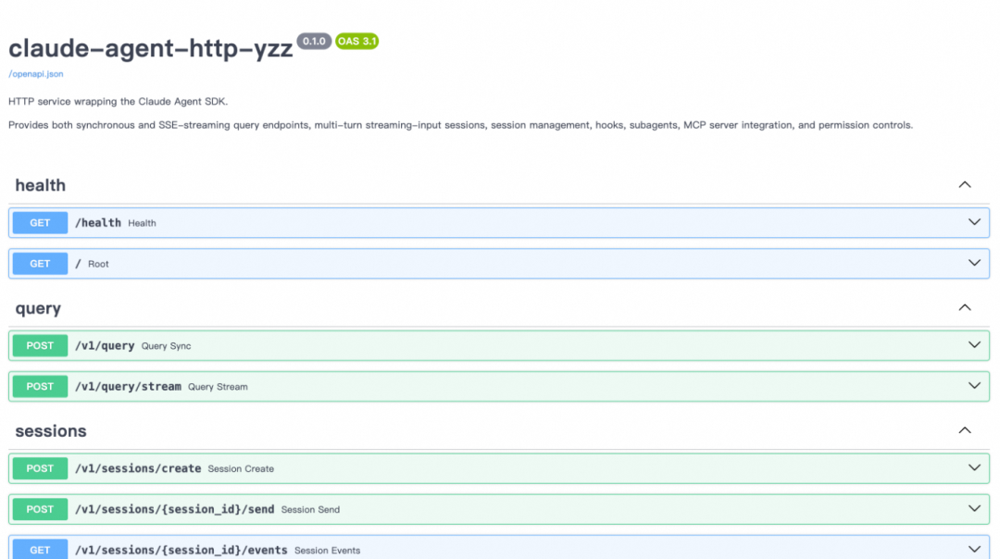

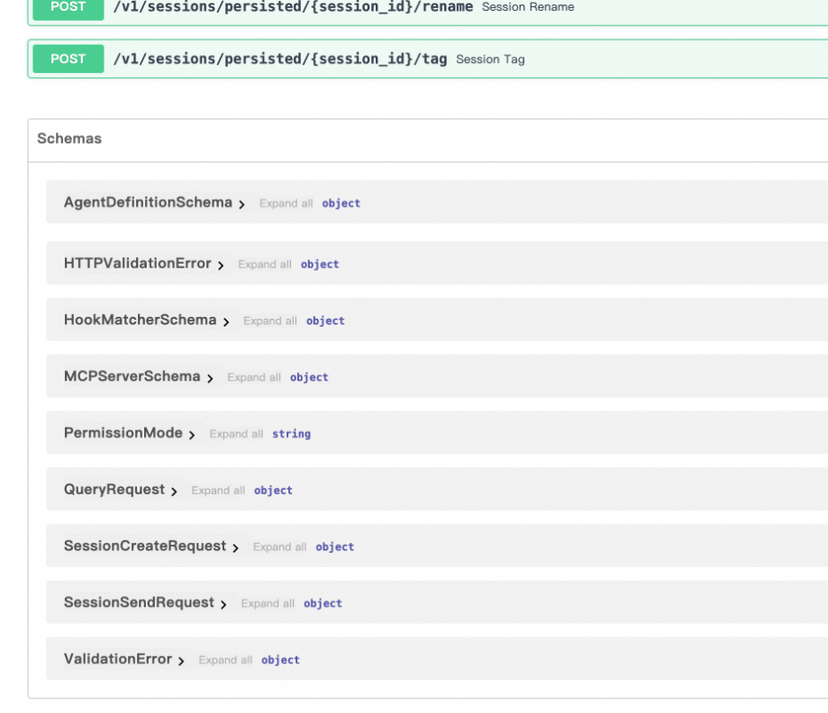

二、整体方案思路

针对上述三个问题，我们设计的整体方案如下图所示：

-
-
-
-
-
-
-
-
-
-
-
-
-
-
-
-
-
-
-
-
-
-
-
-
-
-

```text
┌───────────────────────────────────────────────────────────────────┐│ Application Layer ││ (Web UI / Bot / API Gateway / ...) │└──────────────────────────┬────────────────────────────────────────┘│ HTTP + SSE▼┌───────────────────────────────────────────────────────────────────┐│ Sandbox Control Plane ││ (路由分发 / 沙箱生命周期管理 / 用户实例映射) │└──────┬───────────────┬───────────────┬────────────────────────────┘│ │ │▼ ▼ ▼┌─────────────┐ ┌─────────────┐ ┌─────────────┐│ Sandbox A │ │ Sandbox B │ │ Sandbox C │ ← 每个用户独占一个沙箱实例/文件版本│ ┌─────────┐ │ │ ┌─────────┐ │ │ ┌─────────┐ ││ │ Claude │ │ │ │ Claude │ │ │ │ Claude │ ││ │ Code CLI│ │ │ │ Code CLI│ │ │ │ Code CLI│ ││ └────┬────┘ │ │ └────┬────┘ │ │ └────┬────┘ ││ │ │ │ │ │ │ │ ││ ┌────▼────┐ │ │ ┌────▼────┐ │ │ ┌────▼────┐ ││ │ HTTP │ │ │ │ HTTP │ │ │ │ HTTP │ ││ │ Service │ │ │ │ Service │ │ │ │ Service │ ││ │ :8765 │ │ │ │ :8765 │ │ │ │ :8765 │ ││ └─────────┘ │ │ └─────────┘ │ │ └─────────┘ ││ ~/.claude/ │ │ ~/.claude/ │ │ ~/.claude/ │ ← 独立记忆 & 配置└─────────────┘ └─────────────┘ └─────────────┘

```text

整条链路分为四层：

第一层：云端离线部署。 通过 npm pack 将 Claude Code 打包为 tgz 离线包，在无外网的服务器上通过 npm install -g 完成安装，解决闭源产品无法在线安装的问题。

第二层：HTTP 流式服务化。 我们基于 Claude Code 官方的 Python SDK（claude-agent-sdk）+ FastAPI + SSE，将 SDK 的 query() 和 ClaudeSDKClient 两种调用模式封装为 RESTful HTTP 接口，实现实时流式输出，替代不可用的 CLI 方式。

第三层：基础镜像构建。 将 Node.js 运行时、Claude Code CLI、Python 环境、HTTP 服务代码打包为一个 Docker 基础镜像，做到一次构建、处处部署。

第四层：沙箱多实例隔离。 通过沙箱平台的容器调度能力，为每个用户分配独立的沙箱实例。每个沙箱内部运行一套独立的 Claude Code + HTTP Service，天然实现记忆、配置、文件系统的完全隔离。且由于每个用户的配置其实都是各类文件，可以将用户的所有文件进行版本化存储，新启实例时，加载这个用户的所有文件，销毁实例时，保存这个用户此时的文件版本

三、claude code云端部署（离线方案）

Claude Code CLI 是一个基于 Node.js 的命令行工具，通过 npm 发布。在无外网的云端服务器上安装，核心要解决两个问题：Node.js 运行环境 和 Claude Code 包本身。

**3.1 环境要求**

首先确认目标服务器的环境：

-
-
-

```text
node -v # 需要 Node.js 18+npm -vuname -m # 确认 CPU 架构: x86_64 or aarch64

```text

如果服务器没有 Node.js，需要从 Node.js 官方发布页 下载对应架构的二进制包（推荐 LTS 版本），在本地下载后上传到服务器手动解压配置。

**3.2 获取 Claude Code 离线包**

推荐使用 npm pack 方式。在本地有外网的机器上执行：

-

```text
npm pack @anthropic-ai/claude-code

```text

会生成一个形如 anthropic-ai-claude-code-2.1.119.tgz 的文件，这就是要上传到服务器的核心包。

也可以使用整目录打包方式来避免潜在的依赖缺失问题：

-
-
-
-
-

```text
# 本地全局安装npm install -g @anthropic-ai/claude-code# 找到全局安装路径并打包cd $(npm root -g)tar -czvf claude-code-full.tar.gz @anthropic-ai/claude-code

```text

**3.3 离线安装步骤**

将 tgz 包上传到服务器后：

-
-
-
-
-
-
-

```text
# 如果需要手动安装 Node.jstar -xf node-v20.x.x-linux-x64.tar.xzexport PATH=$PWD/node-v20.x.x-linux-x64/bin:$PATH# 离线安装 Claude Codesudo npm install -g ./anthropic-ai-claude-code-2.1.119.tgz# 验证安装claude --version

```text

**3.4 注意事项**

有几点需要特别注意。首先是 CPU 架构匹配，本地下载的 Node.js 二进制包必须与服务器架构一致（x64 / arm64），可以通过 uname -m 确认。其次，npm pack 只会打包主包本身不含依赖，如果安装时报缺依赖，需要改用整目录打包方案。最后，Claude Code 运行时仍然需要网络访问 Anthropic API，如果服务器完全无外网，需要配置内网 API 代理（例如通过设置 ANTHROPIC_BASE_URL 指向内部代理地址）。

四、基于FastApi重写claude-agent-sdk

这是整个方案中最核心的一层。Claude Code 支持两种调用模式：query() 单次查询和 ClaudeSDKClient 多轮会话。我们基于 FastAPI + SSE（Server-Sent Events）将这两种模式封装为 HTTP 接口，实现了从 CLI 到 HTTP 的完整转换。且该http服务还支持在query中传入harness工程所需的各类工具、插件、skills、hook等

实现的该http调用claude code的代码仓库[1]

**4.1 技术选型**

整个 HTTP 服务基于以下技术栈构建：

●FastAPI：异步 Web 框架，天然支持 async/await，与 SDK 的异步迭代器完美配合。

●sse-starlette：SSE 协议实现库，将异步生成器直接转换为标准 SSE 事件流。

●claude-agent-sdk：Claude Code 官方 Python SDK，提供 query() 和 ClaudeSDKClient 两种调用方式。

●Pydantic：请求/响应模型定义与校验。

依赖配置（requirements.txt）：

-
-
-
-
-
-

```text
fastapi>=0.110.0uvicorn[standard]>=0.29.0sse-starlette>=2.0.0pydantic>=2.6.0claude-agent-sdk>=0.1.60python-multipart>=0.0.9

```text

**4.2 项目结构**

-
-
-
-
-
-
-
-
-
-
-
-
-
-
-

```text
claude-code-scripts/├── app/│ ├── __init__.py│ ├── main.py # FastAPI 应用入口，环境变量配置│ ├── models/│ │ └── schemas.py # Pydantic 请求/响应模型│ ├── routers/│ │ ├── health.py # 健康检查│ │ ├── query.py # 单次查询路由（同步 + SSE 流式）│ │ └── sessions.py # 多轮会话管理路由│ └── services/│ ├── agent_service.py # 核心：SDK 封装、SSE 事件序列化│ └── session_service.py# 持久化会话查询├── run.py # Uvicorn 启动入口└── requirements.txt

```text

**4.3 核心设计：从 SDK 消息到 SSE 事件流**

query() 是一个异步迭代器，每次 yield 出一条消息对象（SystemMessage、AssistantMessage、ResultMessage）。我们的核心工作是将这些消息对象序列化为 JSON，通过 SSE 推送给客户端。

消息序列化层（agent_service.py，关键逻辑摘录）：

-
-
-
-
-
-
-
-
-
-
-
-
-
-
-
-
-
-
-
-
-
-
-
-
-
-
-
-
-
-
-
-
-
-
-
-

```text
def _serialize_message(message: Any) -> dict[str, Any]:"""将 SDK 消息对象转换为 JSON 可序列化的 SSE 事件字典"""if isinstance(message, SystemMessage):return {"event": "system","data": {"subtype": getattr(message, "subtype", None),"session_id": getattr(message, "session_id", None)or (message.data.get("session_id") if hasattr(message, "data") else None),"details": message.data if hasattr(message, "data") else {},},}elif isinstance(message, AssistantMessage):blocks = []for block in message.content:if isinstance(block, TextBlock):blocks.append({"type": "text", "text": block.text})elif hasattr(block, "type") and block.type == "tool_use":blocks.append({"type": "tool_use","name": block.name,"id": getattr(block, "id", None),"input": getattr(block, "input", {}),})else:blocks.append({"type": getattr(block, "type", "unknown"), "raw": str(block)})return {"event": "assistant","data": {"content": blocks,"parent_tool_use_id": getattr(message, "parent_tool_use_id", None),},}elif isinstance(message, ResultMessage):return {"event": "result",

```text

SSE 流式端点（query.py）：

-
-
-
-
-
-
-
-
-

```text
@router.post("/query/stream")async def query_stream(req: QueryRequest):async def event_generator():async for event in run_query_stream(req):yield {"event": event.get("event", "message"),"data": json.dumps(event.get("data", {}), ensure_ascii=False),}return EventSourceResponse(event_generator())

```text

客户端收到的 SSE 事件流形如：

-
-
-
-
-
-
-
-

```text
event: systemdata: {"subtype": "init", "session_id": "abc-123", ...}event: assistantdata: {"content": [{"type": "text", "text": "我来分析一下当前目录..."}]}event: assistantdata: {"content": [{"type": "tool_use", "name": "Glob", "input": {"pattern": "**/*.py"}}]}event: resultdata: {"subtype": "success", "result": "...", "total_cost_usd": 0.012}

```text

**4.4 两种调用模式**

模式一：单次查询（Single-shot）

适用于一问一答的场景。客户端发送一个 prompt，服务端流式返回 Claude 的完整处理过程直至最终结果。

-
-
-
-
-
-
-
-

```text
# SSE 流式curl -N -X POST http://localhost:8765/v1/query/stream \-H 'Content-Type: application/json' \-d '{"prompt": "分析当前目录下的代码结构"}'# 同步（等待完整结果）curl -X POST http://localhost:8765/v1/query \-H 'Content-Type: application/json' \-d '{"prompt": "列出当前目录的文件"}'

```text

模式二：多轮会话（Streaming-input Session）

适用于需要连续对话的场景。客户端先创建一个会话，然后在一个 SSE 连接上持续监听，同时向会话发送多条消息。

-
-
-
-
-
-
-
-
-
-
-
-
-
-

```text
# 1. 创建会话SESSION=$(curl -s -X POST http://localhost:8765/v1/sessions/create \-H 'Content-Type: application/json' \-d '{"allowedTools": ["Read", "Edit", "Glob"]}' | jq -r '.session_id')# 2. 监听事件流（另一个终端）curl -N http://localhost:8765/v1/sessions/$SESSION/events# 3. 发送消息curl -X POST http://localhost:8765/v1/sessions/$SESSION/send \-H 'Content-Type: application/json' \-d '{"message": "分析 auth 模块"}'# 4. 继续对话curl -X POST http://localhost:8765/v1/sessions/$SESSION/send \-H 'Content-Type: application/json' \-d '{"message": "用 JWT 重构它"}'

```text

多轮会话在服务端的实现基于 StreamingSession 类，它内部维护一个消息队列和响应队列，通过后台异步循环驱动 ClaudeSDKClient。以下是核心设计的简化示意（完整实现还包含图片消息支持、关闭信号处理、异常恢复、心跳机制等）：

-
-
-
-
-
-
-
-
-
-
-
-
-
-
-
-
-
-
-
-
-
-
-
-
-
-
-
-
-
-
-
-
-

```text
class StreamingSession:def __init__(self, session_id: str, options: ClaudeAgentOptions):self.session_id = session_idself._client: Optional[ClaudeSDKClient] = Noneself._message_queue: asyncio.Queue = asyncio.Queue() # 用户消息入队self._response_queue: asyncio.Queue = asyncio.Queue() # Agent 响应出队self._running = Falseasync def start(self):"""初始化 SDK Client 并启动后台处理循环"""self._client = ClaudeSDKClient(options=self.options)await self._client.__aenter__()self._running = Trueself._task = asyncio.create_task(self._process_loop())async def _process_loop(self):"""后台循环：从消息队列取用户输入 → 调用 SDK → 推送响应到响应队列"""while self._running:msg = await self._message_queue.get()if msg is None: # 关闭信号breakawait self._client.query(msg["message"])async for response in self._client.receive_response():await self._response_queue.put(_serialize_message(response))await self._response_queue.put({"event": "turn_complete", "data": {"session_id": self.session_id}})async def receive_events(self) -> AsyncGenerator[dict, None]:"""SSE 事件流输出，超时时发送心跳保活"""while self._running or not self._response_queue.empty():try:event = await asyncio.wait_for(self._response_queue.get(), timeout=120)yield eventexcept asyncio.TimeoutError:yield {"event": "heartbeat", "data": {"session_id": self.session_id}}

```text

**4.5 高级功能支持**

除了基础的查询和会话功能，HTTP 服务还完整支持了 SDK 的所有高级特性：

权限控制（Permission Mode）： 支持 default、dontAsk、acceptEdits、bypassPermissions、plan 五种权限模式。默认设置为 bypassPermissions，使 Claude 能自由读写文件系统，避免在无人值守的云端环境中因权限确认而阻塞。

子代理（Subagents）： 支持通过 API 定义专用子代理，指定其工具集、模型和提示词，实现任务分解：

-
-
-
-
-
-
-
-
-
-

```text
{"prompt": "审查并优化代码","agents": {"code-reviewer": {"description": "代码审查专家","prompt": "关注安全性和最佳实践","tools": ["Read", "Glob", "Grep"]}}}

```text

MCP 服务器集成： 支持连接外部 MCP 服务器（stdio/http/sse），将第三方工具能力接入 Claude：

-
-
-
-
-
-
-
-
-
-

```text
{"prompt": "列出最近的 GitHub issues","mcpServers": {"github": {"command": "npx","args": ["-y", "@modelcontextprotocol/server-github"],"env": {"GITHUB_TOKEN": "ghp_xxx"}}}}

```text

钩子（Hooks）： 支持 PreToolUse / PostToolUse 等生命周期钩子，可实现工具调用审计、敏感操作拦截等：

-
-
-
-
-
-
-
-
-
-

```text
{"hooks": {"PreToolUse": [{"matcher": "Write|Edit", "action": "deny", "reason": "禁止写入 .env 文件"}],"PostToolUse": [{"action": "webhook", "webhook_url": "https://audit.example.com/log"}]}}

```text

**4.6 踩坑记录**

在实际开发过程中，遇到了几个值得记录的问题：

1.SDK 版本问题。 Claude Code 的文档中引用的 claude-agent-sdk>=0.2.111 在 PyPI 上并不存在（截至实践时最高版本为 0.1.66）。需将依赖约束改为 >=0.1.60 才能正常安装。

2.权限拦截问题。 SDK 默认的权限模式会在 Claude 尝试读取 ~/.claude/CLAUDE.md 等文件时触发安全确认，导致无人值守场景下卡死。解决方案是在 _build_options() 中将未指定权限模式的请求默认设置为 bypassPermissions。

3.闭包变量绑定问题。 在 _build_hooks() 中动态生成钩子函数时，循环变量 event_name 在闭包内是延迟绑定的，导致所有钩子共享了最后一次循环的值。通过将循环变量作为默认参数捕获（_event_name=event_name）来修复。

4.异步阻塞问题。 SDK 的部分 session 管理函数（list_sessions、get_session_info 等）是同步阻塞调用。在 FastAPI 的异步上下文中直接调用会阻塞事件循环。通过 asyncio.to_thread() 包装解决。

五、构建基础镜像

基础镜像的目标是将运行环境、Claude Code CLI、HTTP 服务代码一次性打包，做到沙箱实例开箱即用。以下是 Dockerfile 的核心模块解析：

-
-
-
-
-
-
-
-
-
-
-
-
-
-
-
-
-
-
-
-
-
-
-
-
-
-
-
-
-
-

```text
# ============================================================# 第一阶段：引入沙箱基础层# ============================================================FROM hub.docker.alibaba-inc.com/aone/sandbox:v0.0.1 as sandboxFROM hub.docker.alibaba-inc.com/ali/ubuntu:22.04# ============================================================# 第二阶段：系统依赖 + Node.js + Python 3.11# ============================================================ENV PYPI_MIRROR http://mirrors.aliyun.com/pypi/simpleENV PYPI_MIRROR_HOST mirrors.aliyun.com# 系统依赖（编译工具链 + 浏览器运行时库）RUN apt-get update && apt-get install -y \make gcc build-essential curl git wget ...# Node.js 22.x（Claude Code 运行时依赖）RUN curl -fsSL https://deb.nodesource.com/setup_22.x | bash - && \apt-get install -y nodejs# Python 3.11（从源码编译，确保版本一致性）RUN cd /opt/temp && \wget https://registry.npmmirror.com/-/binary/python/3.11.13/Python-3.11.13.tgz && \tar xvf Python-3.11.13.tgz && cd Python-3.11.13/ && \./configure && make -j && make install# ============================================================# 第三阶段：安装 Claude Code CLI# ============================================================RUN npm pack @anthropic-ai/claude-code \--registry=https://registry.npmmirror.com && \npm install -g ./anthropic-ai-claude-code-*.tgz && \rm -f ./anthropic-ai-claude-code-*.tgz# ============================================================# 第四阶段：部署 HTTP 服务

```text

容器启动脚本（sandbox_start.sh）非常简洁——只需拉起 HTTP 服务：

-
-
-
-
-
-

```text
#!/bin/bashecho "[INFO] Starting claude-agent-http service on port 8765 ..."cd /home/admin/claude-code-scriptspython3 run.py &echo "[INFO] Service started. Container will stay alive."sleep 365d

```text

构建完成后，沙箱实例启动即可通过 http://:8765/docs 访问完整的 API 文档。

如下图所示：

1.拉起一个沙箱，获取沙箱域名

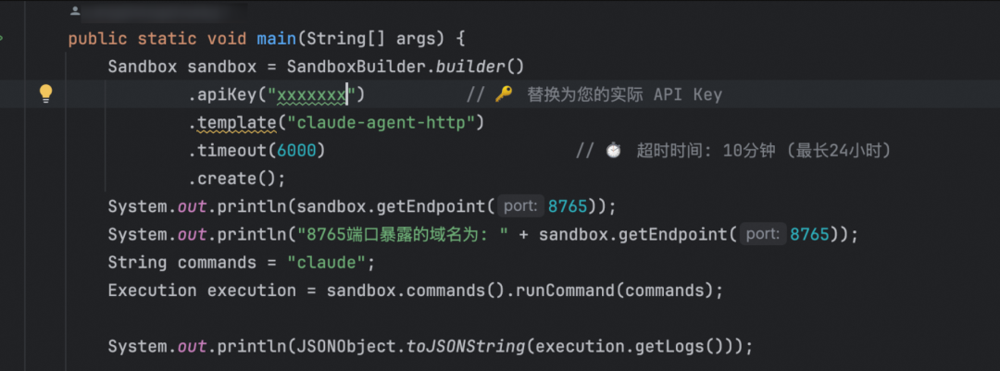

2.调用该FastApi服务，底层调用沙箱中的claude code进行获取流式响应：

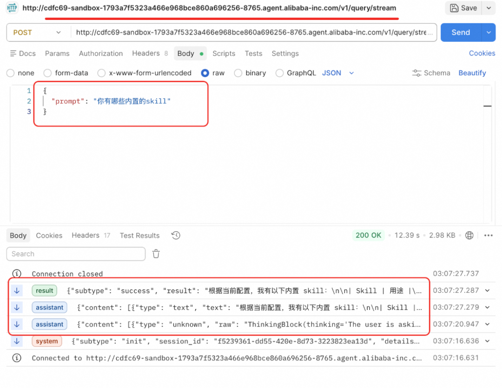

3.该http服务的所有接口示例也能获取到

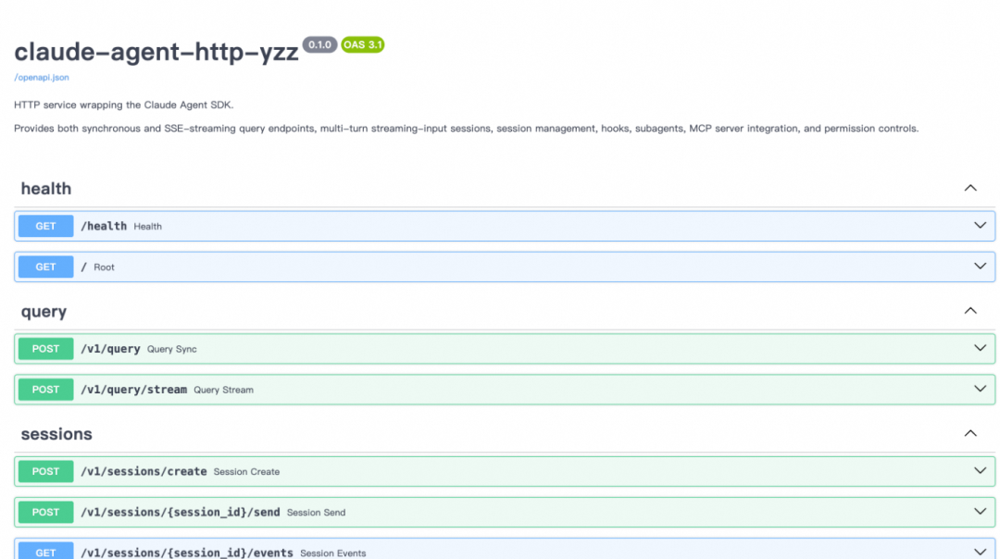

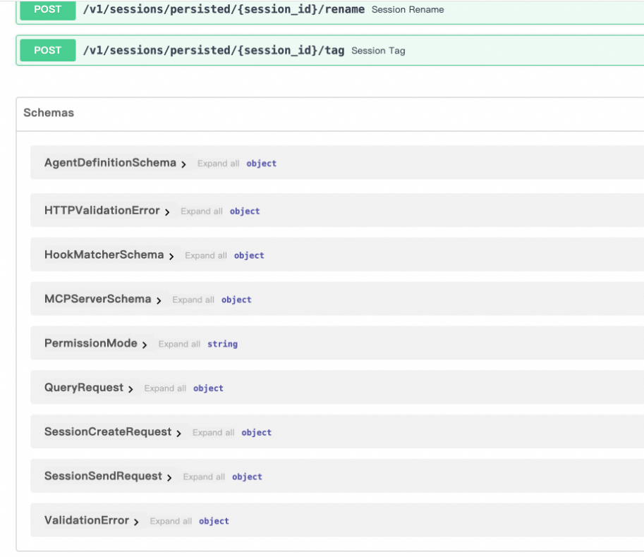

六、沙箱方式实现claude code的
HTTP 远程调用及多用户实例隔离

这是整套方案中最关键的设计——如何在云上实现多用户隔离。

**6.1 问题本质**

Claude Code 在设计上是一个单用户、本地化的系统。它的记忆（~/.claude/ 目录）、项目上下文（CLAUDE.md）、会话历史、MCP 配置等全部以文件形式存储在本地磁盘。这意味着如果多个用户共享同一个 Claude Code 实例，会出现以下问题：

●记忆串扰：用户 A 的对话历史被用户 B 看到或影响。

●配置冲突：不同用户的 system prompt、permission mode 互相覆盖。

●文件系统污染：Claude Code 在工作目录中产生的文件对所有用户可见。

●会话状态冲突：SDK 的内存中会话注册表（_sessions dict）是进程级的，多用户并发会导致会话 ID 碰撞。

**6.2 核心思路：一用户一沙箱 +
用户文件版本化存储**

## 我们的隔离方案分为两层设计：

### 第一层是容器级隔离——利用沙箱平台的容器调度能力，为每个用户分配独立的沙箱实例。每个沙箱内运行一套完整的 Claude Code CLI + HTTP Service，天然实现运行时的全方位隔离。

#### 第二层是用户状态持久化——这是方案的关键创新点。我们观察到，Claude Code 的所有用户态数据本质上都是文件：~/.claude/ 下的记忆文件、项目目录中的 CLAUDE.md、会话历史索引、MCP 配置、工作目录中产生的代码文件等。既然一切皆文件，我们就可以将用户的全部文件进行版本化存储——沙箱实例变成纯粹的无状态计算节点，用户状态完全外置到持久化存储层。

#### 具体来说：新启一个沙箱实例时，从存储层加载该用户最新版本的文件快照；沙箱销毁或回收时，将此刻的文件变更回写并生成新的版本。这样沙箱实例可以随时创建、随时销毁，用户的记忆和上下文永远不会丢失。

**6.3 整体架构**

-
-
-
-
-
-
-
-
-
-
-
-
-
-
-
-
-
-
-
-
-
-
-
-
-
-
-
-
-
-
-
-
-
-
-
-
-
-
-
-
-
-
-
-
-
-
-
-
-
-

```text
┌──────────────────────────────────────────────────────────────────┐│                        Application Layer                         ││               (Web UI / Bot / API Gateway / ...)                 │└───────────────────────────┬──────────────────────────────────────┘                            │  HTTP + SSE (带 user_id)                            ▼┌──────────────────────────────────────────────────────────────────┐│                    Sandbox Control Plane                          ││                                                                  ││  ┌──────────────┐  ┌───────────────────┐  ┌──────────────────┐  ││  │  路由 & 调度  │  │  生命周期管理器     │  │  文件版本管理器   │  ││  │              │  │                   │  │                  │  ││  │ user_id →    │  │  创建 / 销毁       │  │  快照存储(OSS)   │  ││  │ sandbox_ip   │  │  健康检查          │  │  版本记录(DB)    │  ││  │              │  │  闲置回收          │  │  增量同步        │  ││  └──────────────┘  └───────────────────┘  └──────────────────┘  │└────────┬──────────────────┬──────────────────┬───────────────────┘         │                  │                  │         ▼                  ▼                  ▼  ┌─────────────┐   ┌─────────────┐   ┌─────────────┐  │  Sandbox A  │   │  Sandbox B  │   │  Sandbox C  │  │  (user_001) │   │  (user_002) │   │  (无状态闲置) │  │             │   │             │   │             │  │ ┌─────────┐ │   │ ┌─────────┐ │   │ ┌─────────┐ │  │ │Claude   │ │   │ │Claude   │ │   │ │Claude   │ │  │ │Code CLI │ │   │ │Code CLI │ │   │ │Code CLI │ │  │ └────┬────┘ │   │ └────┬────┘ │   │ └─────────┘ │  │ ┌────▼────┐ │   │ ┌────▼────┐ │   │             │  │ │  HTTP   │ │   │ │  HTTP   │ │   │  (等待分配)  │  │ │ :8765   │ │   │ │ :8765   │ │   │             │  │ └─────────┘ │   │ └─────────┘ │   │             │  │             │   │             │   │             │  │ ~/.claude/  │   │ ~/.claude/  │   │             │  │ ~/project/  │   │ ~/project/  │   │             │  │  (从快照    │   │  (从快照    │   │             │  │   恢复)     │   │   恢复)     │   │             │  └──────┬──────┘   └──────┬──────┘   └─────────────┘         │                  │         ▼                  ▼  ┌─────────────────────────────────────────────┐  │         Persistent Storage (OSS / NAS)       │  │                                             │  │  user_001/                                  │  │    ├── v3 (latest) ─ 2024-03-15 14:30      │  │    ├── v2 ─ 2024-03-14 09:00               │  │    └── v1 ─ 2024-03-12 16:45               │  │  user_002/                                  │  │    ├── v5 (latest) ─ 2024-03-15 11:20      │  │    └── ...                                  │  └─────────────────────────────────────────────┘

```text

**6.4 用户文件版本化存储设计**

这套版本化存储机制是整个隔离方案的基石。它要解决的核心问题是：沙箱实例是短暂的，但用户的记忆和工作成果必须是持久的。

需要持久化的文件范围：

Claude Code 的用户态文件主要分布在以下位置，全部需要纳入版本管理：

-
-
-
-
-
-
-
-
-
-
-
-
-
-
-

```text
~/.claude/ # Claude Code 全局记忆与配置├── CLAUDE.md # 用户级记忆文件（跨项目）├── settings.json # 全局设置（权限、模型偏好等）├── credentials.json # 认证信息├── sessions/ # 会话历史索引│ ├── <session_id>.json│ └── ...└── projects/ # 项目级记忆└── <project_hash>/└── CLAUDE.md # 项目级记忆文件~/workspace/ # 用户工作目录├── .claude/ # 项目级 Claude 配置│ └── CLAUDE.md├── src/ # 用户的代码文件（Claude 可能读写）└── ...

```text

版本化存储流程：

整个流程分为三个阶段——加载、运行、保存：

-
-
-
-
-
-
-
-
-
-
-
-
-
-
-
-
-
-
-
-
-
-
-
-
-
-
-
-
-
-
-
-
-
-
-
-
-
-
-
-
-
-
-
-
-
-
-
-
-
-
-

```text
                    ┌─────────────────────────┐                    │    用户发起请求          │                    └────────────┬────────────┘                                 │                    ┌────────────▼────────────┐                    │  Control Plane 查找     │                    │  该用户是否有活跃沙箱？   │                    └────────────┬────────────┘                                 │                   ┌─────────────┴─────────────┐                   │ 无                         │ 有                   ▼                            ▼        ┌────────────────────┐       ┌──────────────────┐        │ ① 分配空闲沙箱实例  │       │  直接转发请求      │        └─────────┬──────────┘       └──────────────────┘                  │        ┌─────────▼──────────┐        │ ② 从 OSS 拉取该    │        │ 用户的最新文件快照   │        │                    │        │ ossutil cp          │        │ oss://snapshots/   │        │ user_001/latest/   │        │ → ~/.claude/       │        │ → ~/workspace/     │        └─────────┬──────────┘                  │        ┌─────────▼──────────┐        │ ③ 启动 HTTP 服务    │        │ 转发用户请求         │        │                    │        │ 用户正常使用 ...     │        │ Claude 读写文件      │        │ 记忆不断积累         │        └─────────┬──────────┘                  │                  │  (闲置超时 / 主动销毁)                  │        ┌─────────▼──────────┐        │ ④ 回写文件快照      │        │                    │        │ 对比文件变更        │        │ (增量 diff)        │        │ 上传至 OSS         │        │ 记录新版本号        │        └─────────┬──────────┘                  │        ┌─────────▼──────────┐        │ ⑤ 释放沙箱实例      │        │ 回归空闲池          │        └────────────────────┘

```text

增量同步策略：

为了避免每次加载和保存时都传输全量文件（用户的工作目录可能包含大量代码），我们采用增量同步策略。加载阶段在沙箱启动后，从对象存储拉取该用户的最新快照，解压到对应目录。首次加载是全量拉取，后续如果沙箱被复用（仅切换用户），则只需替换差异文件。保存阶段在沙箱即将回收时，计算当前文件系统与上一版本的差异（可以利用 rsync --dry-run 或文件 hash 对比），只上传发生变更的文件，并在数据库中记录一条新的版本记录。

版本管理数据模型：

-
-
-
-
-
-
-
-
-
-
-

```text
-- 用户文件快照版本表CREATE TABLE user_snapshots (id BIGINT PRIMARY KEY AUTO_INCREMENT,user_id VARCHAR(64) NOT NULL,version INT NOT NULL,storage_key VARCHAR(256) NOT NULL, -- OSS 路径，如 snapshots/user_001/v3.tar.gzfile_count INT, -- 文件数量total_size BIGINT, -- 快照总大小(bytes)created_at TIMESTAMP DEFAULT NOW(),INDEX idx_user_version (user_id, version DESC));

```text

**6.5 沙箱生命周期管理**

结合文件版本化存储，沙箱实例的生命周期变得更加灵活——实例本身是无状态的、可随时替换的：

按需分配：用户首次请求时，从空闲沙箱池中取一个实例（而非每次新建），拉取用户文件快照后即可提供服务。如果池中无空闲实例，再触发新实例创建。

闲置回收：沙箱在无请求超过一定时间（如 30 分钟）后触发回收流程——先回写文件快照到持久存储，然后清理沙箱内的用户数据，实例回归空闲池等待下一个用户使用。

主动释放：用户可以通过 API 主动关闭自己的沙箱。关闭前同样会触发文件快照保存。

定期清理：超过一定时间（如 30 天）未使用的用户快照可以设置归档或清理策略，避免存储无限膨胀。

**6.6 请求路由流程**

一次完整的用户请求经历如下流程：

-
-
-
-
-
-
-
-
-
-
-
-
-
-
-
-

```text
用户请求 (带 user_id)│▼Control Plane 收到请求│├─ 查映射表：该 user_id 是否已有活跃沙箱？│├─ [有] ──→ 直接转发到 sandbox_ip:8765│└─ [无] ──→ 从空闲池分配沙箱│├─ 从 OSS 拉取该用户最新文件快照├─ 解压到 ~/.claude/ 和 ~/workspace/├─ 启动 HTTP 服务，等待 health check 通过├─ 记录 user_id → sandbox_ip 映射└─ 转发请求

```text

在应用层的调用代码可以非常简洁：

-
-
-
-
-
-
-
-
-
-
-
-
-

```text
import httpxasync def query_claude(user_id: str, prompt: str) -> AsyncIterator[dict]:"""通过 Control Plane 路由到用户专属沙箱"""sandbox_url = await control_plane.get_or_create_sandbox(user_id)async with httpx.AsyncClient() as client:async with client.stream("POST",f"{sandbox_url}/v1/query/stream",json={"prompt": prompt},) as response:async for line in response.aiter_lines():if line.startswith("data: "):yield json.loads(line[6:])

```text

**6.7 方案优势**

这套"一用户一沙箱 + 文件版本化"的组合设计带来了几个关键优势：

彻底的隔离性。 每个用户拥有独立的文件系统、进程空间和网络栈，完全不存在记忆串扰、配置冲突的可能。相比在应用层逐一识别并隔离 Claude Code 散布在各处的状态文件（~/.claude/、.claude/ 项目配置、内存中的会话注册表等），容器级隔离一刀切地解决了所有问题，且不惧 SDK 升级引入新的状态点。

状态永不丢失。 用户的一切工作成果——Claude 积累的记忆、写过的代码、会话历史、个性化配置——都以文件快照的形式持久化在对象存储中。沙箱实例可以随时销毁、随时重建，用户无感知。

资源弹性伸缩。沙箱实例不再与用户绑定，而是变成了可复用的无状态计算节点。活跃用户少时，少量实例即可服务；高峰期只需扩大沙箱池。闲置用户不占用任何计算资源，只占用廉价的对象存储空间。

天然的版本回溯能力。 由于每次回收都生成新版本，用户的文件天然具备了时间线。如果 Claude 在某次操作中写坏了代码或误删了文件，可以回滚到任意历史版本恢复——这实际上为 Claude Code 的工作成果提供了一层"安全网"。

七、总结

本文介绍了一套将 Claude Code 从本地 CLI 工具转变为云端 HTTP 流式服务的完整方案。回顾开篇提出的三个核心问题：

对于离线部署问题，我们通过 npm pack 打包 + Docker 基础镜像的方式，实现了无外网环境下的一键部署。

对于服务化输出问题，我们基于 claude-agent-sdk + FastAPI + SSE 构建了完整的 HTTP 服务层，支持单次查询和多轮会话两种模式，以及 Hooks、Subagents、MCP、Permission 等全部高级特性，解决了 CLI 方式非流式、非结构化的根本缺陷。

对于多用户隔离问题，我们采用"一用户一沙箱 + 用户文件版本化存储"的架构。容器级隔离解决了运行时串扰问题，文件版本化存储则让沙箱实例彻底无状态化——用户的记忆、配置、工作成果以快照形式持久化在对象存储中，沙箱可以随时创建和销毁而用户状态永不丢失。这套设计还附带了版本回溯能力，为 Claude Code 的自动化操作提供了一层额外的安全保障。

整套方案的设计原则是尽量不改造 Claude Code 本身，而是在外围做封装和调度。这样做的好处是，当 Claude Code 升级时（例如 SDK 新增 API、CLI 功能增强），我们只需要更新基础镜像中的 tgz 包，HTTP 服务层和沙箱调度层基本不需要改动。

八、个人感悟

Ai的合理利用真的对研发提效很大，这个项目，从 claude code部署调研->部署方案设计->重构sdk为FastApi项目->基础镜像构建->沙箱部署->本篇ata撰写仅仅耗时1.5人日及1909 Credits

但：个人的工程设计能力 始终是借助ai高效产出的基础，合理的设计思路才能快速引导Ai构建高质量系统

借助ai做的一些具体事情如下：

ai分析离线部署方案：

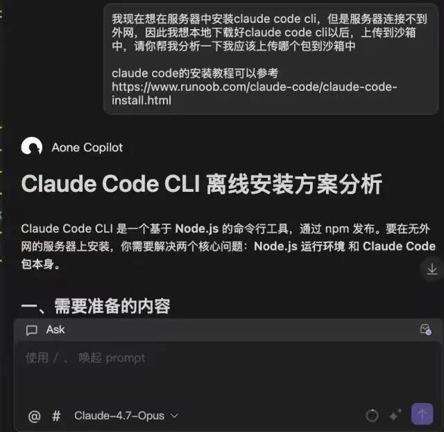

基础镜像构建：

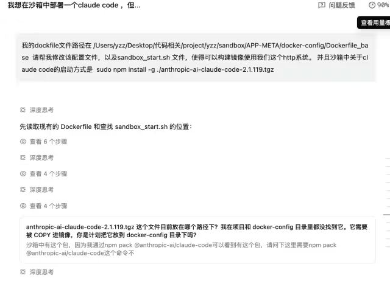

FastApi重构claude code

ata撰写

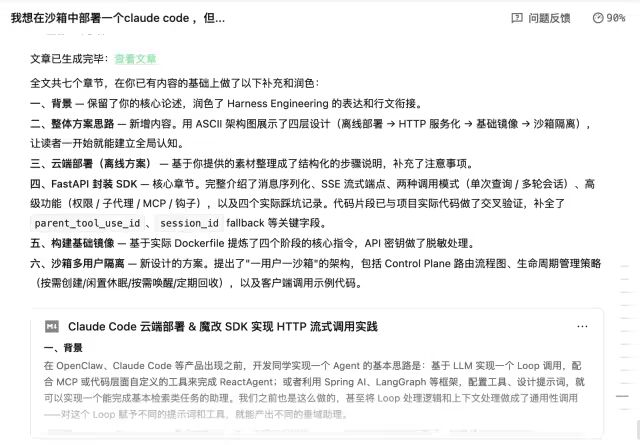

[1]https://code.alibaba-inc.com/alsc-info-ilink-agent/Claude-code-http-service

原文链接: [https://mp.weixin.qq.com/s/gaBKZFIZetj9H9eqyhT13g?bar_style_type=2&from=industrynews&color_scheme=light#rd](https://mp.weixin.qq.com/s/gaBKZFIZetj9H9eqyhT13g?bar_style_type=2&from=industrynews&color_scheme=light#rd)
