# 分享Claude Code团队内部的5条工作原则，我觉得每一条都值得学习。

作者: 数字生命卡兹克

公众号: 数字生命卡兹克

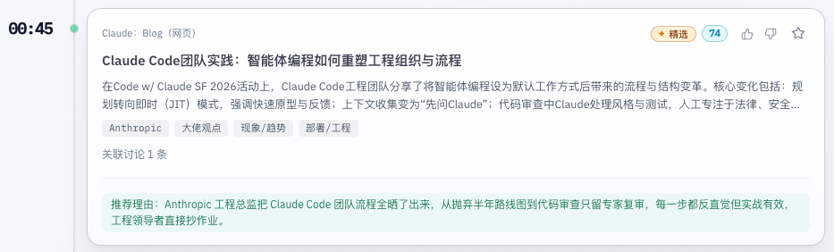

还是蛮少见的，很少见类似于Claude这种真正的AI公司，来分享一些组织上的一些想法和思考。

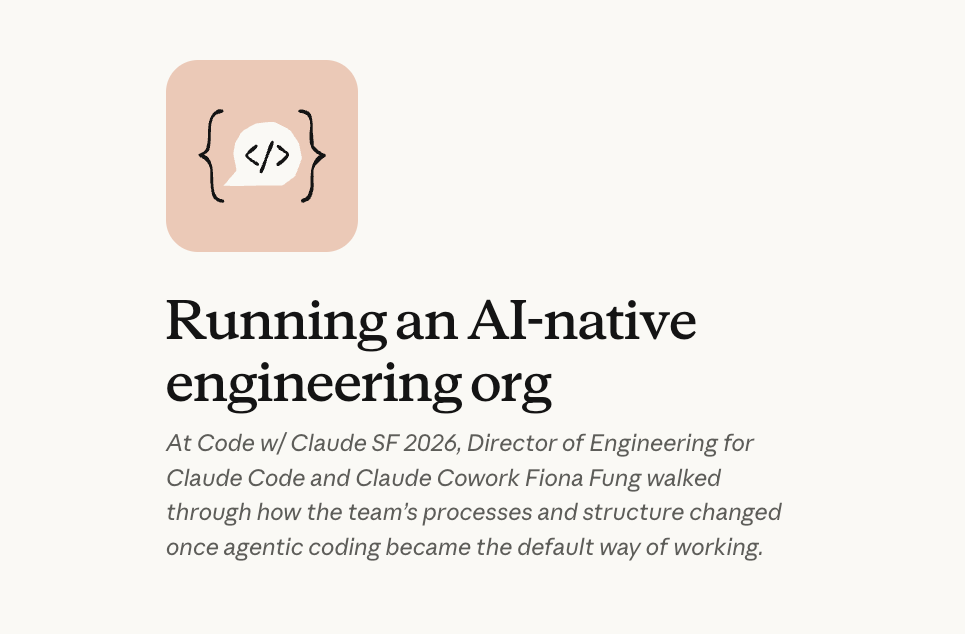

特别这次分享的作者，还是当红炸子鸡Claude Code团队的工程总监，Fiona Fung。

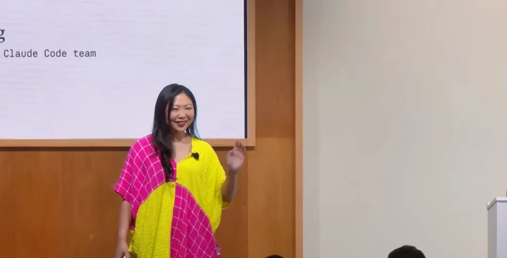

聊得主题就是他们团队作为AI原生组织，在工作方式和流程上的一些变化。我全部看完了，顺带也把那个半个小时演讲的视频给看完了，还是有很多共鸣的，因为很多思路和想法我们团队也在这么做这么践行的。尤其是她反复提到的一个习惯，就是他们团队里，每遇到一个问题，都会再追问一句：能不能把这件事自动化。这跟我自己一直在说的理念、跟很多朋友提到的一个习惯是一样的。就是如果一件事你需要重复3遍以上，请想尽一切办法，用AI将其自动掉。今天看到Claude Code团队居然在用几乎一模一样的逻辑来运转整个工程组织，还是挺兴奋的。所以想把这篇分享里的一些有价值的东西拎出来聊聊，希望能对大家有用。最最开始的时候，她其实有一个很有意思的判断。就是她说过去这么多年，软件工程的所有流程，不管是瀑布还是敏捷，所有那些规范啊方法论啊，本质上都是围绕一个核心成本在转，就是写代码太贵了这个事。工程师时间贵，所以你得花大量时间做规划、写需求文档、做各种各样的评审、开各种各样的会，全是在管理这个最贵的资源。

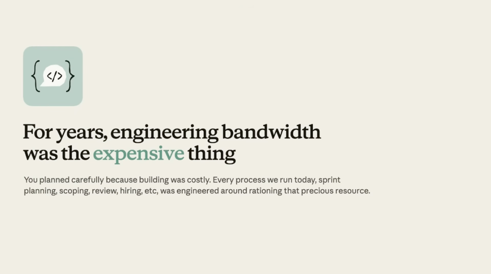

我相信过去在互联网行业里面待过的小伙伴都能感同身受。但在AI时代，或者说，Agent时代。这个前提变了。在Claude Code团队，写代码已经很少是那个拖慢速度的环节了。

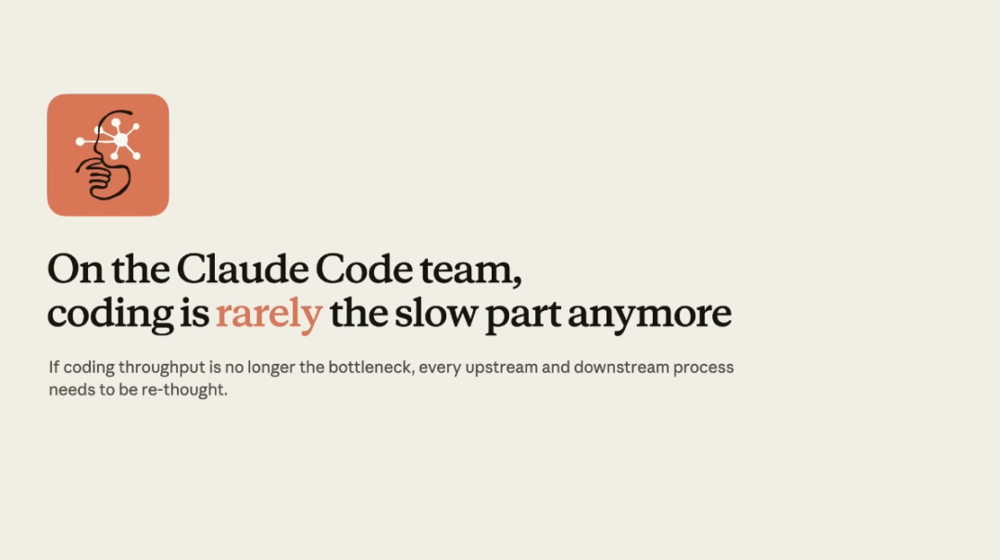

那问题就来了，如果写代码本身不再是瓶颈的话，那围绕它的所有上下游的流程，就全部都得重新想了。Fiona Fung提到了一个非常核心的词，也是她整个分享的最重要的词：转移。瓶颈没有消失，只是转移了。转移到了验证、代码评审、安全。代码生成太快了，新问题变成了，这些代码对不对，怎么维护，人到底该如何跟得上review代码的节奏。

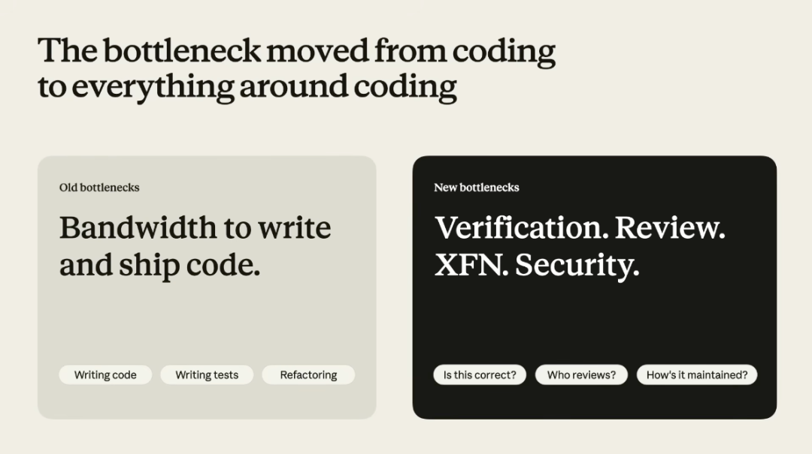

左边灰色的就是是旧瓶颈，写代码和发布代码的产能。右边黑色的就是新瓶颈，验证、评审、跨职能协作、安全。这个关于转移的判断，其实如果用AI来介入组织结构里面越深，大家的感触可能就会越明显。我们的组织结构、流程，其实都需要围绕着这个大的变化来去重新设计。就像当年从马车到汽车，不只是把马换成发动机的事儿，我们的整个公路系统、交通规则、城市规划，全都得重新设计。那具体哪些东西需要重新来呢，Fiona列了一张图。

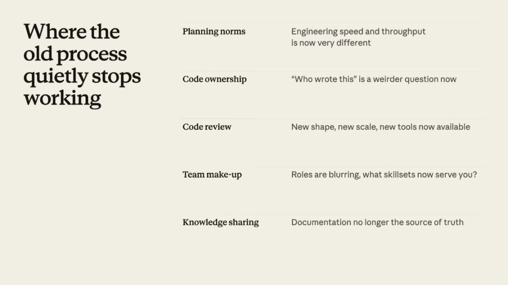

列了五个旧流程正在悄悄失效的领域。1. 规划方式，因为工程速度和产出量完全不同了。2. 代码所有权，谁写的这段代码变成了一个很奇怪的问题。3. 代码评审，新的规模、新的形态、新的工具。4. 团队构成，角色在模糊化，到底什么技能组合才是你需要的。5. 知识共享，文档不再是唯一的真相来源了。然后她对应地讲了五个她们重建的新规范。

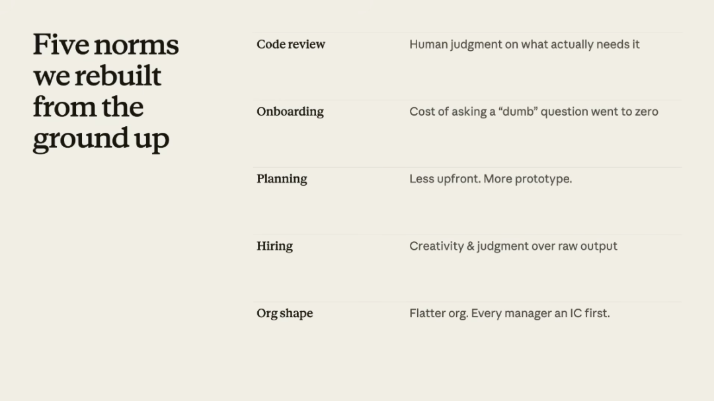

包括要让人类的判断力，聚焦在真正需要的地方；新人入职的成本大大降低，甚至一周就可以直接开始产出代码了；少做前期规划，多做原型；招聘更看重创造力和判断力，不看纯产出速度；组织架构更扁平，每个管理者也都先从一线干活开始做起。这里面每一趴，她又都展开来做了一些分享。一. 规划的变化以前因为coding时间贵，你得花大量时间提前规划。Fiona说她刚加入Claude Code团队的时候，他们写了一个挺漂亮的六个月路线图。结果呢，因为Claude Code本身迭代太快，三个月左右这个路线图就过时了。。。所以他们现在的做法叫JIT规划，Just-In-Time，像JIT编译一样，在对的时间做恰好足够的规划。不再写长篇大论的设计文档了，直接在PR或者原型里面讨论，不再做冗长的产品评审了，先做原型，让内部用户去用，然后根据反馈快速迭代。

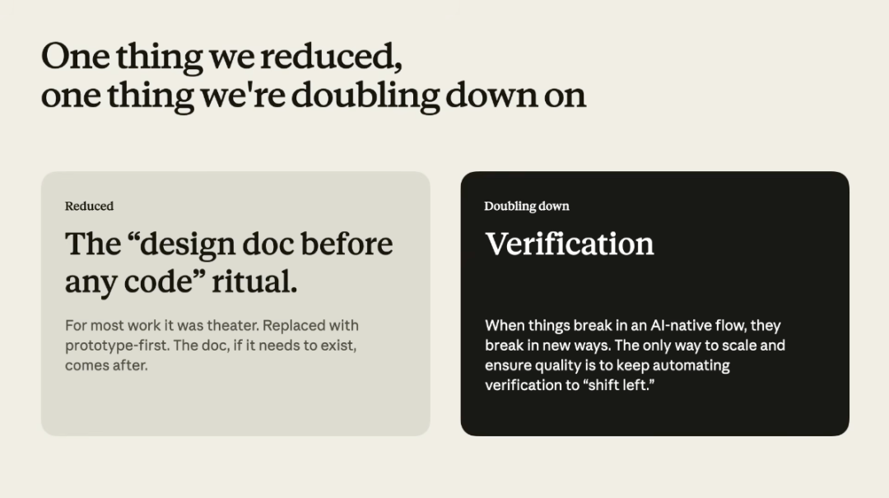

左边是她们砍掉的东西，就是那个写代码之前必须先写设计文档的仪式。Fiona说对大部分工作来说这就是theater，做戏。现在换成原型先行，文档如果需要存在，写完代码之后感觉可以的话，再补需求文档。右边是她们加码的东西，验证。因为在AI原生的工作流里，东西出bug的方式跟以前不一样了，唯一能保证质量的方式就是不断把验证流程往前推。她还讲了一个观点我觉得特别好。

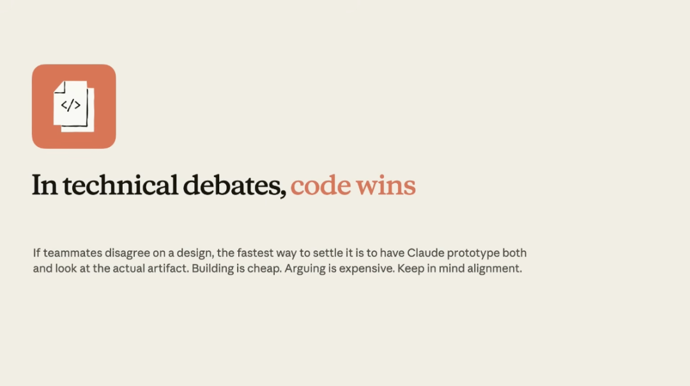

在技术讨论中，代码赢才牛逼。就是如果两个人对一个方案有分歧，最快的解决方式不是继续吵，是让Claude把两个方案都做成原型，看实际的东西来判断。Building is cheap，做东西很便宜。Arguing is expensive，争吵才昂贵。想起了当年，互相争某个方案，然后各自PK可能要各写一份PPT，开两轮会来讨论，现在十分钟两个原型都出来了，看着实物聊比对着PPT吵高效一万倍。。。我自己也是类似的路径。以前做AIHOT的时候还试过写比较详细的PRD，结果发现写PRD的时间比我直接用Claude Code把东西做出来还长。。。后来就改了，有想法先做原型，能用了再说。很多功能都是在用的过程中发现不对，当场就改，极速迭代。。。坦率的讲，在AI时代，我觉得过度规划就是浪费。二. 自动化的变化Fiona说的，在Claude Code团队里，他们每遇到一个这样的问题，都会追问一句，能不能把这件事自动化。她举了一个她自己的例子，她以前每天早上端着咖啡，手动去总结各个客户反馈渠道的内容，这是她的每天固定的工作。后来她把这件事变成了一个后台自动运行的任务，咖啡还是那杯咖啡，但她不再需要边喝边刷了。这个例子听起来很小对吧，就一个总结客户反馈的事儿，能有多大工作量。但重点不在这一件事，重点在这个习惯。Claude Code团队里每个人，每次遇到一个重复性工作，都会条件反射地问自己，能不能自动化，她说，已经快形成了一种肌肉记忆。这就是我一直在说的东西。如果一件事你需要重复3遍以上，请想尽一切办法用AI将其自动掉。在公司里面我反复跟团队讲，这甚至不是建议，是要求。但坦率的讲，要真正把这个变成团队的肌肉记忆，比说出来难太多了。因为大多数人对自动化的理解还停留在一个很粗的层面，觉得自动化就是写个脚本嘛，搞个定时任务嘛，这我知道，但AI时代的自动化跟以前完全不是一个量级的东西。现在你用Claude Code，很多自动化的事情十分钟就搞定了，甚至不用十分钟。比如我为了同步家里电脑和公司，我就跟Claude说了一句“帮我写一个hook，每次打开我的XX项目之前都去github拉取最新的代码”，几分钟就能跑起来。以前自动化成本高，所以只有高频、高重复度、高价值的事情才值得自动化，但现在自动化成本几乎为零，逻辑就反过来了，几乎所有重复超过3次的事情都应该自动化。除了工作流之外，触发器hook是一个非常好用的东西，这个我感觉以后我可以单独给大家写一篇Agent+hook搞自动化的一些小玩法，还是挺有意思的。一个一个小的自动化攒起来，你会发现，最后这些东西，会在你可能都没反应过来的时候，一起长成了一颗苍天大树。所以如果你现在还在犹豫要不要开始，我的建议是别想太大。别一上来就想着我要搭建一个完整的自动化体系这种东西，那太吓人了，也没必要。就从今天开始，找一件你今天重复做了的事情，花十分钟让Claude Code或者Codex帮你自动化掉。明天再找一件，后天再找一件，一个月以后你回头看，你的工作方式已经完全不一样了。三. 代码评审的变化代码评审这块，Fiona说她过去六个月跟其他工程leader聊天，被问到最多的一个问题就是，你们人怎么跟得上代码review的速度。

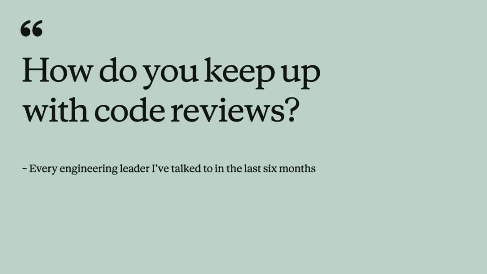

她的做法叫Trust but verify，信任但验证。Claude Code团队大量使用Code Review功能。Claude负责处理所有的风格检查、linting、PR反馈、bug捕捉和修复、补充测试，这些以前可能占了review工作量60-70%的部分，现在Claude全接了。但人类review仍然不可替代，在那些真正需要专业判断的地方。法律合规的东西，Fiona说她永远需要她的法务伙伴参与风险评估，信任边界和安全敏感代码，需要领域专家，产品方向和品味的判断，需要PM和设计师。

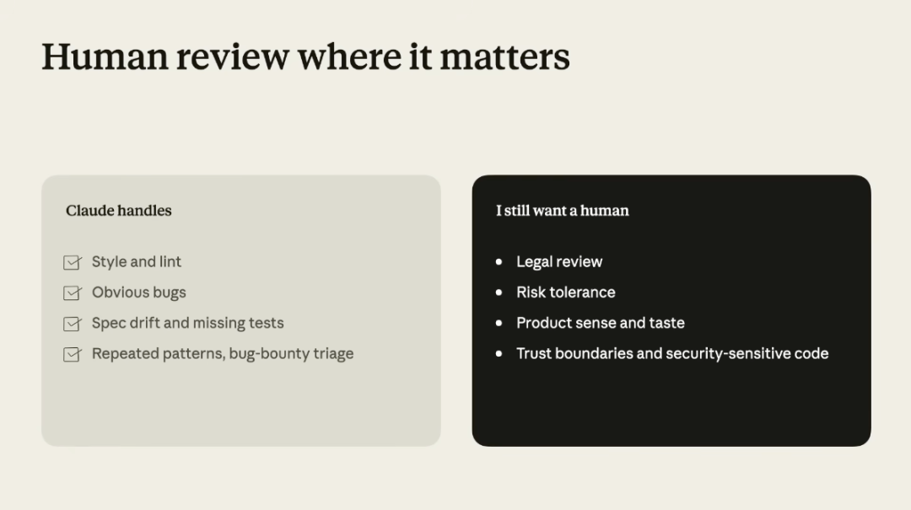

而且她特别强调了，这个trust和verify之间的平衡是动态的。今天需要人来做的事情，下一个模型可能就能做了，所以你必须得不断重新评估这条线。这就跟打游戏一样嘛，每个版本的版本答案都不一样，你不能拿上个版本的攻略打新版本，那只会被人干死。四. 团队角色的变化
Fiona说在Claude Code团队，角色界限已经变得很模糊了。PM在大量写代码，工程师也在做内容和设计的事情，以前泾渭分明的边界正在消融。比如以前一个工程师修了个bug，要等内容设计师排期来写用户端的文案，排期这个破事大家懂的都懂，结果要么等好几天，要么赶进度发一个凑合的文案出去。现在的流程是工程师修完bug，Claude来起草文案初稿，人类来做最终判断，当天就能发。

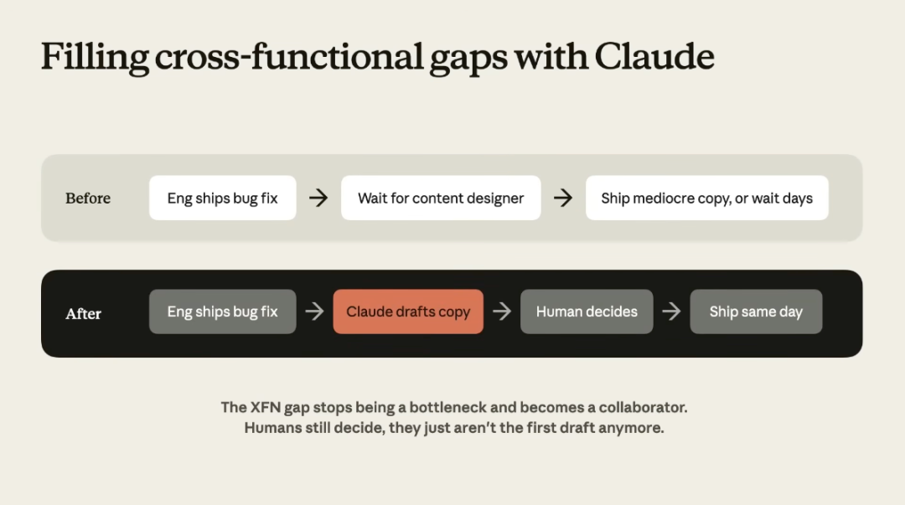

跨职能的gap不再是瓶颈了，开始变成了协作者，人类还是做最终决策的那个人，只是不再是写初稿的那个人了。然后她说了一个我非常认同的观点，她现在招人主要看两种特质。

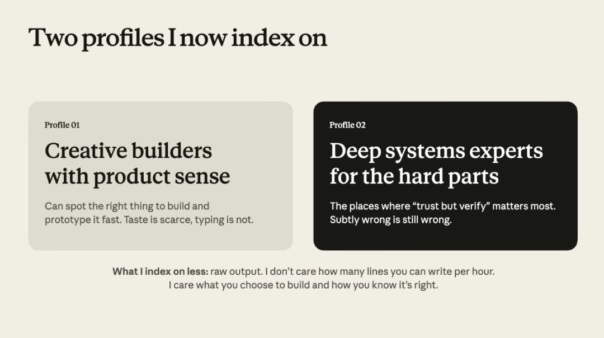

一种是有产品sense的创意builder，能识别出该做什么，能快速做出原型。她还特意在描述里强调了一句：Taste is scarce, typing is not. 品味是稀缺的，打字不是。另一种是有深厚系统背景的工程师，负责那些「trust but verify」里最需要人的部分，因为subtly wrong is still wrong，微妙的错误仍然是错误。她说我根本不在乎你一个小时能写多少行代码，我在乎的是你选择去做什么，以及你怎么知道它是对的。

当AI能把执行速度提升10倍的时候，决定性的因素变成了你知不知道应该做什么，以及什么样的结果叫真正的优秀。

这，就是品味。**

五. 如何推动团队变化Fiona她们团队有一些有意思的核心原则。**

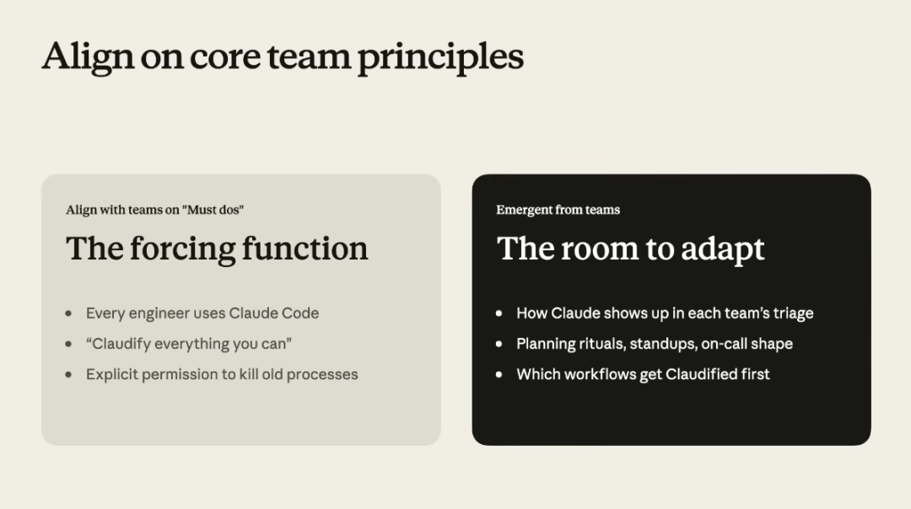

**

她把团队原则分成了两类。左边灰色是必须做的硬性要求，右边黑色就是大家自己摸索的空间。其实本质上，就是给团队设计了一个harness，核心就是大的方向统一，具体怎么落地各团队自己定。**Fiona总结了三条她最看重的事情。1. 保持团队尽可能扁平，管理者支持各个小组的工作，但保持灵活让人能流动到工作需要的地方。2. 如果Claude能做的事情，就让Claude做，这能让我们腾出手来做更难的工作。3. 人不会主动去删除流程，只会在旧流程上面继续叠新流程，所以你得主动站出来，指名道姓地说出哪些流程可以走了。这三条说起来都没啥特别的，但难在执行，特别是第三条。Fiona说，她之前在一个团队里，有一个每周的review会议，一大堆人坐在会议室里，但她发现所有人都在看电脑，只有轮到自己汇报的时候才抬头说两句status，说完又低头继续看电脑（我相信我们很多时候的会议也都是这样的）。

然后她问了一句，我们为什么还在开这个会。

这时候，所有人才意识到，好像，这个会根本不需要。于是，从此，这个会就取消了。这种事太常见了，国内的公司里其实到处都是。无数的流程和会议，当初设立的时候都有道理，但环境变了、工具变了，它们早就失去了存在的意义，只是因为惯性还在那里被迫转着。没有人觉得它有用。但，好像很多时候，也没有人站出来说一句这破逼会太浪费时间了，能不能别开了。AI在你的组织里介入的越深，你会发现，很多过去的步骤和流程，其实液晶可以自动化了，如果我们不主动去审视，那这些步骤就会一直在那里，最后，变成纯粹的形式主义。最后，Fiona还放了三个她在思考的问题，她没有答案。但是很有意思。

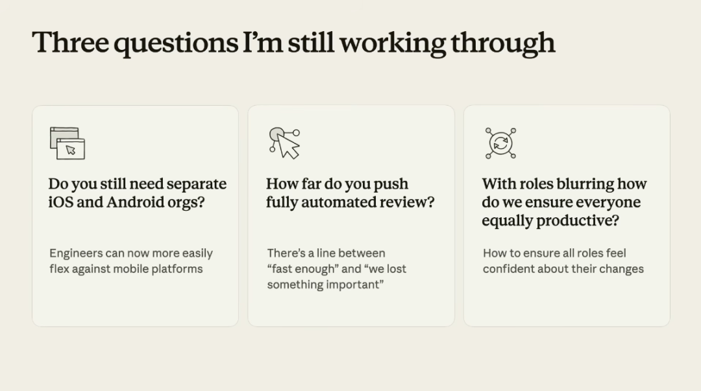

第一，你还需要单独的iOS和Android团队吗？因为现在工程师已经可以更灵活地跨平台工作了。第二，全自动化的review到底能推到多远，在「够快了」和「我们漏掉了什么重要的东西」之间那条线在哪里？第三，当角色越来越模糊的时候，怎么确保所有角色都对自己的产出有信心？我觉得她把这三个问题放出来这个动作本身就很有价值。因为你会发现，即使是Claude Code的亲爹团队，也没有把所有事情都想明白。他们也在摸索，很多时候，这就不是一个有标准答案的事情。每一次的大型技术的到来，其实都不只是工具升级，整个组织的运作方式很多时候，都要推倒重来。所谓的AI原生，AI Native，其实也并不是买几个Claude会员或者包个API Key啥的，给大家用就算AI转型了，我一直觉得真正的AI原生组织，从规划方式到知识管理到评审流程到人才结构，每一层都是重新设计过的。我们也没有做到，但是还是在不断的朝这个方向努力，最近加入的一些新的小伙伴，他们的好奇心和自驱力，且没有被过去一些传统且饱受诟病的工作方式所污染，已经感觉让我看到了一些雏形了。

而贯穿所有这些变化的，我觉得其实就是开头说的那个最朴素的思维习惯。

遇到重复的事情，自动化掉。遇到没用的流程，干掉。遇到不需要人做的判断，交给AI。

一个一个来，不着急，但不能停。

最后，用Fiona的最后一段话作为结尾吧。

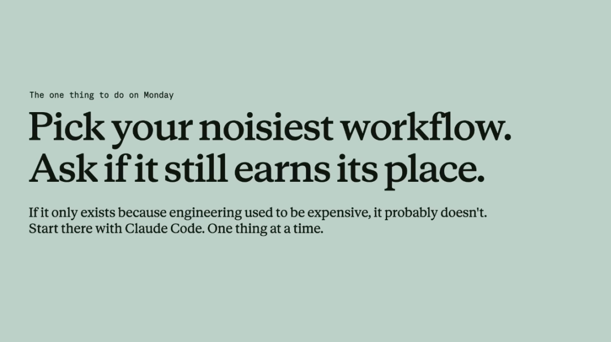

Pick your noisiest workflow. Ask if it still earns its place.找到你最繁琐的那个工作流，问问它。是不是还配占着这个位置。

以上，既然看到这里了，如果觉得不错，随手点个赞、在看、转发三连吧，如果想第一时间收到推送，也可以给我个星标⭐～谢谢你看我的文章，我们，下次再见。

> / 作者：卡兹克

> / 投稿或爆料，请联系邮箱：wzglyay@virxact.com

原文链接: [https://mp.weixin.qq.com/s/iBELIhdHf44aWKs0Z-Iudg](https://mp.weixin.qq.com/s/iBELIhdHf44aWKs0Z-Iudg)
