# Codex 最全使用技巧，5000字长文！

作者: 鹏磊

公众号: 架构师专栏


鹏磊新业务：https://shop.apiya.ai

质保 30 天不掉订阅，掉订阅，按天退差价

大家好，我是鹏磊

AI 编程这块现在是真的卷起来了，Cursor、Trae、Claude Code、Codex……一个接一个往出冒

前几天我发了几篇节省 token 的教程，没想到后台一堆人在问 Codex，感觉这玩意大家还挺感兴趣的。。

那行，今天就把 Codex 从头到尾好好捋一遍，能踩的坑我基本都踩过了，给你省点力气.

## Codex 到底是啥，有哪些用法

很多人一听 Codex，容易跟 2021 年那个老版 Codex API 搞混，那个早死了，现在说的是 2025 年 4 月 OpenAI 重新整出来的这个，完全不是一回事

现在的 Codex 是个真正的编程 Agent，能读代码、改文件、执行命令、跑测试、提交 Git，整套流程都能自己干

跟 Claude Code 是同一个类型的东西，只不过底层模型不一样，各干各的那种

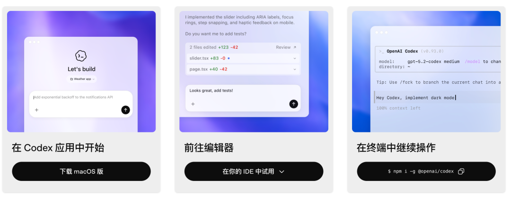

入口这块，很多人搞不清楚，现在一共有六个

* 网页端（Codex 官网 / ChatGPT Code）
* 桌面 App（macOS / Windows）
* 手机 App（iOS / Android）
* CLI 命令行
* VS Code 插件
* API 调用 / GitHub 云端

网页版（chatgpt.com/codex）是最轻的，浏览器开就行，本机啥都不用装。连上 GitHub 仓库之后，Codex 在云端把代码读了、任务跑了、最后给你提一个 PR，你都不用开电脑。在 GitHub 的 issue 或者 PR 里
```
@codex
```
它也能直接接活儿干

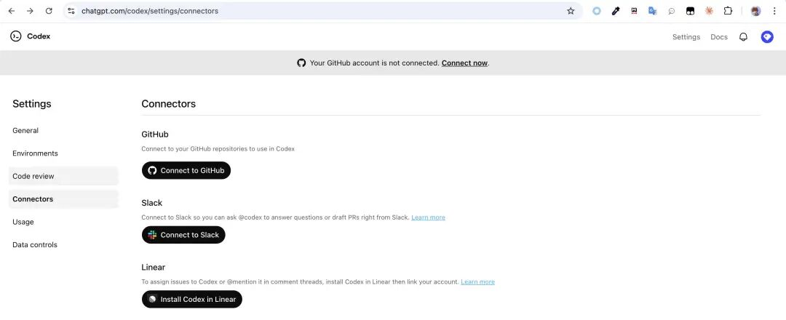

桌面 App 是 macOS 和 Windows 都有的，内置
```
worktree
```
，可以同时并行跑好几个任务互不影响，自带终端，Git 操作也集成了，可视化看改动也方便。想把 Codex 当主力工具使的，用这个.

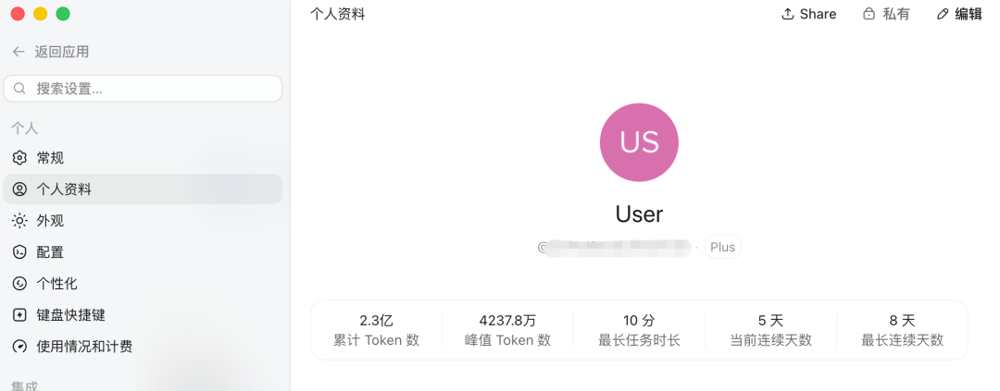

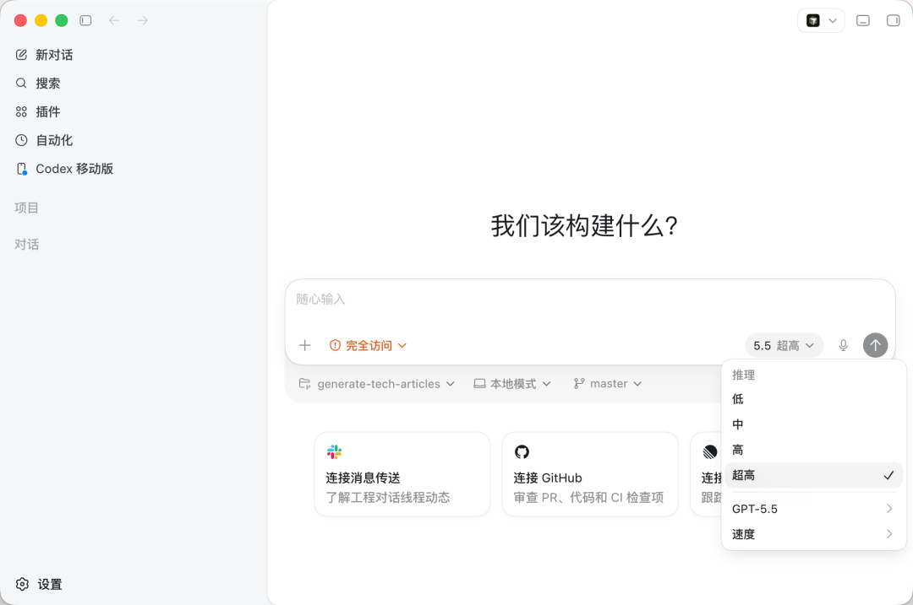

手机 App 这个要注意，不是单独下载的 App，是集成在 ChatGPT App 里的。2026 年 5 月 14 日上线，所有套餐包括免费都能用，离谱的


手机端的作用主要是远程监控和审批，你出门了，本机上跑着的 Codex 任务需要你批某步操作，掏手机点一下就行。但注意手机不能单独发起任务，必须先在电脑上开着桌面 App，手机扫码配对连过去才行

CLI 命令行是最灵活的，终端里跑，脚本化、CI 集成、MCP 全支持，后面我重点讲这个

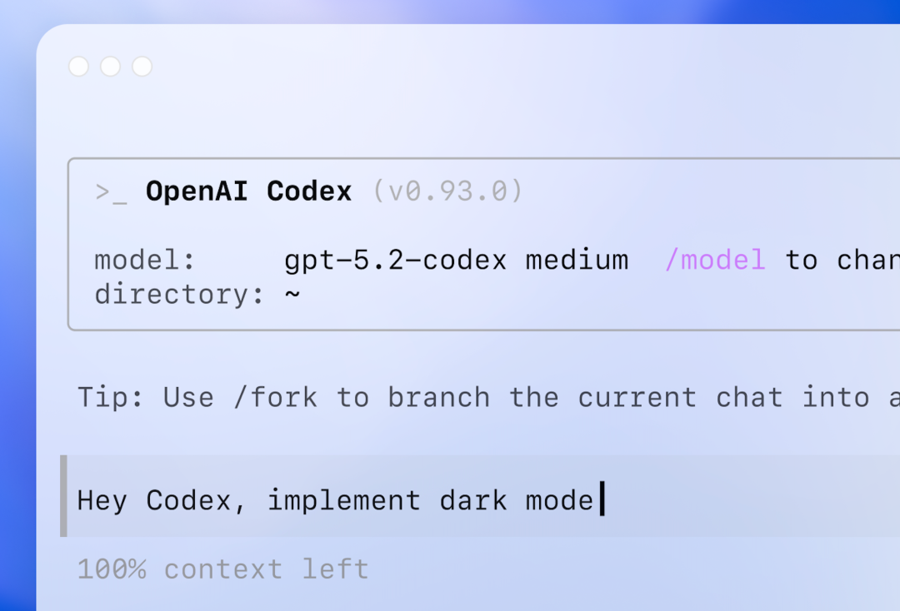

VS Code 插件适合不想离开编辑器的，行内编辑、实时改代码，跟平时的编辑器工作流融在一起。

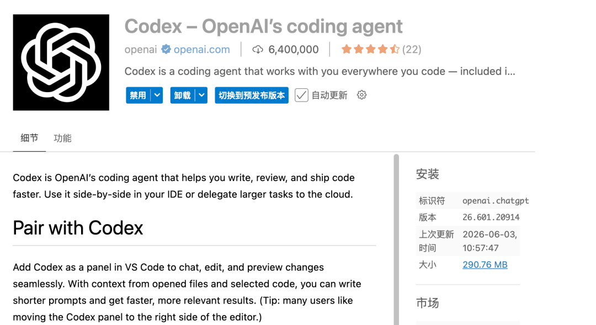

还有 SDK 和 GitHub Action，TypeScript SDK（
```
@openai/codex-sdk
```
）可以把 Codex 接进内部平台、CI/CD 流水线，程序化管理会话；GitHub Action 可以在 CI 里直接触发 Codex 任务；在 GitHub 上
```
@codex
```
也是走这套云端机制的，适合团队用

六个入口共享同一套配置——
```
~/.codex/config.toml
```
、AGENTS.md、技能包，设置一次到处生效

我日常主要用 CLI，偶尔开桌面 App 并行跑任务，出门在外就用手机端看一眼批批操作

## 安装和基本配置

安装一行命令搞定：

```
npm install -g @openai/codex
```

国内网络不稳的加个镜像源：

```
npm install -g @openai/codex --registry=https://registry.npmmirror.com
```

装完登录 OpenAI 账号就能用，或者设置 API Key 也行。

配置文件在
```
~/.codex/config.toml
```
，这里设默认模型、沙箱模式、权限策略，不用每次启动都手敲参数

项目级的配置放在项目根目录的
```
.codex/config.toml
```
，会覆盖全局那个

日常启动建议直接加这两个参数当默认：

```
codex --sandbox workspace-write --ask-for-approval on-request
```

```
workspace-write
```
是说 Codex 只能动你当前工作区的文件，出不去沙箱

```
on-request
```
是执行前问你一下要不要批准，不会直接就干了

只是看代码做分析用只读模式：

```
codex --sandbox read-only --ask-for-approval on-request
```

## 三种操作模式，用对了差很多

Codex 有三种权限模式，很多人直接用默认的也不管，其实搞清楚挺重要的

```
suggest
```
模式是最保守的，Codex 只给建议，具体改不改由你决定，适合你不确定它会干啥的时候先看看

```
auto-edit
```
会自动改文件，但执行命令还是要你点确认，日常开发用这个比较顺手

```
full-auto
```
是全自动，改文件执行命令都不用你管，适合"运行测试然后修所有报错"这类批量任务

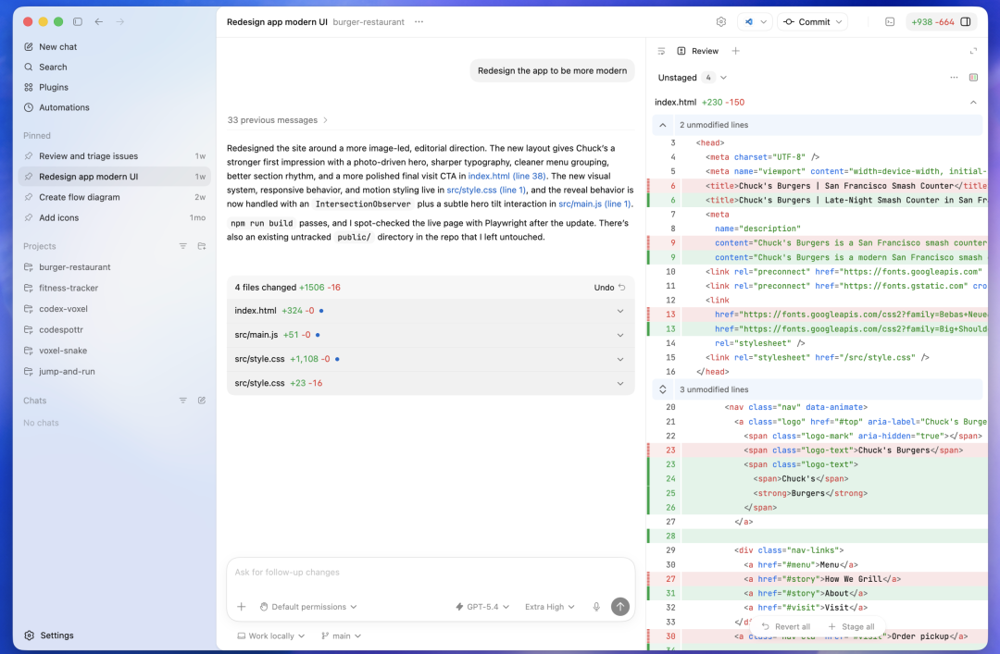

```
codex -a suggest "重构这个函数"codex -a auto-edit "给这个模块加上错误处理"codex -a full-auto "跑测试，修掉所有失败的用例"
```

我一般日常用 auto-edit，遇到批量任务才切 full-auto，suggest 基本不用

## 「AGENTS.md」，这才是 Codex 的核心

说实话，「AGENTS.md」才是 Codex 区别于普通聊天工具的关键，很多人装上了也不知道这玩意，白瞎了。。

AGENTS.md 是放在项目根目录的一个 Markdown 文件，Codex 每次启动都会自动读这个文件，里面的内容当作指令持久生效

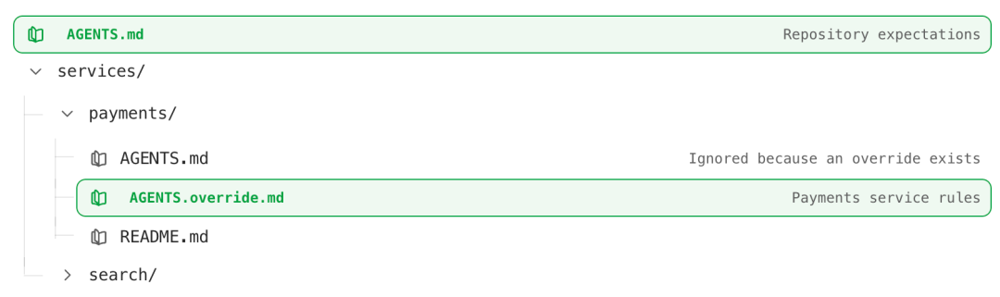

你可以理解成给 AI 写的项目说明书，但不是给人看的那种，是给 AI 专门读的

写什么进去最有用？构建和测试命令是最重要的，比如
```
npm run build
```
、
```
pytest tests/
```
、
```
pnpm lint
```
这些，写进去之后 Codex 跑完改动会自动帮你验证，不用你手动跑。

项目的特殊约定也要写，比如"所有 API 路由文件放在
```
src/routes/
```
下"、"状态管理统一用 Zustand 不要用 Redux"这类，AI 没法从代码里推断，得你告诉它

高风险禁区明确写出来能省很多麻烦，比如"不要动
```
config/prod.yaml
```
"、"不要直接修改
```
migrations/
```
下已提交的文件"

代码规范里那些不明显的约定，比如"错误处理统一抛出
```
AppError
```
"、"日志用
```
logger.info
```
不要用
```
console.log
```
"，这类东西不写它不知道

有个坑要注意

有人直接跑
```
/init
```
让 AI 自动生成 AGENTS.md，这个 ETH 苏黎世有研究明确验证过，AI 自动生成的 AGENTS.md 反而会拉低任务成功率大约 3%，同时增加超过 20% 的 token 消耗

原因是 AI 生成的东西里面全是废话和冗余，代理读了反而要额外推理这些没用的东西，整的挺拖累的

正确的做法是自己手写，只写 AI 从代码里推断不了的东西，控制在 100 到 150 行以内

不知道从哪下手，可以先把 README.md 做底稿，大幅裁掉面向人类阅读的章节，只留命令、约定、禁区这些可执行信息。

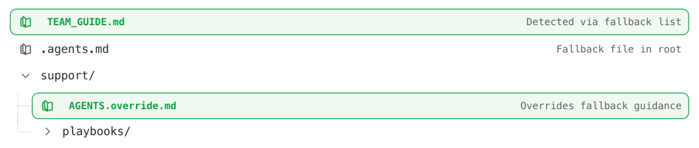

一个能用的 AGENTS.md 大概长这样：

```
# AGENTS.md## 构建与测试- 构建：`pnpm build`- 测试：`pnpm test`，覆盖率：`pnpm test:coverage`- 代码检查：`pnpm lint && pnpm typecheck`- 每次修改后必须跑 lint 和 typecheck 确保通过## 项目结构- API 路由：`src/routes/`（每个模块一个文件）- 数据库操作：`src/db/`（禁止在路由层直接写 SQL）- 工具函数：`src/utils/`（纯函数，不依赖外部状态）## 约定- 错误统一抛出 `AppError`，不要直接 `throw new Error`- 日志用 `logger`，禁止 `console.log` 进代码库- 所有数据库操作要用事务，别裸写## 禁区- 不要动 `config/prod.yaml`- 不要修改 `migrations/` 里已提交的文件- 不要往 `package.json` 里随便加依赖
```

清晰、可执行、没废话，这个省事

## Plan 模式，复杂任务先规划再动手

这个功能真的有用，很多人不知道。。

Codex 里输入
```
/plan
```
或者按
```
Shift+Tab
```
可以切换到规划模式，让它先搞清楚要干什么、怎么干，再开始写代码

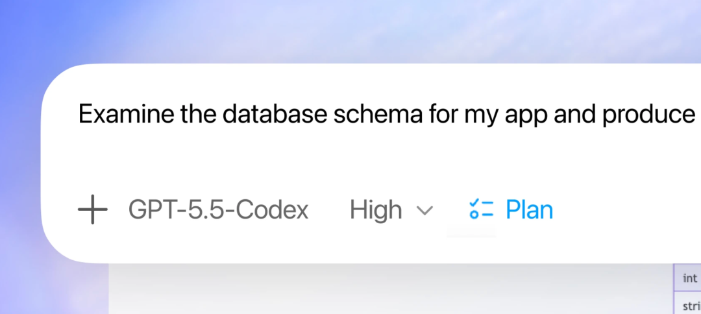

复杂任务或者描述不清楚的时候，直接让它上手写往往跑偏，来回改还不如一开始先规划

规划模式里 Codex 会收集相关文件的上下文，可能问你几个关键问题，然后给你一个实施计划，你觉得方向对了再让它动手。

改动涉及多个模块的时候，或者需求本身有模糊的地方，我都会先开 plan 模式

任务描述按这个结构来，效果会好很多：

目标——要做什么，说清楚结果而不是过程

上下文——相关的文件用
```
@filename
```
直接引用，把要看的东西喂给它

约束——不能动哪些地方，有什么取舍要注意。

完成标志——什么叫做完了，比如"所有测试通过"、"接口返回格式符合规范"

最后这条很重要，Codex 能自己跑验证循环，但得你告诉它怎么算「做完了」，否则它可能改完就停了也不管对不对

## 「Skills」，把重复工作打包成技能包

这个是 2025 年 12 月才加的，好用但知道的人不多

Skills 是你自己写的 SKILL.md 文件，放在
```
~/.agents/skills/
```
（全局生效）或者
```
.agents/skills/
```
（项目级），Codex 会自动加载

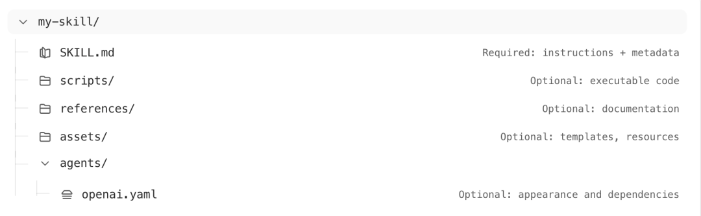

作用是把重复用的工作流打包起来，下次说几个关键词就能触发，不用每次写一大段提示词

比如你每次都要做"跑 lint、跑测试、生成变更摘要、格式化提交信息"这套操作，写一个 Skill 之后说"帮我准备提交"就自动跑完整套，你不是说要省事吗，就是这么省的

```
---name: prep-commitdescription: 提交前检查：跑 lint、测试，生成变更摘要，格式化 commit message---## 触发场景用户说"帮我准备提交"、"提交前检查"、"生成 commit"时使用## 步骤1. 执行 `pnpm lint && pnpm typecheck`，报错必须先修完2. 执行 `pnpm test`，失败的用例必须修完3. 分析 `git diff --staged` 总结改动4. 按照 Conventional Commits 格式生成 commit message5. 输出完整命令供用户确认后执行
```

写 Skill 最关键的是 description 写好，让 Codex 知道什么时候该用这个，触发词写得越接近用户真实会说的话越好

## MCP 接入外部工具

这个是高阶玩法，但能大幅扩展 Codex 能干的事

MCP（模型上下文协议）可以把外部系统接进来，比如 GitHub、Linear、Notion、数据库，Codex 就能直接拿到这些系统里的数据，不用你手动复制粘贴

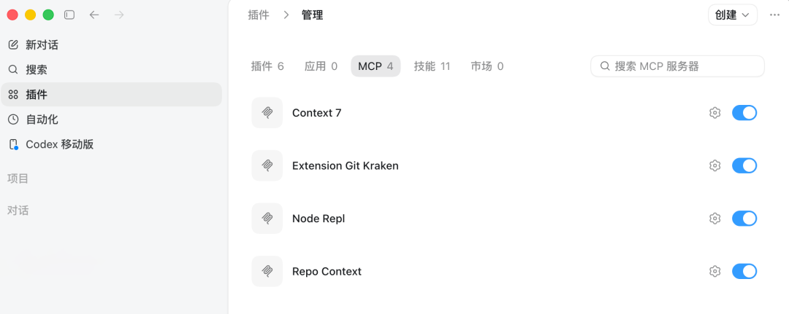

配置在
```
~/.codex/config.toml
```
里加 MCP 服务器地址，接上 GitHub 之后 Codex 可以直接查 PR、读 issue；接上 Linear 就能查任务、更新状态

没有 MCP 你只能把需要的信息手动贴给它，有 MCP 就能真正做到"处理一下这个 issue"然后它自己把 issue 详情读进来，这个感觉还是差挺多的

## 并行任务，用 worktree 隔离

这个是我最近用起来的，感觉挺顺的。。

需要同时推进几个不相关任务的时候，用 Git worktree 给每个任务开独立的工作目录和分支，让 Codex 在各自的 worktree 里跑，互相不影响。

比在同一个目录里来回切任务稳很多，也不用担心没提交的改动搞混

桌面 App 里这个比较直观，UI 里直接管理多个 worktree

## 一些实际踩过的坑

验证这步不能省。Codex 改完之后看起来没问题，但可能有细节错了，它不知道你的项目里有什么隐性约定。

让它改完之后必须跑测试、lint、typecheck，确认全过了再接受，别偷懒

上下文变脏了要开新会话。一个会话聊太久，之前的来回会把上下文搞乱，后面的输出质量会明显下降。

发现它开始跑偏或者重复犯同样的错，直接开新会话，别在旧的上继续磨

AGENTS.md 不要让 AI 帮你生成。上面说了，自动生成的会增加成本还降效果，自己手写，短一点好。

权限能收紧就收紧，
```
full-auto
```
很爽，但遇到不熟悉的代码库要谨慎，先
```
auto-edit
```
看看它想干啥，没问题了再放开

会话卡住了别磨叽。Codex 在某个问题上转圈转三四次还没解决，不要继续喂提示词，换个角度重新描述，或者换个更小的子任务切入

## 最后说两句

我用下来感觉 Codex 确实能打，尤其是把 「AGENTS.md」 和 「Skills」 这套配置搭起来之后，很多重复的事情真的能甩出去。。

但你别指望装上就能自动出活，配置这一套是要花时间的，你的角色要从「写代码的人」变成「审代码的人」，自己的判断和验证那一关不能省

现在每周超过 400 万开发者在用，不是没有原因的

有问题评论区聊，真实用过觉得坑的地方欢迎说，大家一起避坑


鹏磊新业务：https://shop.apiya.ai

质保 30 天不掉订阅，掉订阅，按天退差价


原文链接: [https://mp.weixin.qq.com/s/0PTVhjj_imYCquUYLXkOsA?from=industrynews&color_scheme=light#rd](https://mp.weixin.qq.com/s/0PTVhjj_imYCquUYLXkOsA?from=industrynews&color_scheme=light#rd)