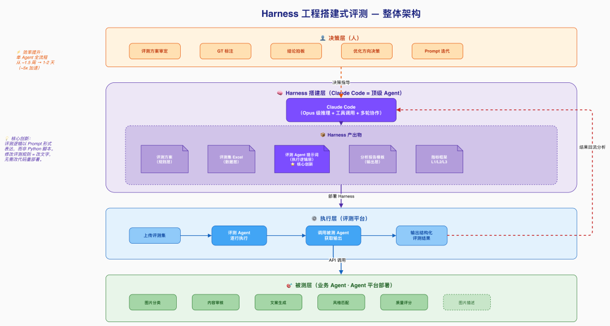
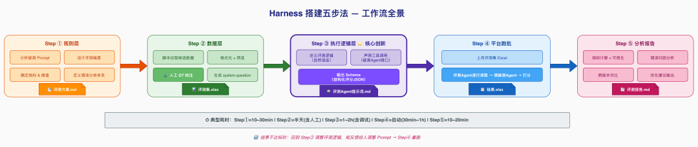
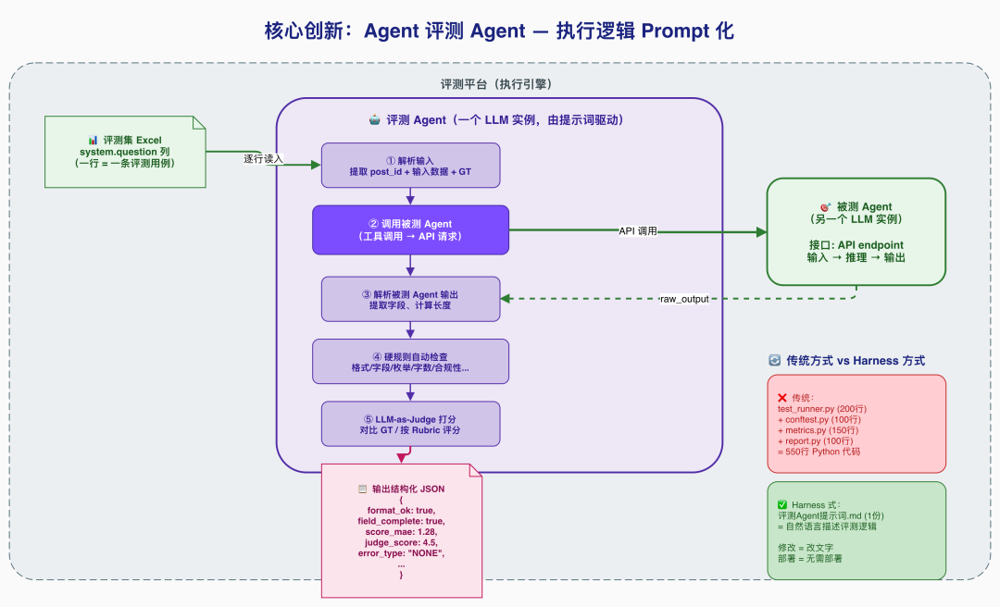

# 基于顶级 Agent（Claude Code）的 Harness 工程搭建式业务 Agent 评测方案

作者: 泊予

公众号: 阿里云开发者


阿里妹导读

用一个强 Agent 构建评测 Harness，系统性评测一群业务 Agent（文章内容基于作者个人技术实践与独立思考，旨在分享经验，仅代表个人观点。）

一、背景与问题

**1.1 业务场景**

某业务系统的内容生成链路由多个子 Agent 协作完成，每个 Agent 负责不同的任务（图片理解、内容审核、文案生成、风格匹配等）。这些 Agent 的 prompt 方案频繁迭代，每次变更后需要快速验证效果。

核心矛盾：业务 Agent 迭代快（天级），但传统评测工程搭建慢（周级）。

**1.2 传统评测的痛点**
痛点表现启动成本高搭建评测工程、写脚本、部署服务，还没开始评就花了一周人力密集标注数据集、写分析脚本、出报告，每个环节都需人工介入迭代慢prompt 改了一行，想看效果要等半天重新跑可复现性差评测逻辑散落在各种脚本和 Notebook 里指标不统一不同 Agent 各搞一套，无法横向对比工程化沉重每换一个 Agent 就要新写一套评测代码
**1.3 我们的解法：Harness 工程搭建式评测**

核心思路：用一个顶级 Agent（Claude Code）作为 Harness 工程的搭建者和运行者，系统性地对业务 Agent 进行评测。

## 什么是 "Harness 工程搭建式"？

传统做法：人写评测代码 → 跑脚本 → 看结果 → 改代码 → 再跑

Harness 式做法：顶级 Agent 搭建完整的评测骨架（harness），包括评测方案、数据集、评测逻辑（以 Agent 提示词形式表达）、分析流程。人只需提供被测对象和做关键决策。

## 为什么 Claude Code 是合适的 Harness 搭建者？
能力在 Harness 中的作用深度理解 prompt分析被测 Agent 的逻辑，设计针对性评测维度代码生成数据获取/处理脚本，评测辅助工具结构化输出评测方案文档、评测 Agent 提示词、评测报告多轮协作跨版本持续迭代（v1→v2→v3），保持上下文连贯数据分析对跑批结果做统计、归因、对比
关键洞察：评测 Harness 的本质是一套结构化的评估规则 + 执行流程。传统做法把它编码为 Python 脚本，而我们把它编码为 Agent 提示词——更灵活、更可读、更易迭代。

二、Harness 工程整体架构

**2.1 三层架构**



**2.2 Harness 搭建五步法**



**2.3 与传统评测工程的类比**
传统评测工程Harness 式评测变化```
test_config.yaml
```评测方案 .md规则从配置文件变为自然语言文档```
test_data.json
```评测集 Excel（system.question）数据格式统一，人可直接看懂```
test_runner.py
```
（数百行）评测 Agent 提示词（数千字）执行逻辑从代码变为 Prompt```
conftest.py
```
+ fixturesGT 标注 + ground_truth 字段预期结果内嵌在数据中```
report_generator.py
```CC 实时分析报告生成从脚本变为交互```
requirements.txt
```
+ CI评测平台一键跑批零部署成本
**2.4 职责分工**
角色职责不做什么人GT 标注、方案审核、最终决策不写评测脚本、不手动计算指标Claude CodeHarness 全链路搭建 + 结果分析不做批量推理主循环（交给平台）评测平台批量执行引擎（逐行调用）不做方案设计和指标汇总
三、统一评测指标框架

**3.1 三层指标体系**


在评测 6 个不同类型的 Agent 后，我们沉淀了一套通用的三层指标框架：

L1：通用基础指标（所有 Agent 必报）
指标含义为什么重要输出格式合规率JSON 可成功解析的比例下游消费方直接报错字段完整率必要字段均存在的比例缺字段 = 功能不可用
L2：按能力类型选用（从菜单中按需勾选）
能力类型指标适用场景分类判断分类准确率枚举值选择（如类型判断）二元决策召回率 / 精确率过滤 / 准入决策数值提取精确匹配率离散数值的精确提取连续评分MAE + 分档一致率内容质量打分文本生成LLM-as-Judge 1-5 分文案、描述等开放式输出
L3：Agent 专属指标（按需自定义）

每个 Agent 可在 L1+L2 基础上追加专有指标。例如：

●文案生成 Agent：违禁词清洁率、关键信息保留率

●风格匹配 Agent：不适用风格过滤合规率

**3.2 新 Agent 接入时的指标选型流程**

```
确定 Agent 涉及的能力类型↓从 L2 菜单勾选对应指标↓按需追加 L3 专属指标↓设定每个指标的目标阈值
```

四、Harness 各层的搭建方法

**4.1 规则层：评测方案设计（CC 角色：方案架构师）**

输入：被测 Agent 的 prompt 文件 + 业务上下文描述

CC 输出：

●完整的评测方案文档（含维度、指标、阈值、数据集要求、错误分类体系）

●边界用例建议（CC 分析 prompt 逻辑后主动提出应覆盖的场景）

实际效果：从一个 prompt 文件到一份完整评测方案，大约 10 分钟的交互。

示例对话：

```
人：这是新的内容审核 Agent 的 prompt，帮我设计评测方案CC：[分析 prompt] 我建议从以下维度评测：1. 格式合规（JSON可解析 + 字段完整）2. 过滤决策（召回率/精确率）3. 评分准确性（MAE + 分档一致率）需要覆盖的边界：少量输入/全过滤/极端分数...目标阈值建议：过滤精确率≥90%，MAE≤3...人：某个维度容易低估，阈值放宽到 MAE≤5CC：好的，已更新。[输出完整方案文档]
```

**4.2 数据层：黄金评测集构建（CC 角色：数据工程师）**

CC 做的事：

1.数据获取：编写脚本调用业务接口，批量拉取候选数据

2.数据处理：格式化为评测所需的 JSON 结构

3.GT 辅助标注：对分类型指标，CC 先给建议标注，人工复核

4.评测集打包：生成评测平台可直接消费的 Excel（含 system.question 列）

关键设计：system.question 列

每行数据都有一个system.question列，格式为 JSON，包含：

●被测 Agent 所需的全部输入字段

●ground_truth（人工标注的黄金答案）

评测 Agent 读取这一列即可获得输入和预期输出，无需额外配置。

```
{  "sample_id": 243,  "title": "XX品牌零食合集...",  "content": "最近发现了...",  "items": [...],  "ground_truth": {    "should_filter": false,    "total_score": 64,    "dimension_a": 22,    "dimension_b": 22,    "dimension_c": 20  }}
```

**4.3 执行逻辑层：评测 Agent 提示词**

**（CC 角色：Harness 工程师）**



这是整套方案最核心的创新：把传统的评测脚本（Python/Java）替换为一份评测 Agent 提示词。评测逻辑从"代码"变为"自然语言指令"，一个 Agent 来评测另一个 Agent。

评测 Agent 的工作流程：

```
读取 system.question（一行数据）       ↓调用被测 Agent（获取实际输出）       ↓解析输出 → 硬规则自动检查 → LLM 打分       ↓输出结构化 JSON（所有指标的计算结果）
```

评测 Agent 提示词的结构模板：

```
##角色定义你是一个严谨的 AI 评测专家，负责对「XXX」Agent 进行单条样本评测。##工具声明-{agentId}：调用被测 Agent，传入 XXX，返回原始输出##约束1.必须先调用工具获取 Agent 输出，再评测2.最终只输出一个合法 JSON3.数值统计必须精确计算，不可估算##工作流程1.解析输入（提取 post_id、输入数据、ground_truth）2.调用被测 Agent3.解析输出为 JSON4.硬规则自动检查（格式/字段/枚举/字数/...）5.LLM-as-Judge 打分（对比 ground_truth 或按评分标准）6.错误归因（FORMAT_ERROR / WRONG_CHOICE / ...）7.输出最终 JSON##输出 Schema{完整的 JSON schema 定义}
```

## 为什么要这样设计？
优势说明逻辑可读评测逻辑以自然语言写在提示词里，无需读代码快速迭代发现评测逻辑有误，改一段文字就行，不用改代码重部署统一执行所有 Agent 的评测逻辑结构一致，只改内容不改框架评测即文档提示词本身就是评测标准的完整说明
**4.4 输出层：结果分析与报告（CC 角色：数据分析师）**

典型流程：

```
人：跑批完了，结果在 XXX.xlsx，帮我出报告CC：[读取 Excel]- 总量 50 条，API 成功 46 条- 格式合规率 92%- 过滤 Recall 100% / Precision 18.2% ❌- 核心问题：模型将评分维度误用为过滤条件- 建议：修复 prompt 中过滤逻辑的边界定义[输出完整报告 Markdown]
```

CC 在分析中的增值：

1.自动识别 pattern：不只报数字，还归因（"18 条误过滤中，12 条都是把某评分维度<60 当过滤条件"）

2.跨批次对比：和上一版结果对比，明确哪些指标进步/退步

3.给出可操作建议：不只是"分数低"，而是"建议在 prompt 第三段加入明确的过滤条件边界"

五、关键实践经验

**5.1 评测集设计原则**
原则说明反例小而精20-55 条足够，覆盖所有边界场景200+ 条但都是简单 case分布均衡正/负例比例合理，边界场景必须有全是正例，评不出问题GT 可复核每条 GT 标注有据可查GT 靠感觉打分版本化管理评测集跟随被测 prompt 版本变更用 v1 评测集评 v3 prompt
**5.2 评测 Agent 提示词的迭代策略**

我们发现评测 Agent 本身也需要迭代（评测系统 bug ≠ 被测 Agent bug）：

常见评测系统 bug：
问题表现修复方式匹配逻辑过严语义等价的判定原因被判错GT⊆AI 超集匹配硬编码规则误报排除列表不全导致误判改为动态语义比对Token 截断输出超长被评测平台截断正则容错提取关键字段GT 覆盖缺口新增选项未在 GT 中体现更新 GT 标注
迭代节奏：

●v1：基本逻辑跑通（调试模式，带推导过程）

●v2：切换为跑批模式（纯 JSON 输出），修复首批发现的评测逻辑 bug

●v3+：基于实际结果持续调优（指标定义、匹配方式、容错逻辑）

**5.3 LLM-as-Judge 的使用心得**

对文本生成类 Agent（无法精确匹配 GT），我们用 LLM 做评委：

做法：在评测 Agent 提示词中嵌入评分标准（1-5 分 rubric），评测 Agent 同时扮演"执行者"和"评委"。

有效的 rubric 设计：

```
5 分：改写自然，传达原文单一核心意图，一次读完即懂4 分：基本达标，有轻微瑕疵但整体可读3 分：勉强可接受，但存在轻度问题2 分：明显问题：信息压缩过度或照抄原文1 分：严重错误：与输入无关或完全无法理解
```

注意事项：

●每个分值必须有具体、可区分的判定标准

●避免"好/较好/一般"这类主观描述

●分值之间的差异应该一个正常人也能判断

**5.4 "评测 Agent 调被测 Agent" 的技巧**

```
评测平台→ 调用评测 Agent（一个 LLM 实例）→ 评测 Agent 通过工具调用被测 Agent（另一个 LLM 实例）→ 获得被测 Agent 的原始输出→ 评测 Agent 对输出进行多维度评分→ 返回结构化评测 JSON
```

实际踩坑：
坑解法评测 Agent 忘记调用工具在 Constraints 中强调"必须先调用工具"工具参数传递失败在提示词中显式写明参数构造逻辑评测 Agent 重试耗尽 token添加"禁止重试"约束输出截断减少推导过程，只输出最终 JSON
六、效率对比


**6.1 时间投入**
阶段传统方式CC 协助加速比评测方案设计1-2 天10-30 分钟~10x评测集构建2-3 天半天（含人工标注）~5x评测脚本/Agent 开发2-3 天1-2 小时~10x跑批执行同（平台执行）同1x结果分析 + 报告半天-1天10-20 分钟~5x单 Agent 全流程~1.5 周~1-2 天~5x
**6.2 质量保障**

CC 方案不仅更快，分析质量往往更高：

●覆盖性：CC 不会遗漏任何数据行（人工数 50 行 Excel 容易看漏）

●一致性：同样的评测标准，CC 不会因为疲劳而评分漂移

●溯源性：每条评测结果都可追溯到 prompt 中的具体逻辑

●可复现：同一份评测 Agent 提示词 + 同一份评测集 = 结果可复现

七、适用场景与局限

**7.1 适用场景**
场景适合度原因Prompt 迭代验证⭐⭐⭐⭐⭐改 prompt → 跑批 → 看报告，闭环最快多 Agent 横向对比⭐⭐⭐⭐⭐统一指标框架 + 相同评测流程新 Agent 上线前验收⭐⭐⭐⭐系统性覆盖，不依赖人工抽检线上问题复盘⭐⭐⭐可快速构造问题用例验证
**7.2 局限与建议**
局限建议LLM-as-Judge 本身有偏差对关键决策用人工抽检兜底评测集规模受限（人工 GT）小而精优于大而糙，20-55 条覆盖边界即可依赖评测平台稳定性token 截断、API 超时需做容错首次搭建有学习成本第二个 Agent 起复用率很高
八、可复用资产

经过 6 个 Agent 的实战，已沉淀的可复用资产：
资产说明复用方式三层指标框架模板L1/L2/L3新 Agent 对照选用评测方案文档模板目标+维度+数据集+流程+错误分类填空式生成评测 Agent 提示词模板角色+工具+约束+工作流+输出 schema替换业务逻辑即可评测集 Excel 格式system.question 列规范标准化接入评测平台评测报告模板执行情况+指标汇总+问题分析+建议CC 自动填充错误分类体系FORMAT_ERROR/WRONG_CHOICE/...按需扩展Agent 平台调用经验接口格式/参数/踩坑记录减少试错
九、快速上手指南

想要复用这套方案的同学，按以下步骤操作：

# Step 1：准备工作（5 分钟）

●准备好被测 Agent 的 prompt 文件

●确认被测 Agent 的接口信息和调用方式

●在 Claude Code 中打开项目目录

# Step 2：设计评测方案（10-30 分钟）

```
告诉 CC：这是被测 Agent 的 prompt [粘贴/路径]，帮我设计评测方案。CC 会输出：维度、指标、阈值、数据集要求、错误分类。你来审核和调整。
```

# Step 3：构建评测集（半天，含人工标注）

```
告诉 CC：帮我从 XXX 接口拉取候选数据，格式化为评测集。CC 输出：候选数据 Excel。你来做 GT 标注（CC 可以先给 AI 建议，你复核）。CC 打包为带 system.question 列的最终评测集。
```

# Step 4：编写评测 Agent 提示词（1-2 小时）

```
告诉 CC：基于评测方案，帮我写评测 Agent 的提示词。CC 输出：完整的评测 Agent System Prompt。上传到评测平台，用 1-2 条数据调试。根据调试结果让 CC 修改（通常需要 2-3 轮）。
```

# Step 5：跑批 + 出报告（30 分钟）

```
上传评测集到平台 → 等待跑批完成。下载结果 Excel → 告诉 CC：帮我分析这份结果。CC 输出：完整评测报告 + 优化建议。
```

十、总结

**10.1 核心理念**

一句话：用一个强 Agent（Claude Code）搭建评测 Harness 工程，将评测逻辑从"代码"升级为"Prompt"，实现业务 Agent 的系统性快速评测。

范式转变：

```
传统：人写评测代码 → 跑脚本 → 人看结果 → 人改代码 → 再跑（周级启动，天级迭代）Harness式：CC搭建Harness → 平台跑批 → CC分析 → CC调整Harness → 再跑（天级启动，小时级迭代）
```

**10.2 核心收益**
收益具体表现从周到天单 Agent 评测全流程从 ~1.5 周压缩到 1-2 天一人成军一个人 + Claude Code 完成原来需要测试开发 + 数据标注 + 分析师的工作可持续迭代每次 prompt 变更后的验证成本极低（改提示词 → 重跑 → 看报告）零部署评测逻辑是 Prompt 而非代码，无需 CI/CD，改完即生效方法论沉淀指标框架 + Agent 提示词模板 + 错误分类体系，可迁移复用到任何 Agent
**10.3 适用场景**

●任何有 Agent/LLM 应用、需要系统性评测能力的业务组

●Prompt 迭代频繁（天级/周级），需要快速验证效果

●多 Agent 协作系统，需要分模块独立评测

**10.4 开放讨论**
问题思考评测 Agent 自身的准确性如何保证？调试期用 2-3 条数据人工核对；正式跑前先小批次验证能否替代人工测试？不能完全替代，但可以覆盖 80%+ 的重复劳动与 Evals 框架（OpenAI）的关系？理念类似，但我们的 Harness 更轻量、更灵活、无需工程部署能否跨团队复用？可以——三层指标框架 + 评测 Agent 模板 + 工作流模板，换被测对象即可
十一、最后

感谢对营销消费清单 AI 项目评测专项给予大力支持和鼓励的各位老师：

团队战友：岑坚、茉书、沈芃、飘飘、鲜佳伟等同学

协作兄弟：危素、朱八、墨謧、临汀、图兔、书屹、深空等同学


原文链接: [https://mp.weixin.qq.com/s/n9zkbKTi3Q1j-L2vgmO1Vw?from=industrynews&color_scheme=light#rd](https://mp.weixin.qq.com/s/n9zkbKTi3Q1j-L2vgmO1Vw?from=industrynews&color_scheme=light#rd)