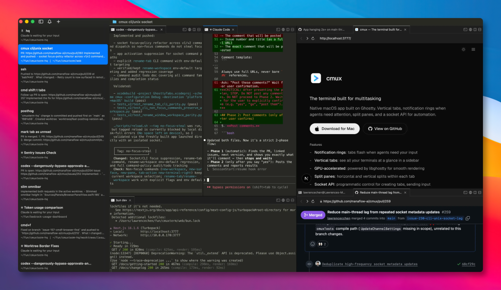
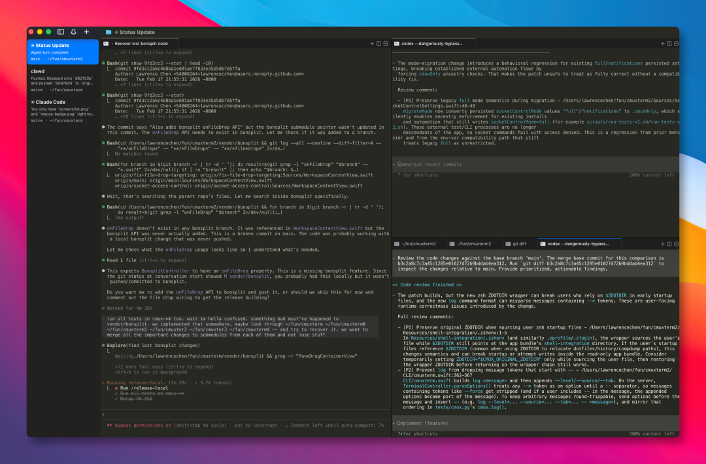
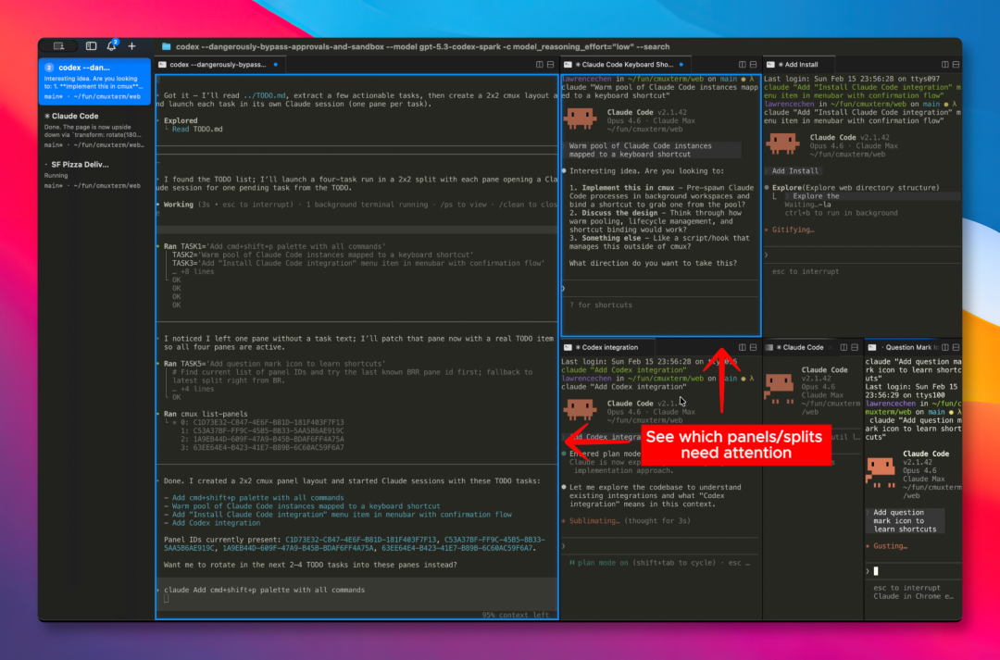
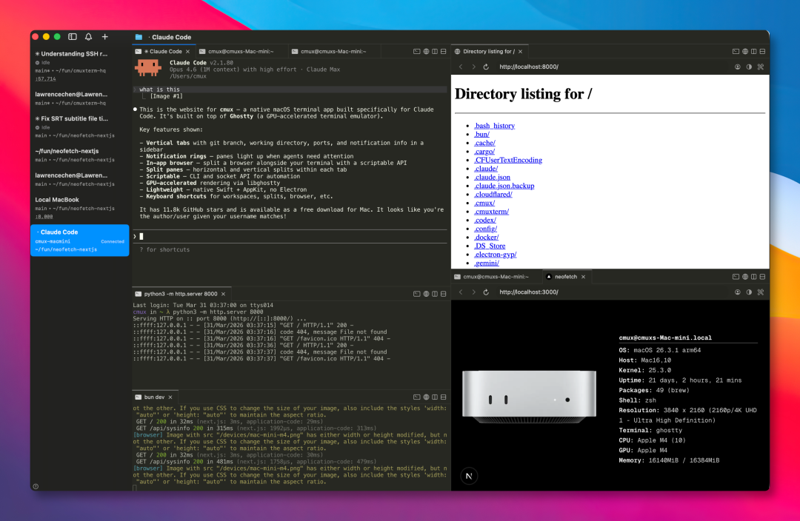
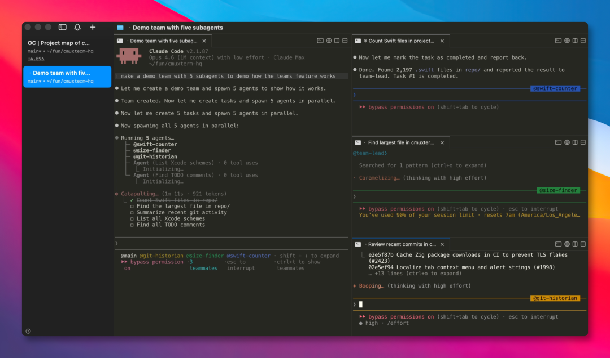

# 专为 Claude Code 而生的终端，开源了！

作者: 小 G

公众号: GitHubDaily


现在 Claude Code 和 Codex 已是不少人日常工作中，重度使用的 Agent 编程工具了。

经常会同时打开五六个会话，跑几个任务， 满屏 Warp 终端 Tab，连标题都挤得看不清，还得经常切来切去确认进度。

有时某个 Agent 卡主时，弹出一条系统通知 「Claude is waiting for your input」，还真不知道哪个 Agent，只能一个个点开排查。

最近偶然在 GitHub 上看到了一个专为 AI Agent 设计的终端工具： **cmux** ，已狂揽 21000+ Star。



在 README 文件上看到，作者为什么做这个工具，原因与前面所说类似。

他平时大量并行跑 Claude Code 和 Codex 各种任务，仅仅靠 macOS 原生通知盯着进度。

但是从通知上看，没有任何上下文，标签页一多也认不出来，体验非常糟糕。

他也曾经试过几款编程协作工具，可大多是 Electron 或 Tauri 应用，性能上并不满意。

而这类 GUI 工具，往往会把人锁死在它们自己的工作流里。

所以他干脆用 Swift 和 AppKit，写了一个原生的 macOS 应用。

回到产品本身，cmux 最核心的两块，一个是 **侧边栏** ，另一个 **通知系统** 。

侧边栏用的是垂直标签页，每个工作区会直接显示 Git 分支、关联 PR 的状态和编号、工作目录、监听端口，还有最新的那条通知文本。

信息密度直接拉满，而且一眼就知道每个会话的近况，不会因为任务多而掩盖了看不到进度。



另外，就是通知系统，这个则解决了开头提及到的排查麻烦问题。

当某个 Agent 的执行任务卡主，需要等我们确认时，窗口会自动亮起蓝色光环，对应的侧边栏标签页也会高亮。

在众多的分屏和标签页之间，哪个需要我们确认，一眼就能认出来。还可以通过快捷键，快速跳到最新的未读通知里。



除了这两个核心功能外，cmux 还 **内置一个浏览器** ，可以在终端旁边新打开一个窗口。

用它可以让 Agent 抓取页面的无障碍树快照、获取元素引用、执行点击、填写表单、运行 JS。

这样一来，Claude Code 就能直接和我们本地的开发服务器打交道，在调试的时候，可以省去来回切窗口。

不止浏览器，工作区、分屏、标签、按键这些操作，都能通过它的 CLI 和 socket API 脚本化控制。



还有一个功能叫 **Claude Code Teams** ，只需运行一条命令，就能启动 Claude Code 队友模式。

多个 Agent 以原生分割窗格的形式并排出现，侧边栏同步显示各自的元数据和通知状态。

不需要 tmux，不需要额外配置。

除此之外，cmux 就连 SSH 场景也覆盖，专门为远程机器创建工作区。

浏览器窗格通过远程网络路由，localhost 可直接可用。把图片拖进远程会话，自动走 scp 上传，不用手动敲命令。



至于如何安装，目前仅支持 macOS 系统，可使用 Hombrew 命令进行安装：

```
brew install --cask cmux
```

另外在 Release 发布页面提供了
```
.dmg
```
安装包，也可以开箱即用。


再提一句，cmux 是基于 Ghostty 二次开发。如果本地有装 Ghostty，可直接应用原来的主题、字体、颜色 等配置。

### 写在最后

今年 Agent 编程工具集中爆发，但和 Agent 之间的协作到底怎样才顺手。

没人敢说自己摸清了，那些做闭源产品的团队也一样，每个人都有各自的需求。

而 cmux 提供了终端、浏览器、通知、工作区、分割、标签页，以及可控制这一切的 CLI。

与其在等待某个完善的产品出现，不如用 cmux 自己搭积木，构建专属自己的高效工作流。

如果我们每天都在跑多个 Claude Code session，这个工具值得试一下。

如果我们经常在并行跑多个 Agent 任务，这款终端工具值得安装一试。

GitHub 项目地址：https://github.com/manaflow-ai/cmux

今天的分享到此结束，感谢大家抽空阅读，我们下期再见，Respect！


原文链接: [https://mp.weixin.qq.com/s/LyoEocZDJEAruCopbUD9kA?from=industrynews&color_scheme=light#rd](https://mp.weixin.qq.com/s/LyoEocZDJEAruCopbUD9kA?from=industrynews&color_scheme=light#rd)