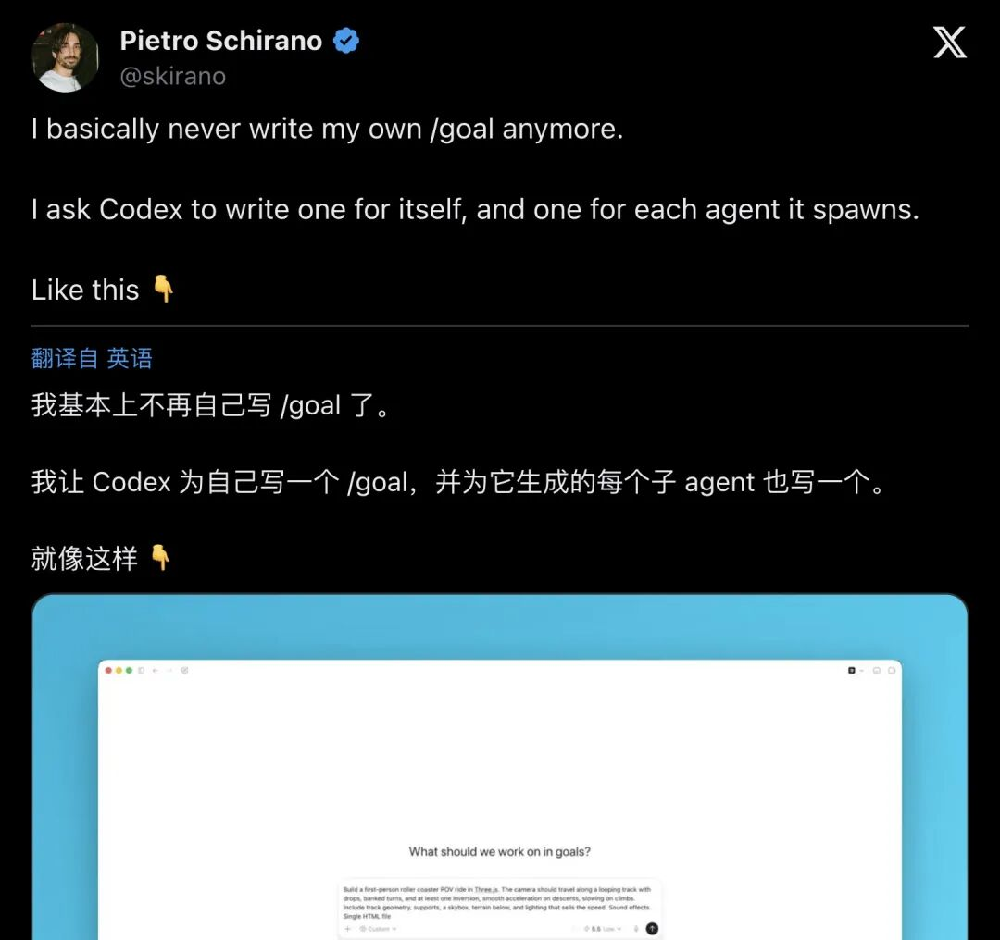
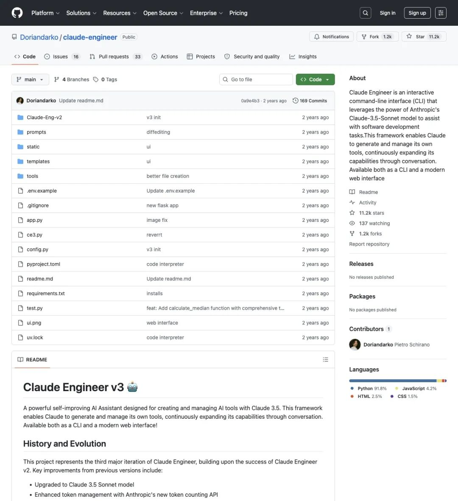
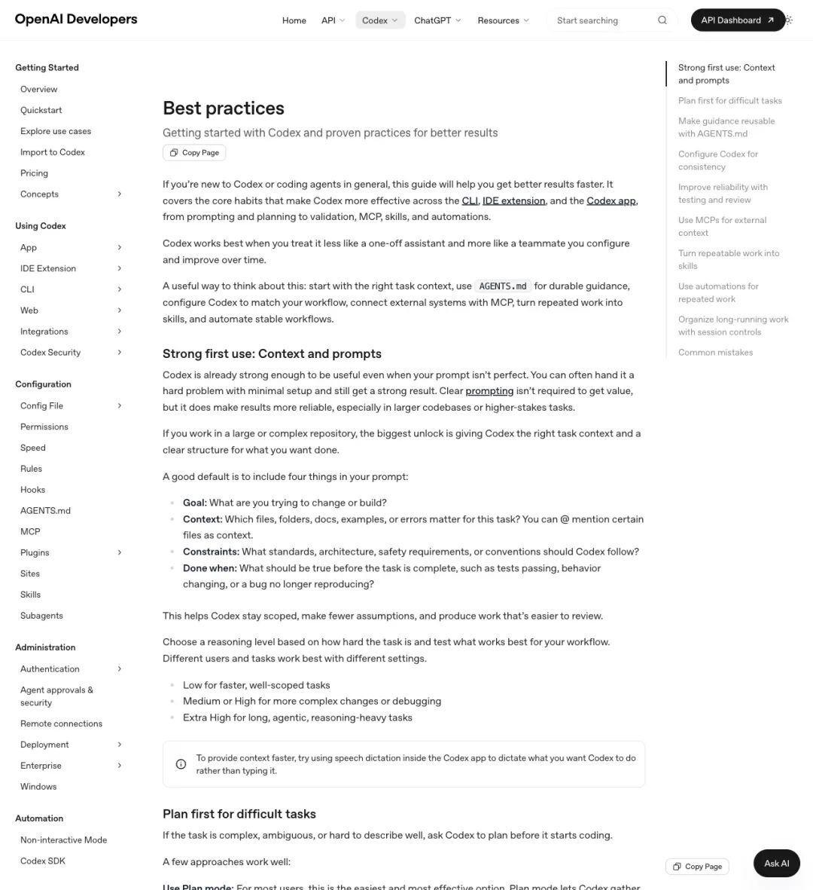
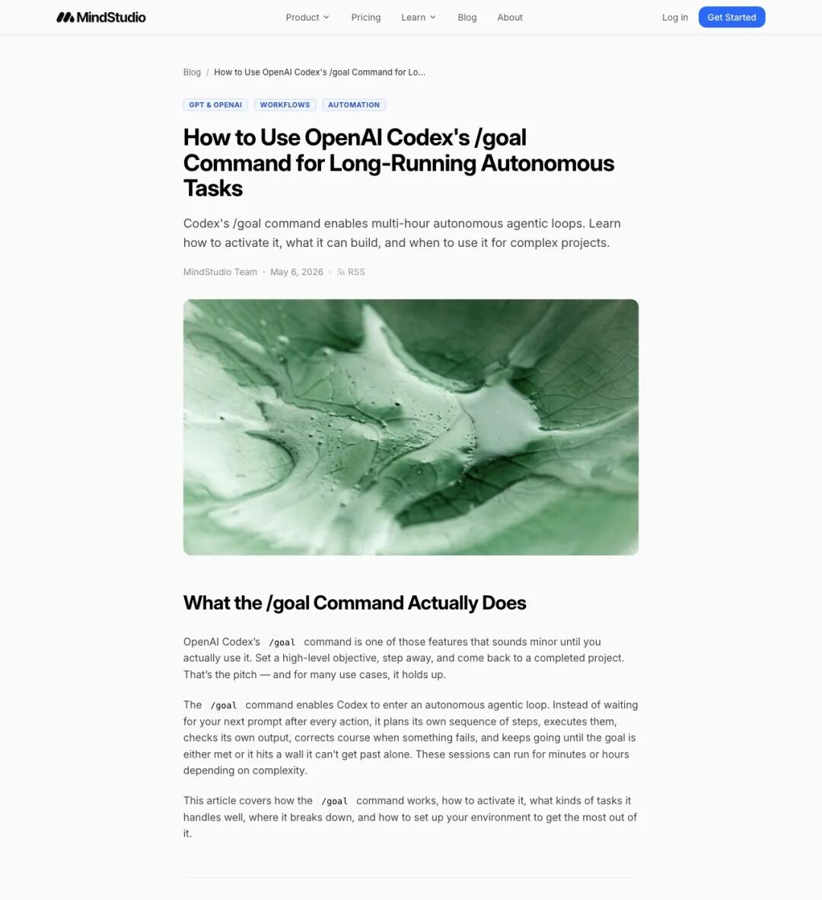
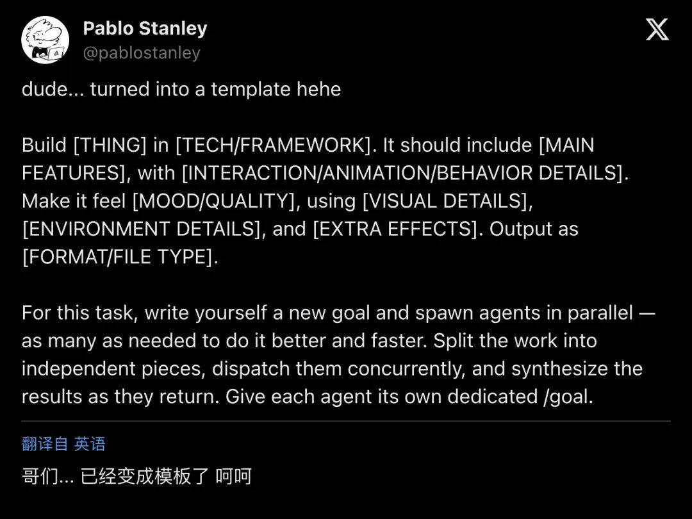

# 「我不再手写 /goal 了」Claude Engineer 作者扔出核弹级演示：让 Codex 自己给 AI 写目标，再分发给子 Agent！45 万人围观

作者: 智灵纪元

公众号: 智灵纪元

导读
2026 年 6 月 14 日，前 Anthropic 工程师、Claude Engineer 作者 Pietro Schirano 在 X 上发了一条帖，48 小时内被 45 万人围观，近四千人点了收藏。他的核心操作：不再自己写 Codex 的 /goal 指令，而是让 Codex 为它自己以及它生成的每一个子 Agent 分别编写专属 /goal。OpenAI Codex 团队当场送了 10 倍额度。

## 一条帖，改写了 /goal 的打开方式

6 月 14 日下午，Pietro Schirano（@skirano）发了一条帖，正文不绕弯子：
"I basically never write my own /goal anymore. I ask Codex to write one for itself, and one for each agent it spawns."
「我现在基本不自己写 /goal 了。我让 Codex 为它自己写一个，再为它生成的每一个 Agent 各写一个。」

配了一段 30 秒的视频演示：用户给一个高层意图，Codex 自动生成顶层目标加多个子 Agent 专属目标，然后并行分发、执行、合成。没有中间步骤，没有反复调 prompt 的折腾。

▲ Pietro Schirano 的原帖。48 小时内 45 万浏览、2673 次点赞、3774 次收藏——收藏数是点赞数的 1.4 倍

数据值得看细节：131 条回复、159 次转发、2673 赞、3774 收藏。在 X 上，收藏远多于点赞——人们把这条帖当工具书存进了自己的知识库，3774 个开发者做了这个动作。它被当成操作手册来用。

## 发帖这个人，自己就是 Agent 工具的老玩家

Pietro Schirano 的履历拉出来，每一项都在为这条帖增加分量。

Facebook、Uber、Brex 的设计/工程背景打底。后来他创建了开源项目 **Claude Engineer** ——一个基于 Claude 3.5 Sonnet 的交互式 CLI agentic coding 工具。这个项目登上了 IBM 的 "Mixture of Experts" 播客，被当作“编码未来”的案例讨论，也直接帮他敲开了 **Anthropic** 的大门。

进 Anthropic 工作一阵后，他出来做了 **MagicPath** ——一个人类与 Agent 共享的无限多人协作画布。2026 年 6 月初，MagicPath 成为 **Codex 官方插件** ，与 OpenAI 合作，让 Codex 可以在内置浏览器里直接操作无限 canvas：导入仓库 UI、理解组件与设计系统、生成可交互的功能原型。

▲ Pietro 早期作品 Claude Engineer 的 GitHub 仓库。这个项目为他打开了 Anthropic 的大门，也奠定了他对 agent 工具的深度理解

所以别把他当成刚接触 Codex 的新用户。他是从 CLI agent 做到视觉协同平台、再从平台倒推工作流的人。他说“不自写 /goal 了”，这句话的重音来自他亲手建过 agent 工具、也亲手用过所有主流方案。

## /goal 凭什么重要

先把基础概念拆清楚：2026 年的 Codex 不是 2021 年那个老代码生成模型 API。它是一套完整的 agentic 编码系统，支持 CLI、桌面 App、IDE 扩展、内置浏览器，内建了 plan-act-test 自纠错的自主循环。OpenAI 自己 85% 的员工每周都在用。

**/goal** 是这套系统里最关键的一条命令。

普通 prompt 是一次性对话：你问，它答。/plan 是先规划再动手：搜集上下文、问澄清问题、出计划、等你审批。

/goal 做的事完全不一样：它设置一个 **持久化的高层目标** ，然后 Codex 进入循环——拆解步骤、写代码、跑 shell 命令、读报错、自己修、自己测，直到目标达成或遇到无法逾越的障碍。中途可以暂停、resume、清掉重来。在 full-auto 模式下，你走开几小时，回来看到一个自测通过的 PR。已经有真实案例：有人 18 小时无人值守跑完了 14 个 feature。

OpenAI 官方最佳实践文档里写得明确：每个 /goal 的 prompt 应包含四个要素—— **Goal** （要构建/改变什么）、 **Context** （哪些文件、文档、错误相关）、 **Constraints** （架构、规范、安全要求）、 **Done when** （什么条件算完成）。

▲ OpenAI 官方文档推荐的 Goal / Context / Constraints / Done when 四要素结构

▲ 第三方教程对 /goal 自主循环的拆解：full-auto 模式、git branch 安全实践、适用场景与翻车场景

这就引出一个很直觉的问题：既然官方说要把 Goal 写清楚，为什么不由最懂自己能力边界的 Codex 来写？

## 认知卸载：人定意图，AI 做任务工程

Pietro 的手法演进路径，从他自己的帖子里能拼出来：

* **早期** 
：手动写 prompt，反复调试。
* **6 月 11 日前后** 
：用 Fable（当时最强模型）写详尽的 plan.md，把文件路径丢给 Codex 执行 /goal。
* **6 月 14 日** 
：连 plan 和 goal 都让 Codex 自己生成，并且为它 fork 出来的每一个子 Agent 生成专用 /goal。

第三步才是质变。

Codex 清楚自己能访问什么工具、当前上下文窗口还剩多少、在这个 repo 上的历史表现、哪些坑踩过。它生成的目标和子目标，比人类“猜”出来的更贴合实际执行路径。

人不再做“为 Agent 写 spec”的苦力活——这层认知负担被卸给了 Agent。人只需要给出意图和高层约束。剩下的目标拆解、并行分派、合成验证，Codex 自己完成。

这跟程序员带团队做项目的逻辑一样：你不需要替每个工程师写他们的任务卡。告诉他们目标是什么、约束是什么，让他们自己拆。

只不过现在，“工程师”是 AI。

## Pablo 的模板，让这个手法可以一键复用

如果说 Pietro 的视频是“秀”，那设计师 **Pablo Stanley** 的回复就是“给”。

Pablo 直接在评论区扔出一个结构化模板：
"Build [THING] in [TECH]. MAIN FEATURES: ... INTERACTION DETAILS: ... MOOD: ... VISUAL: ... ENVIRONMENT: ... FORMAT: ..."
然后附上那条关键指令：
"For this task, write yourself a new goal and spawn agents in parallel — as many as needed to do it better and faster. Split the work into independent pieces, dispatch them concurrently, and synthesize the results as they return. Give each agent its own dedicated /goal."
「为这个任务，给你自己写一个新 goal，并行生成 Agent——需要多少就生成多少，更快更好地完成。把工作拆成相互独立的部分，并发分派，随结果返回实时合成。给每个 Agent 一个专属 /goal。」

▲ Pablo Stanley 的模板：Build 结构化输入 + 让 Codex 自写 goal 并并行分派的显式指令

Pietro 在下面回了一个词："Amazing."

社区迅速跟进。有人把模板做成可复用的 skill，扩展为完整的 parallel-goals-for-a-task 流程——filled brief → goal setup → parallel dispatch → synthesis。日语社区快速出了解读帖，标题就叫「自己设定目标的时代，结束了」。

## OpenAI 官方当场盖章

这个用法不只社区认。6 月初，OpenAI Codex 团队的 **Tibo** （@thsottiaux）发起了一个活动：每天选一个人，送一个月的 10 倍使用额度。Pietro 是第一个。
"First one is @skirano. Enjoy the 10X and keep building magic. Who's next?"
「第一位是 @skirano。享受 10 倍额度，继续创造魔法。下一位是谁？」

▲ OpenAI Codex 团队成员 Tibo 公开赠送 Pietro 10 倍额度

Tibo 亲自把 10x 额度送给 Pietro，这个动作的实际含义是“我们内部也在推这套用法”——把它理解成 PR 表演就错了。

官方文档对 subagents、AGENTS.md、skills 的强调，与 Pietro 的做法完全咬合：subagents 做并行有界任务，主 agent 负责合成和冲突消解；AGENTS.md 提供持久指导；skills 封装可复用流程。Pietro 只是把这些官方最佳实践拧成了一条端到端的工作流。

## 从“写 prompt”到“让 AI 写 prompt”

这件事底层的信号更值得关注。

agentic coding 发展到当前阶段，人类瓶颈已经从“写代码”移到了“写好目标与拆分”。/goal 的存在本身就是对这个瓶颈的回应——它把一个对话变成一套持续运行的循环，让 AI 能自己管自己。

Pietro 往前多走了一步：/goal 是控制这个循环的入口，那这个入口本身也可以由 AI 来生成。

社区有人总结得很准：prompt space is underexplored——与其为 agent 写 prompt 和循环，不如写 prompt 和循环让 agent 自己生成 prompt。

人类的认知带宽从“任务工程”细节里释放出来，集中到“意图设定”层面。这个做法指向的是认知效率的重新分配——跟偷懒完全是两回事。

当然，这个手法有边界。用户仍然需要一个清晰的顶层意图——如果自己都不知道想要什么，Codex 写出来的 goal 也会漂移。长时程 session 的 token 成本是实打实的（Pietro 自己说平均 5-10 小时一个 session）。有清晰验证面（测试套件、行为断言）的 scoped 任务效果最好；超级模糊的长期目标，目前还不是它的主战场。

但这些边界不改核心结论： **让最懂执行者的 AI 自己写目标，正在从 power user 的独家技巧变成新的默认姿势。**

MagicPath 的 canvas 让这种 swarm 式工作流从“终端日志”变成了可以实时看到、参与、迭代的活原型。Codex 在 canvas 里改 UI、加动画、连状态，人类随时介入或 review。不再是一个黑箱吐代码——一群 Agent 在一个共享画布上协作，人看着就行。

从 Claude Engineer 到 Anthropic，再到 MagicPath，再到 Codex 官方插件，这条线串起来的是一股持续趋势：agent 工具从“单次单步”走向“长时程自主 + 可视化协同”。Pietro 这次演示的“AI 替 AI 写 /goal”，只是这条趋势上最新、也最直观的一个切片。

— END —

— END —

原文链接: [https://mp.weixin.qq.com/s/BHE-PBYB5CSnvuHMmmeJjQ?from=industrynews&color_scheme=light#rd](https://mp.weixin.qq.com/s/BHE-PBYB5CSnvuHMmmeJjQ?from=industrynews&color_scheme=light#rd)