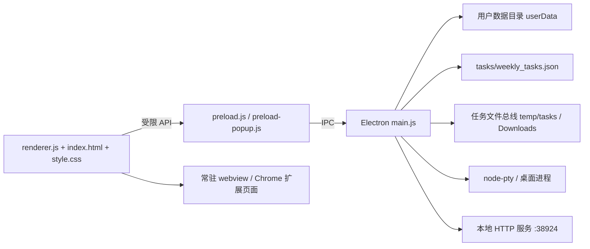

# Personal Workbench 项目手册

> 这是 `personal-workbench` 的当前事实主文档。它描述产品边界、功能、架构、数据、测试、版本状态和维护规则。规格书、审查报告与交接文档可以补充历史背景，但与本手册冲突时，必须先核对代码和测试，再更新本手册。

- 最后更新：2026-07-16
- 项目类型：Windows Electron 桌面应用
- 代码入口：`main.js`、`preload.js`、`renderer.js`
- 当前工作分支：`codex/personal-workbench-redesign`
- 上一稳定基线：`personal-workbench-stable-2026-07-15`
- 本次检查点：`personal-workbench-stable-2026-07-16`

## 1. 新成员 / 新模型先读什么

按以下顺序建立上下文：

1. 本文件：了解当前系统，而不是只看历史计划。
2. `personal-workbench/README.md`：了解启动方式和用户可见功能。
3. `personal-workbench/package.json`：了解脚本、依赖和打包入口。
4. `personal-workbench/regression-checklist.md`：了解已修复缺陷、仍需人工验证的风险和验收标准。
5. 与当前任务直接相关的代码和测试；不要为了“熟悉项目”一次性阅读整个 `renderer.js` 或 `main.js`。
6. 根目录的 `personal-workbench-roadmap.md`、`personal-workbench-automation-plan.md` 和 `decisions/`：只在需要路线图或历史决策时阅读。

首次运行：

```powershell
cd personal-workbench
npm install
npm start
```

Windows 下如果通过包装器启动导致 `node-pty` 报 `AttachConsole failed`，使用独立 Electron 进程：

```powershell
Start-Process .\node_modules\.bin\electron.cmd -ArgumentList "." -WorkingDirectory (Get-Location)
```

## 2. 项目定位与边界

Personal Workbench 是一个“任务优先”的桌面工作台：把常驻网页、企业微信/平台页面、Chrome 扩展、终端、本地应用、任务文件和周报整理到一个 Electron 窗口中。

### 目标

- 保留网页登录态、表单状态和滚动位置。
- 用任务状态和文件夹把网页操作产生的文件归档到正确位置。
- 给能力训练类任务提供准备、测试、评估、报告和结束的可见流程。
- 用卡片舱和平台注入辅助重复填写，但不把外部平台完全自动化当作前提。
- 让工作结果可复盘：任务、文件、卡片复制状态和周报各自持久化。

### 非目标

- 不在工作台内实现企业微信或腾讯文档的服务端 API 集成；周报首版通过富文本剪贴板粘贴到企业微信文档。
- 不把用户本地任务数据、登录 Cookie、扩展路径或个人配置提交到 Git。
- 不把所有网页都当成可信来源；普通外网标签不能拿到工作台会话 Token。

## 3. 当前功能状态

| 模块 | 当前状态 | 入口 / 主要代码 |
|---|---|---|
| 常驻网页标签 | 已实现 | `renderer.js` 的标签、webview、分屏逻辑 |
| 本地 PowerShell 终端 | 已实现 | `main.js` 的 `node-pty` IPC、`renderer.js` 的 xterm |
| CLI / 桌面应用标签 | 已实现 | `main.js` 的 CLI PTY 与桌面进程管理 |
| 任务中心 | 已实现 | `renderer.js` 的任务卡、任务表单和任务状态 |
| 五步任务流水线 | 已实现 | `PIPELINE_STEPS`、任务舱、下载/报告事件 |
| 任务暂停、继续、子任务 | 已实现并有 E2E | `startTaskAutomation`、`pauseTaskAutomation`、`resumeTaskAutomation` |
| 文件总线 | 已实现 | 下载归档、上传注入、任务文件托盘、图片裁切 |
| `cards.md` 卡片舱 | 已实现并有 E2E | `renderRailCards`、卡片字段复制和持久化 |
| Chrome 扩展兼容层 | 已实现，依赖真实扩展与登录态 | `preload-popup.js`、扩展兼容 IPC |
| 平台字段试注入 | 预研 / 辅助能力 | `platformFieldMap`、`platform:test-inject` |
| 主题 | 已实现 | `sky`、`morning`、`night` |
| 周报中心首版 | 已实现 | `__weeklyreport__`、周报编辑器和预览 |
| 直接上传企业微信/腾讯文档 | 未实现 | 当前使用 HTML + 纯文本剪贴板 |

### 周报中心首版行为

- 从当前任务生成一份独立的周报快照，不直接修改任务记录。
- 表格字段为：课程名称、学校名称、任务名称、任务进度、任务数量、任务状态、本周建议情况描述。
- 支持手动添加/删除表格行、非量化事项和产品需求 / Bug / 卡点 / 疑问。
- 周报按 `YYYY-Www` 保存；标题、姓名和日期范围可编辑。
- 复制操作同时写入纯文本和 HTML，适合粘贴到企业微信文档。
- 支持导出 HTML 和 Markdown；导出时由主进程打开系统保存对话框。
- 周报数据保存到 Electron `userData/weekly-reports.json`，与 `tasks/weekly_tasks.json` 分离，并有备份与临时文件原子替换。

## 4. 系统架构



### 进程职责

#### `main.js`：主进程与系统边界

- 创建主窗口，配置 `contextIsolation: true`、`nodeIntegration: false` 和 `webviewTag`。
- 管理 Electron session、下载、文件系统、任务目录、本地 HTTP 服务、终端 PTY、CLI 和桌面应用进程。
- 负责所有需要系统权限的操作：读写文件、打开目录、系统文件选择器、剪贴板、导出文件。
- 通过 IPC 验证任务路径、扩展能力和本地服务 Token，不把 Node.js 直接暴露给网页。

#### `preload.js`：主窗口的最小桥接层

- 使用 `contextBridge.exposeInMainWorld("workbench", ...)` 暴露白名单 API。
- 任务、周报、偏好、扩展、终端、上传、下载和窗口操作都应经过这里。
- 新增 IPC 时必须同时检查：调用方是否真的需要、参数是否在主进程验证、是否有回归测试。

#### `preload-popup.js`：扩展页面兼容层

- 为嵌入扩展提供必要的 runtime、storage、tabs、cookies 或平台 API 代理。
- 扩展能力由 manifest 权限、host permission 和发送方扩展 ID 共同决定。
- 不要为了修复一个扩展页面而放宽所有扩展或所有网页的权限。

#### `renderer.js`：界面状态与业务编排

- 管理标签、内置任务中心、内置周报中心、任务状态、任务舱、卡片复制状态和 UI 事件。
- 任务数据和周报数据都通过 `window.workbench` 读写；renderer 不直接访问文件系统。
- `TASK_CENTER_ID` 和 `WEEKLY_REPORT_ID` 是内置视图 ID，不能当成普通网页标签创建 webview。

## 5. 关键数据与持久化

### 5.1 版本库中的文件

| 路径 | 作用 | 提交规则 |
|---|---|---|
| `personal-workbench/*.js`、`index.html`、`style.css` | 应用源码 | 应提交 |
| `personal-workbench/tests/` | 静态和 Electron 回归测试 | 应提交 |
| `personal-workbench/docs/PROJECT_HANDBOOK.md` | 当前项目主手册 | 每次功能/缺陷变化维护 |
| `personal-workbench/regression-checklist.md` | 回归标准和风险登记 | 修复/发现缺陷时维护 |
| `tasks/weekly_tasks.json` | 用户本地任务数据 | 默认不提交，不覆盖用户改动 |
| `personal-workbench/temp/` | 运行时产物 | 不提交 |

### 5.2 用户数据目录 `app.getPath("userData")`

以下文件由应用运行时产生，不属于源码版本：

- `weekly-reports.json`：周报快照。
- `backups/weekly_tasks.json`、`backups/weekly-reports.json`：写入前备份。
- `workbench-prefs.json`：主题、裁切、待办路径、平台字段映射等偏好。
- `extensions.json`：扩展配置；可能包含本机路径，只能留在本机。
- `extension-debug.log`：扩展兼容调试日志。
- Electron session、缓存和其他运行时文件。

测试通过以下环境变量隔离这些数据：

```text
PERSONAL_WORKBENCH_USER_DATA
PERSONAL_WORKBENCH_WEEKLY_TASKS_PATH
PERSONAL_WORKBENCH_DOWNLOAD_ROOT
```

### 5.3 任务记录的核心字段

任务记录以 `tasks/weekly_tasks.json` 的数组保存，核心字段包括：

```json
{
  "id": "task-id",
  "school": "学校",
  "course": "课程",
  "taskType": "capability-setup",
  "quantity": 1,
  "status": "pending",
  "subtasks": [{ "index": 1, "status": "pending" }],
  "step": "testing",
  "taskFolder": "",
  "chatLogPath": "",
  "reportPath": ""
}
```

任务状态包括 `pending`、`running`、`evaluating`、`paused`、`unsubmitted`、`completed`。应用重启时会把未恢复的 `running/evaluating` 任务收敛为 `paused`，避免假装仍在执行。

### 5.4 周报记录的核心字段

周报是任务的独立快照，不把编辑后的周报字段写回任务：

```json
{
  "id": "report-2026-W29",
  "periodKey": "2026-W29",
  "title": "M7W2周报",
  "author": "",
  "dateRange": "7月13日 - 7月19日",
  "rows": [{
    "sourceTaskId": "task-id",
    "course": "",
    "school": "",
    "taskName": "能力训练搭建",
    "progress": "100%",
    "quantity": "1",
    "status": "已完成",
    "note": ""
  }],
  "nonQuantified": [{ "text": "" }],
  "issues": [{ "text": "" }],
  "createdAt": "ISO-8601",
  "updatedAt": "ISO-8601"
}
```

默认状态映射：`pending` → 未开始，`running/evaluating` → 进行中，`paused` → 已暂停，`unsubmitted` → 已完成、未提交，`completed` → 已完成。用户在周报中手动改状态不会改变任务状态。

## 6. 任务与文件数据流

1. 用户在任务中心创建或导入任务。
2. 开始任务后，主进程在下载根目录下建立任务文件夹，并通过 `task:active-update` 注册当前任务。
3. 符合来源域名和流水线步骤的下载进入任务文件夹；没有活动任务时回到系统 Downloads 行为。
4. `fs.watch` 观察活动任务文件夹，任务舱读取 `dialogue.json`、`eval_report.pdf`、`cards.md` 等产物。
5. 上传通过 CDP 文件选择器拦截，把已选文件注入网页；系统文件选择器作为降级路径。
6. 任务结束后按用户选择清理临时任务目录；任务记录保留必要的状态和产物路径。
7. 周报中心只读取当前任务，生成可编辑快照；保存周报不会改变第 1 至 6 步的数据。

## 7. 安全边界

- 主窗口使用 context isolation，普通 webview 不拥有 Node.js 能力。
- 工作台 session Token 只允许注入本地项目或 `localhost` / `127.0.0.1` 页面；普通外网网页不能读取。
- 本地 HTTP 服务默认监听 `38924`，敏感路由需要 session Token。
- `local-apps` 静态服务和 `temp/tasks` IPC 必须进行绝对路径边界检查，不能只用字符串前缀比较。
- 扩展 API 按扩展 ID、manifest 权限和 host permission 门控；修复扩展问题时不能把权限扩大到 `<all_urls>`。
- 所有用户路径、Cookie、Token、扩展目录和调试日志都不应写进 Markdown、测试夹具或 Git 提交。

安全相关代码变更必须至少运行静态安全回归、HTTP 安全 E2E，并记录结果；不能只凭“页面看起来正常”结案。

## 8. 测试与验收

在 `personal-workbench` 目录执行：

```powershell
npm run check
npm test
npm run test:e2e
npm run test:all
npm run pack
npm run dist
```

当前 E2E 覆盖：启动冒烟、卡片舱、P1 缺陷、HTTP 安全、主题和 webview 生命周期、下载归档、任务重启恢复、任务状态/子任务、周报生成与持久化。

人工验收仍然重要的场景：

- 真实浏览器中的扩展注入和重新打开扩展后的行为。
- 已登录的能力训练平台上传、评估和报告下载。
- 企业微信文档对 HTML 剪贴板的实际粘贴效果。
- Windows 桌面启动脚本、`node-pty` 和不同代理/登录态下的启动。

任何测试失败都应先保存错误日志和复现步骤，再修改代码；不要为了让测试变绿而删除测试或放宽安全边界。

## 9. Git 版本控制规则

### 分支与提交

- 功能开发、缺陷修复和重构使用 `codex/<topic>` 分支；本项目当前使用 `codex/personal-workbench-redesign`。
- 提交信息使用简短前缀：`feat:`、`fix:`、`refactor:`、`test:`、`docs:`、`chore:`。
- 一个提交应能说明一个可回滚的逻辑单元；如果代码、测试和文档属于同一功能，可以放在同一提交。
- 发布或交接前创建可读 tag，例如 `personal-workbench-stable-YYYY-MM-DD`。

### 提交前检查

```powershell
git status --short --branch
git diff --check
npm run test:all
git diff --stat
```

提交时显式选择源码、测试和文档。除非用户明确要求，不要把以下内容加入提交：

- `tasks/weekly_tasks.json` 和其他个人任务数据。
- `personal-workbench/temp/`、下载文件、截图和运行日志。
- 本机扩展路径、Cookie、Token、API key 和用户目录。

### 本次维护约定

本手册是“当前状态”文档，不是一次性方案。以后每次新功能或 Bug 修复完成后，必须同步：

1. 更新“当前功能状态”表和受影响的架构/数据流说明。
2. 在“变更记录”增加日期、类型、行为变化、关键文件和验证命令。
3. 新增或更新对应回归测试；若只能人工验证，明确写出缺口。
4. 维护 `personal-workbench/README.md` 或相关规格书的入口链接，避免出现多个互相矛盾的现状描述。
5. 提交前重新阅读本节，确认没有把本地数据或秘密带进版本库。

## 10. 当前风险与后续方向

### 已知风险

- `main.js` 和 `renderer.js` 仍是较大的编排文件；后续重构必须保持 IPC 契约和 E2E 行为不变。
- 扩展兼容层依赖第三方扩展版本、登录态和平台页面结构，自动化测试不能覆盖所有真实页面变化。
- 平台字段注入是辅助能力，selector 映射失效时应提供明确反馈，而不是静默写入。
- 周报目前没有企业微信/腾讯文档 API 直连，也没有多人协作冲突合并；它是本地快照 + 剪贴板工作流。
- 完整 E2E 会启动多个 Electron 实例，开发时应使用测试隔离环境，不能让夹具污染真实用户数据。

### 推荐顺序

1. 继续完善周报：历史周次选择、模板字段配置、人工验收粘贴效果。
2. 处理 `regression-checklist.md` 中仍未关闭的真实浏览器和上传边界风险。
3. 在不改变 IPC 的前提下拆分任务状态、文件总线、扩展兼容和报告生成模块。
4. 只有在真实需求明确后，才评估企业微信/腾讯文档的官方接口或导出格式。

## 11. 变更记录

| 日期 | 类型 | 内容 | 关键文件 | 验证 |
|---|---|---|---|---|
| 2026-07-16 | feat | 新增周报中心：从任务生成、独立快照、手动编辑、预览、企业微信富文本复制、HTML/Markdown 导出 | `main.js`、`preload.js`、`renderer.js`、`index.html`、`style.css` | `npm run test:all` |
| 2026-07-16 | docs | 建立本项目主手册、维护规则和代码入口 | `docs/PROJECT_HANDBOOK.md`、`README.md`、`AGENTS.md` | 文档入口与状态核对 |

## 12. 相关文档

- 应用快速介绍：`personal-workbench/README.md`
- 回归清单：`personal-workbench/regression-checklist.md`
- 任务系统要求：`personal-workbench/task_system_requirements.md`
- 自动化重构方案：`personal-workbench-automation-plan.md`
- 产品路线图：`personal-workbench-roadmap.md`
- 交接记录：`handoff/`
- 架构决策：`decisions/architecture-decisions.md`
- 协作协议：`PROTOCOL.md`
