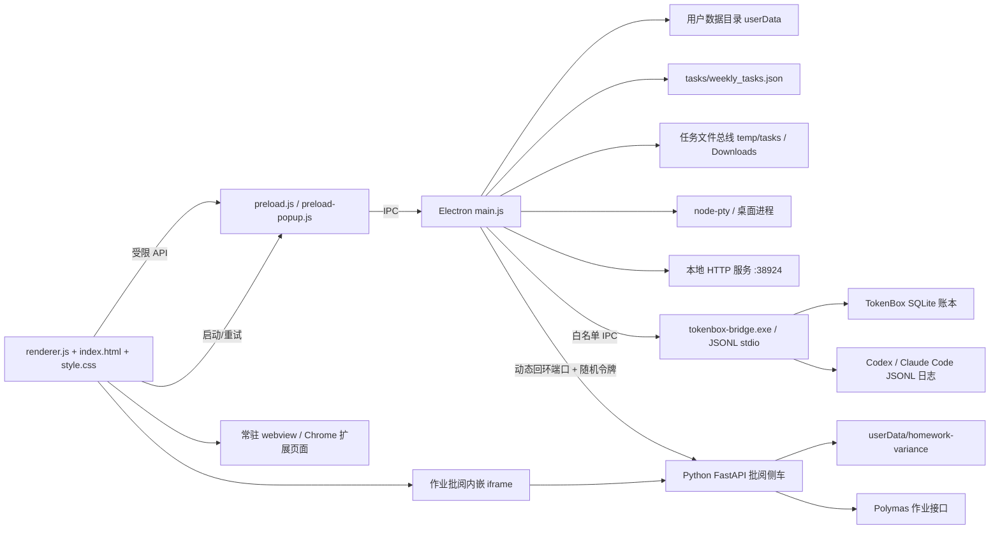

# Personal Workbench 项目手册

> 这是 `personal-workbench` 的当前事实主文档。它描述产品边界、功能、架构、数据、测试、版本状态和维护规则。规格书、审查报告与交接文档可以补充历史背景，但与本手册冲突时，必须先核对代码和测试，再更新本手册。

- 最后更新：2026-07-24
- 项目类型：Windows Electron 桌面应用
- 代码入口：`main.js`、`preload.js`、`renderer.js`
- 当前工作分支：`codex/personal-workbench-redesign`
- 上一稳定基线：`personal-workbench-stable-2026-07-16`
- 本次检查点：2026-07-24 未提交工作区（当前分支 `codex/personal-workbench-redesign`）

## 1. 新成员 / 新模型先读什么

按以下顺序建立上下文：

1. 本文件：了解当前系统，而不是只看历史计划。
2. `personal-workbench/README.md`：了解启动方式和用户可见功能。
3. `personal-workbench/package.json`：了解脚本、依赖和打包入口。
4. `personal-workbench/regression-checklist.md`：了解已修复缺陷、仍需人工验证的风险和验收标准。
5. 与当前任务直接相关的代码和测试；不要为了“熟悉项目”一次性阅读整个 `renderer.js` 或 `main.js`。
6. 根目录的 `personal-workbench-roadmap.md`、`personal-workbench-automation-plan.md` 和 `decisions/`：只在需要路线图或历史决策时阅读。

### 日常启动（推荐）

Windows 用户日常打开工作台，使用桌面 **`打开个人工作台.vbs`**（本机路径通常为 `C:\Users\<用户名>\Desktop\打开个人工作台.vbs`）：

- 无常驻黑窗；启动脚本结束后工作台进程独立运行，关闭启动器不会关掉应用。
- 会先进入项目目录，再执行 `electron.exe .`，确保加载 `main.js`（不要只双击 `electron.exe`，否则只会看到 Electron 默认欢迎页）。
- 不写 `personal-workbench-launch.log`；不依赖桌面 `.cmd` / `.ps1` 启动器（已弃用，只保留 vbs）。
- 若上次异常退出导致“已在运行却打不开”，脚本会尝试清理 `%APPDATA%\personal-workbench\Singleton*` 锁文件。

脚本不在 Git 仓库内（属于本机桌面入口）；修改启动方式时必须同步本节与 `README.md`。

### 开发启动

```powershell
cd personal-workbench
npm install
npm start
```

Windows 下如果通过包装器启动导致 `node-pty` 报 `AttachConsole failed`，使用独立 Electron 进程：

```powershell
Start-Process .\node_modules\electron\dist\electron.exe -ArgumentList "." -WorkingDirectory (Get-Location)
```

## 2. 项目定位与边界

Personal Workbench 是一个“任务优先”的桌面工作台：把常驻网页、企业微信/平台页面、Chrome 扩展、终端、本地应用、任务文件和周报整理到一个 Electron 窗口中。

### 目标

- 保留网页登录态、表单状态和滚动位置。
- 用任务状态和文件夹把网页操作产生的文件归档到正确位置。
- 给能力训练类任务提供准备、测试、评估、报告和结束的可见流程。
- 用卡片舱和平台注入辅助重复填写，但不把外部平台完全自动化当作前提。
- 让工作结果可复盘：任务、文件、卡片复制状态和周报各自持久化。

### 非目标

- 不在工作台内实现企业微信或腾讯文档的服务端 API 集成；周报首版通过富文本剪贴板粘贴到企业微信文档。
- 不把用户本地任务数据、登录 Cookie、扩展路径或个人配置提交到 Git。
- 不把所有网页都当成可信来源；普通外网标签不能拿到工作台会话 Token。

## 3. 当前功能状态

| 模块 | 当前状态 | 入口 / 主要代码 |
|---|---|---|
| 常驻网页标签 | 已实现 | `renderer.js` 的标签、webview、分屏逻辑；逐标签可选的页面返回书签 |
| 本地 PowerShell 终端 | 已实现 | `main.js` 的 `node-pty` IPC、`renderer.js` 的 xterm |
| CLI / 桌面应用标签 | 已实现 | `main.js` 的 CLI PTY 与桌面进程管理 |
| 任务中心 | 已实现 | 专注/全部视图、疑似重复提示、任务卡、搜索筛选、归档、跨区拖拽改状态、完成时限、跨周清理 |
| 五步任务流水线 | 已实现 | `PIPELINE_STEPS`、任务舱、下载/报告事件 |
| 任务暂停、继续、子任务 | 已实现并有 E2E | `startTaskAutomation`、`pauseTaskAutomation`、`resumeTaskAutomation` |
| 任务筛选 / 搜索 / 归档 | 已实现 | `matchesTaskQuery`、`filterTasks`、任务中心 filter bar、卡片归档菜单 |
| 任务跨区拖拽 / 时限 / 周清理 | 已实现 | 三区拖拽改 status；`dueDate` 默认本周日；`purgeCompletedFromPreviousWeeks` |
| 文件总线 | 已实现 | 下载归档、上传注入、任务文件托盘（打开/定位/复制/重命名/裁切/删除）、图片裁切覆盖原图 |
| 任务产物徽章 | 已实现 | 任务卡对话/报告/卡片徽章；文件夹回扫；`taskArtifactsFromPathsAndFiles` |
| 报告到达系统通知 | 已实现 | 主进程 `Notification`（窗口未聚焦 + 活动任务 report 完成） |
| 指针拖拽收尾 | 已实现 | 标签拖/分屏拖在 blur、visibility、buttons=0 时强制结束；guest 页补发 mouseup |
| `cards.md` 卡片舱 | 已实现并有 E2E | `renderRailCards`、卡片字段复制和持久化 |
| Chrome 扩展兼容层 | 已实现，依赖真实扩展与登录态 | `preload-popup.js`、扩展兼容 IPC |
| 平台字段试注入 | 预研 / 辅助能力 | `platformFieldMap`、`platform:test-inject` |
| 主题 | 已实现 | 默认 `sakura`，并可切换 `sky`、`morning`、`night` |
| 周报中心首版 | 已实现 | `__weeklyreport__`、历史周次、模板姓名/标题、编辑器、预览、HTML/Markdown/DOCX 导出和表格复制 |
| Token 统计 | 已实现，构建 sidecar 后可用 | `__tokenbox__`、TokenBox Rust sidecar、Codex/Claude Code 日志扫描、模型/日期筛选、证据审计、导出和 relay 对账 |
| 作业批阅方差 | 已集成首版，需本机 Python 依赖与平台登录态 | `__homework_variance__`、`integrations/homework-variance`、懒启动 FastAPI 侧车、批阅进度/均值/总体方差/Excel 导出 |
| 直接上传企业微信/腾讯文档 | 未实现 | 当前使用 HTML/纯文本剪贴板或 DOCX 文件导出 |

### 网页返回书签行为

- 功能只适用于 `web` / `local-web` 标签，默认关闭，由每个标签独立设置。
- 开启后，主框架普通跳转与单页应用路由跳转会把“当前页”保存为“上一页”；网页左侧出现独立窄栏，不覆盖 `webview`，也不影响右侧扩展面板。
- 点击书签会交换当前页与上一页，因此返回后还能再次切回；这里只保存一层，不是完整浏览历史。
- 网页内的隐藏按钮只隐藏该标签的书签；编辑标签并重新勾选「显示返回书签」可恢复。
- 关闭功能会删除该标签的 `lastVisitedUrl` 和 `returnBookmarkUrl`，之后不再持久化访问地址；地址栏原有后退/前进功能不受影响。

### 任务中心专注视图

- 默认使用「专注视图」：依次优先进行中/评估中、暂停、未提交、过期、两天内到期任务，再按时限补足到 6 项；紧急任务超过 6 项时全部保留。
- 「全部任务」保留原有三分区卡片；视图选择保存在 renderer `localStorage` 的 `personal_workbench_task_center_view`。
- 搜索、状态 chip 或学校筛选属于用户的明确查询，会临时绕过专注数量限制，确保列表之外的任务仍可找到；顶部统计卡始终按全量任务计算。
- 学校、课程、任务类型三项标准化后完全相同的记录会显示“疑似重复”提示。该提示只提供证据，不自动合并、归档或删除任务。

### 周报中心首版行为

- 从当前任务生成一份独立的周报快照，不直接修改任务记录。
- 表格字段为：课程名称、学校名称、任务名称、任务进度、任务数量、任务状态、本周建议情况描述。
- 支持手动添加/删除表格行、非量化事项和产品需求 / Bug / 卡点 / 疑问；表格「操作」列 sticky 固定在右侧，删除按钮始终可见。
- 周报按 `YYYY-Www` 保存；标题、姓名和日期范围可编辑。
- 支持历史周次列表（已保存草稿）、上一周 / 下一周切换，以及 `type=week` 输入任意跳转；切换前若有未保存修改会先落盘。
- 新建周次草稿可使用偏好模板：默认姓名 `weeklyReportDefaults.author`、可选标题模式 `weeklyReportDefaults.titlePattern`（占位符 `{period}` `{year}` `{isoWeek}` `{month}` `{weekOfMonth}`）；周报信息区提供「存为默认」姓名按钮。模板只影响新建草稿，不覆盖已保存周报。
- 「从任务生成」按 `sourceTaskId` 合并刷新进度/学校/课程等字段，保留手动备注与无来源任务的手动行；已有草稿时 toast 提示“手动备注已保留”。
- 完整周报复制操作同时写入纯文本和 HTML，适合粘贴到企业微信文档；“复制表格”只写入表格 HTML 和 TSV，适合粘贴到目标表格首个单元格。
- 支持导出 HTML、Markdown 和 DOCX；导出时由主进程打开系统保存对话框，DOCX 由 `weekly-report-docx.js` 生成 OOXML 文档并保留表格。
- 周报数据保存到 Electron `userData/weekly-reports.json`，与 `tasks/weekly_tasks.json` 分离，并有备份与临时文件原子替换。
- 周报默认值保存在 `userData/workbench-prefs.json` 的 `weeklyReportDefaults` 字段。

## 4. 系统架构



### 进程职责

#### `main.js`：主进程与系统边界

- 创建主窗口，配置 `contextIsolation: true`、`nodeIntegration: false` 和 `webviewTag`。
- 管理 Electron session、下载、文件系统、任务目录、本地 HTTP 服务、终端 PTY、CLI 和桌面应用进程。
- 负责所有需要系统权限的操作：读写文件、打开目录、系统文件选择器、剪贴板、导出文件。
- 启动并管理 TokenBox sidecar；TokenBox IPC 每个入口绑定固定 gateway method，不把任意命令、路径或 method 转发给 renderer。
- 按需启动并回收作业批阅 Python 侧车：分配 loopback 动态端口、生成访问令牌、健康检查、注入用户数据根目录，并在退出时结束 Python 进程树。
- 通过 IPC 验证任务路径、扩展能力和本地服务 Token，不把 Node.js 直接暴露给网页。

#### `preload.js`：主窗口的最小桥接层

- 使用 `contextBridge.exposeInMainWorld("workbench", ...)` 暴露白名单 API。
- 任务、周报、偏好、扩展、终端、上传、下载和窗口操作都应经过这里。
- 新增 IPC 时必须同时检查：调用方是否真的需要、参数是否在主进程验证、是否有回归测试。

#### `preload-popup.js`：扩展页面兼容层

- 为嵌入扩展提供必要的 runtime、storage、tabs、cookies 或平台 API 代理。
- 扩展能力由 manifest 权限、host permission 和发送方扩展 ID 共同决定。
- 不要为了修复一个扩展页面而放宽所有扩展或所有网页的权限。

#### `renderer.js`：界面状态与业务编排

- 管理标签、内置任务中心、内置周报中心、Token 统计视图、作业批阅方差视图、任务状态、任务舱、卡片复制状态和 UI 事件。
- 任务数据和周报数据都通过 `window.workbench` 读写；renderer 不直接访问文件系统。
- `TASK_CENTER_ID`、`WEEKLY_REPORT_ID`、`TOKENBOX_ID` 和 `HOMEWORK_VARIANCE_ID` 是内置视图 ID，不能当成普通网页标签创建 webview。

## 5. 关键数据与持久化

### 5.1 版本库中的文件

| 路径 | 作用 | 提交规则 |
|---|---|---|
| `personal-workbench/*.js`、`index.html`、`style.css` | 应用源码 | 应提交 |
| `personal-workbench/tests/` | 静态和 Electron 回归测试 | 应提交 |
| `personal-workbench/sidecars/` | TokenBox bridge 本地 staging 目录 | 只提交说明文件；`*.exe` 由构建生成并忽略 |
| `personal-workbench/integrations/homework-variance/` | 作业批阅方差集成源码、FastAPI 页面和依赖说明 | 提交代码与示例配置；不提交 `secrets.json`、`output/`、上传文件和 `__pycache__/` |
| `personal-workbench/wb-audit/sample-cards.md` | `cards-bay.e2e.js` 使用的脱敏卡片夹具 | 应提交；不是运行时个人数据 |
| `personal-workbench/docs/PROJECT_HANDBOOK.md` | 当前项目主手册 | 每次功能/缺陷变化维护 |
| `personal-workbench/regression-checklist.md` | 回归标准和风险登记 | 修复/发现缺陷时维护 |
| `tasks/weekly_tasks.json` | 用户本地任务数据 | 默认不提交，不覆盖用户改动 |
| `personal-workbench/temp/` | 运行时产物 | 不提交 |

### 5.2 用户数据目录 `app.getPath("userData")`

以下文件由应用运行时产生，不属于源码版本：

- `weekly-reports.json`：周报快照。
- `backups/weekly_tasks.json`、`backups/weekly-reports.json`：写入前备份。
- `workbench-prefs.json`：主题、裁切、待办路径、平台字段映射、周报默认姓名/标题模板等偏好。
- `extensions.json`：扩展配置；可能包含本机路径，只能留在本机。
- `extension-debug.log`：扩展兼容调试日志。
- `homework-variance/`：作业批阅侧车的任务 JSON、上传文件、状态、Excel 和可选 LLM 凭证。
- Electron session、缓存和其他运行时文件。

renderer 的 `localStorage` 也位于 Electron 用户数据目录。其中：

- `personal_workbench_tabs` 保存标签配置。网页书签开启时，标签可额外包含 `returnBookmarkEnabled`、`returnBookmarkHidden`、`lastVisitedUrl` 和 `returnBookmarkUrl`；关闭功能时两个 URL 字段会被清除。
- `personal_workbench_task_center_view` 保存任务中心的 `focus` / `all` 视图偏好。
- 上述地址可能包含用户访问路径，只属于本机运行时数据，不得复制到版本库、日志夹具或文档示例。

测试通过以下环境变量隔离这些数据：

```text
PERSONAL_WORKBENCH_USER_DATA
PERSONAL_WORKBENCH_WEEKLY_TASKS_PATH
PERSONAL_WORKBENCH_DOWNLOAD_ROOT
PERSONAL_WORKBENCH_LOCAL_SERVER_PORT
```

`PERSONAL_WORKBENCH_LOCAL_SERVER_PORT` 只用于自动化隔离：生产启动未设置时仍固定使用 `38924`。安全 HTTP E2E 会预留随机 loopback 端口，避免用户正在运行的工作台截获测试请求并造成假 `401/404`。

### 5.3 任务记录的核心字段

任务记录以 `tasks/weekly_tasks.json` 的数组保存，核心字段包括：

```json
{
  "id": "task-id",
  "school": "学校",
  "course": "课程",
  "taskType": "capability-setup",
  "quantity": 1,
  "status": "pending",
  "dueDate": "2026-07-19",
  "completedAt": "",
  "sortKey": 0,
  "archived": false,
  "subtasks": [{ "index": 1, "status": "pending" }],
  "step": "testing",
  "taskFolder": "",
  "chatLogPath": "",
  "reportPath": ""
}
```

任务状态包括 `pending`、`running`、`evaluating`、`paused`、`unsubmitted`、`completed`。应用重启时会把未恢复的 `running/evaluating` 任务收敛为 `paused`，避免假装仍在执行。

可选字段 `archived`（默认 `false`）只影响任务中心默认列表与「写回待做任务」；归档不改变 `status`、不删除任务文件夹、不清除 `chatLogPath`/`reportPath`。默认列表隐藏已归档任务；状态 chip「已归档」才显示。写回「待做任务.txt」时不会把归档任务写回。

`dueDate` 为 `YYYY-MM-DD` 完成时限；创建/导入缺省时设为当前 ISO 周周日。任务中心各分区内按 `dueDate` 升序，再按 `sortKey`、学校、课程排序。过期未完成任务有轻微过期样式。

任务卡可在「待处理/已暂停」「未提交」「已完成」三区间拖拽：区内拖动只重排（写 `sortKey`）；跨区松手按目标区改 `status`（active→`pending`、unsubmitted→`unsubmitted`、done→`completed`）。若拖的是当前流水线活动任务，会先暂停流水线再改状态。

标记为 `completed` 时写入 `completedAt`。每次成功加载任务列表后，会移除「完成归属周」早于当前 ISO 周的已完成记录（归属周优先 `completedAt`，其次 `dueDate`）；只删 `weekly_tasks.json` 记录，不删任务文件夹。

### 5.4 周报记录的核心字段

周报是任务的独立快照，不把编辑后的周报字段写回任务：

```json
{
  "id": "report-2026-W29",
  "periodKey": "2026-W29",
  "title": "M7W2周报",
  "author": "",
  "dateRange": "7月13日 - 7月19日",
  "rows": [{
    "sourceTaskId": "task-id",
    "course": "",
    "school": "",
    "taskName": "能力训练搭建",
    "progress": "100%",
    "quantity": "1",
    "status": "已完成",
    "note": ""
  }],
  "nonQuantified": [{ "text": "" }],
  "issues": [{ "text": "" }],
  "createdAt": "ISO-8601",
  "updatedAt": "ISO-8601"
}
```

默认状态映射：`pending` → 未开始，`running/evaluating` → 进行中，`paused` → 已暂停，`unsubmitted` → 已完成、未提交，`completed` → 已完成。用户在周报中手动改状态不会改变任务状态。

### 5.5 Token 统计与 TokenBox 账本

- 工作台不解析原始日志，也不在 renderer 内复制计费规则；`main.js` 启动 `tokenbox-bridge.exe`，通过 JSONL stdin/stdout 调用 TokenBox 的 Rust 核心。
- sidecar 通过 JSONL gateway 暴露 `refresh_dashboard`、`get_dashboard`、`get_evidence`、`export_dashboard`、`get_audit_summary`、`export_audit_report`、`import_relay`、`get_reconciliation`、`backup_database`、`rebuild_usage_ledger` 和对应导出接口；`refresh_dashboard` 先增量扫描 Codex / Claude Code JSONL，再从 `%LOCALAPPDATA%\TokenBox\tokenbox.db` 读取统一账本。
- renderer 只提交 provider、from、to、model、format 等白名单参数，展示总 Token、billable input、官方估算成本、中转站实际金额、请求次数、模型用量、每日用量、事件级 evidence、源日志/SQLite 审计和 relay 逐字段对账；未识别模型和扫描警告保留显示，并提供 SQLite 备份和带备份的派生账本重建。
- sidecar 不是 HTTP 服务，不接收任意文件路径、shell 命令或 prompt/response/tool 内容；relay 导入只写规范化账单字段与 source hash。工作台 preload 暴露固定 TokenBox 操作，不暴露任意 method 或命令转发。
- 开发态可从 `../../tokenbox/src-tauri/target/release/tokenbox-bridge.exe` 发现 sidecar；打包态使用 `resources/sidecars/tokenbox-bridge.exe`。运行 `npm run build:bridge:stage` 后再 `npm run dist` 才会把统计能力放进安装包。

`npm run build:bridge` uses `scripts/build-tokenbox-bridge.js`: it selects MSVC when `link.exe` exists, otherwise the installed GNU Rust toolchain plus `TOKENBOX_MINGW_BIN` or a WinGet MinGW package.
### 5.6 作业批阅方差集成

- `integrations/homework-variance/polymas_grade_engine.py` 保留原项目的批阅状态机：`init` → 多轮 `next` / 平台轮询 → `report`；评分以平台返回产物为准，再计算均值和总体方差。
- `integrations/homework-variance/web_server.py` 提供批阅台页面和任务 API。它由 `main.js` 懒启动，监听 `127.0.0.1` 的动态端口，所有 `/api/*` 路由在工作台模式下必须带随机令牌。
- `integrations/homework-variance/web/static/index.html` 作为 iframe 页面承载原有上传、任务历史、进度卡片和 Excel 下载流程；页面通过 `X-Workbench-Token` 访问 API，下载链接使用令牌查询参数。
- 任务配置、平台凭证、上传文件、状态文件、评分表和可选 `secrets.json` 位于 `app.getPath("userData")/homework-variance`，不是源码目录；仓库只提交引擎、服务、前端和示例凭证配置。
- 运行前需要 Python 3.10+ 和 `integrations/homework-variance/requirements.txt` 中的依赖。便携包通过 `extraResources` 带入 Python 源码，但当前不捆绑 Python runtime，未安装依赖时工作台应显示明确错误。
- 集成入口文档：`integrations/homework-variance/README.md`；Electron 边界契约测试：`tests/homework-variance-integration-contract.test.js`。

## 6. 任务与文件数据流

1. 用户在任务中心创建或导入任务。
2. 开始任务后，主进程在下载根目录下建立任务文件夹，并通过 `task:active-update` 注册当前任务。
3. 符合来源域名和流水线步骤的下载进入任务文件夹；没有活动任务时回到系统 Downloads 行为。
4. `fs.watch` 观察活动任务文件夹，任务舱读取 `dialogue.json`、`eval_report.pdf`、`cards.md` 等产物。
5. 任务中心异步 `listTaskFiles` 回扫未归档任务的产物徽章（对话/报告/卡片）；路径为空且发现标准文件名时可写回 `chatLogPath`/`reportPath`，已有路径不覆盖。
6. 评估报告下载完成：renderer 前台 toast；若主窗口未聚焦，主进程发系统 `Notification`（仅活动任务 `type=report`）。
7. 上传通过 CDP 文件选择器拦截，把已选文件注入网页；系统文件选择器作为降级路径。
8. 任务舱托盘可对任务夹内文件重命名（`tasks:file-action` + `resolveTaskPath`）；图片裁切覆盖原路径（先写临时文件再 rename；`webp` 输出为同主名 `.png` 并删除原文件）。
9. 任务结束后按用户选择清理临时任务目录；任务记录保留必要的状态和产物路径。
10. 周报中心只读取当前任务，生成可编辑快照；保存周报不会改变第 1 至 9 步的数据。

## 7. 安全边界

- 主窗口使用 context isolation，普通 webview 不拥有 Node.js 能力。
- 工作台 session Token 只允许注入本地项目或 `localhost` / `127.0.0.1` 页面；普通外网网页不能读取。
- 本地 HTTP 服务默认监听 `38924`，敏感路由需要 session Token。
- `local-apps` 静态服务和 `temp/tasks` IPC 必须进行绝对路径边界检查，不能只用字符串前缀比较。
- 扩展 API 按扩展 ID、manifest 权限和 host permission 门控；修复扩展问题时不能把权限扩大到 `<all_urls>`。
- TokenBox sidecar 只从固定候选路径启动，并且要求文件扩展名为 `.exe`；renderer 不能指定 sidecar 路径、方法名或启动参数。sidecar 的 stdout 只承载 JSONL 协议，stderr 只作为诊断信息。relay content 在主进程和 Rust gateway 两侧均限制为 50 MiB。
- 作业批阅侧车只由主进程启动，固定绑定 `127.0.0.1` 动态端口；主进程生成随机令牌，Python 服务保护所有 `/api/*` 路由，renderer 不可指定任意 Python 命令、端口或数据目录。
- 作业批阅侧车限制任务编号、单文件大小和文件数量；评分表下载会把路径解析限制在对应任务目录内，防止任务元数据把文件下载路由带出数据根目录。
- 所有用户路径、Cookie、Token、扩展目录和调试日志都不应写进 Markdown、测试夹具或 Git 提交。

安全相关代码变更必须至少运行静态安全回归、HTTP 安全 E2E，并记录结果；不能只凭“页面看起来正常”结案。

### 7.1 Adversarial review remediation (2026-07-25)

- Desktop application launch is main-process gated by canonical realpath, approved extension, and a persisted allowlist populated only by the file picker or dropped-file registration.
- `prefs:set-workbench` cannot set `todoFilePath`; the main process accepts only a canonical existing `.txt` selected by the dialog for read/write.
- Upload injection accepts canonical files inside the captured active task folder or paths approved by the main-process picker; cookie HTTP access requires an explicit `http`/`https` URL.
- Local webviews receive a per-tab scoped token with no cookie route; the full session token is not exposed through the renderer preload.
- Weekly report generation filters tasks by `periodKey` and retains orphan source rows. Completed imports receive `completedAt`; same-lane reorder preserves status.
- Artifact refresh treats disk state as authoritative, retargets renamed paths, clears deleted paths, and the fixed-port local server reports startup failures through IPC and a toast.

## 8. 测试与验收

在 `personal-workbench` 目录执行：

```powershell
npm run check
npm test
npm run test:e2e
npm run test:all
npm run pack
npm run dist
npm run build:bridge:stage  # 自动选择 MSVC 或 GNU toolchain
```

当前 E2E 覆盖：启动冒烟、卡片舱、P1 缺陷、HTTP 安全、主题和 webview 生命周期、下载归档、逐网页返回书签、任务专注/完整视图、任务重启恢复、任务状态/子任务、周报生成与持久化。

作业批阅集成的本地验证：

```powershell
python -m py_compile integrations/homework-variance/web_server.py integrations/homework-variance/polymas_grade_engine.py
```

另有一次不接触平台网络的 Uvicorn 冒烟：健康检查返回 `200`；无令牌访问 `/api/jobs` 返回 `401`；带令牌可读取空任务列表。真实批阅仍需要用户提供有效的 Polymas 作业 URL、JWT/Cookie、作业文件和平台登录态，不能用离线契约测试替代。

2026-07-24 洁癖收尾核对结果：`npm run check` 通过；`npm test` 通过（69/69）；`npm run pack` 通过，但因当前机器没有 Rust MSVC `link.exe`，构建产物不包含 `tokenbox-bridge.exe`。最近一次完整 E2E 尝试中，启动冒烟通过，随后 `cards-bay.e2e.js` 长时间无输出，已停止该测试进程，因此不能把 `npm run test:e2e` 或 `npm run test:all` 标记为全量通过。

2026-07-24 作业批阅集成后的最新回归：`npm test` 通过（70/70）；隔离 Electron 点击「作业批阅方差」并加载本地 iframe 通过；`npm run pack` 已确认 `resources/integrations/homework-variance/web_server.py` 存在。`npm run test:all` 已通过冒烟、卡片舱和 P1 缺陷，随后在既有 `security-http.e2e.js` 以 8/10 失败停止：正确 session token 访问 `/tabs` 仍返回 401，以及联接目录安全用例返回 404 而不是测试期望的 403；这两项不属于本次作业批阅改动，仍不能把全量 E2E 标记为通过。

2026-07-28 最新回归：上述安全 E2E 失败已确认是生产工作台与测试实例争用固定 `38924`，请求误入生产实例所致，并非 token 或联接目录保护失效。测试改用随机 loopback 端口后，`npm run test:all` 全量通过：单元/契约测试 89/89，E2E 从启动冒烟到周报流程 111 项断言全部通过；用户的生产工作台可在测试期间保持打开。

人工验收仍然重要的场景：

- 真实浏览器中的扩展注入和重新打开扩展后的行为。
- 已登录的能力训练平台上传、评估和报告下载。
- 报告下载完成后：前台 toast；窗口在后台时 Windows 系统通知（依赖通知权限与专注助手设置）。
- 企业微信文档对完整周报 HTML、表格 HTML/TSV 剪贴板的实际粘贴效果；目标编辑器可能选择新建表格或按 TSV 填充已有表格，这是第三方粘贴策略，应用无法强制改变。
- TokenBox 真实 sidecar 构建、首次扫描本机 Codex / Claude Code 日志、筛选结果与重启后的账本复用需要在本机手工验收；自动化契约测试不读取用户真实日志。
- 作业批阅方差需要手工验收 Python 解释器/依赖、平台认证、真实上传、批阅轮询、方差结果和 Excel 下载；自动化测试只验证 Electron/Python 边界和本地令牌，不读取真实 Cookie、作业或平台数据。
- 桌面 `打开个人工作台.vbs` 一键启动（无黑窗、独立进程）；开发态 `npm start` / 独立 `electron.exe .`；`node-pty` 与不同代理/登录态下的启动。

任何测试失败都应先保存错误日志和复现步骤，再修改代码；不要为了让测试变绿而删除测试或放宽安全边界。

## 9. Git 版本控制规则

### 分支与提交

- 功能开发、缺陷修复和重构使用 `codex/<topic>` 分支；本项目当前使用 `codex/personal-workbench-redesign`。
- 提交信息使用简短前缀：`feat:`、`fix:`、`refactor:`、`test:`、`docs:`、`chore:`。
- 一个提交应能说明一个可回滚的逻辑单元；如果代码、测试和文档属于同一功能，可以放在同一提交。
- 发布或交接前创建可读 tag，例如 `personal-workbench-stable-YYYY-MM-DD`。

### 提交前检查

```powershell
git status --short --branch
git diff --check
npm run test:all
git diff --stat
```

提交时显式选择源码、测试和文档。除非用户明确要求，不要把以下内容加入提交：

- `tasks/weekly_tasks.json` 和其他个人任务数据。
- `personal-workbench/temp/`、下载文件、截图和运行日志。
- 本机扩展路径、Cookie、Token、API key 和用户目录。

### 本次维护约定

本手册是“当前状态”文档，不是一次性方案。以后每次新功能或 Bug 修复完成后，必须同步：

1. 更新“当前功能状态”表和受影响的架构/数据流说明。
2. 在“变更记录”增加日期、类型、行为变化、关键文件和验证命令。
3. 新增或更新对应回归测试；若只能人工验证，明确写出缺口。
4. 维护 `personal-workbench/README.md` 或相关规格书的入口链接，避免出现多个互相矛盾的现状描述。
5. 提交前重新阅读本节，确认没有把本地数据或秘密带进版本库。

## 10. 当前风险与后续方向

### 已知风险

- `main.js` 和 `renderer.js` 仍是较大的编排文件；后续重构必须保持 IPC 契约和 E2E 行为不变。
- Token 统计依赖外部 TokenBox Rust sidecar；当前仓库不提交二进制，若缺少 MSVC linker 或未执行 staging，工作台会明确显示“未找到 sidecar”，不会退化为猜测或重复解析。
- 作业批阅方差依赖本机 Python 3.10+、FastAPI 等依赖和 Polymas 平台接口；当前打包只携带源码，不携带 Python runtime，目标机器需要先安装依赖。
- 作业批阅侧车仍需要用户在页面输入平台 JWT/Cookie；它只保证本地服务边界和数据目录隔离，不负责刷新或验证平台登录态。
- 扩展兼容层依赖第三方扩展版本、登录态和平台页面结构，自动化测试不能覆盖所有真实页面变化。
- 平台字段注入是辅助能力，selector 映射失效时应提供明确反馈，而不是静默写入。
- 周报目前没有企业微信/腾讯文档 API 直连，也没有多人协作冲突合并；它是本地快照 + 剪贴板工作流。
- DOCX 导出保留周报表格结构；企业微信/腾讯文档的实际粘贴行为仍由目标编辑器决定，表格专用复制通过 HTML + TSV 提高兼容性但不承诺填充每一种已有表格。
- 系统通知依赖 Windows 通知权限与专注助手；失败时静默，不阻塞下载归档与前台 toast。
- 任务卡产物回扫依赖 `listTaskFiles` 与内存 cache；任务很多时靠 debounce + 仅未归档任务回扫控制 IPC 频率。
- 图片裁切覆盖原图不可撤销；`webp` 会变成 `.png`，需在真实样本上确认平台是否仍接受。
- 完整 E2E 会启动多个 Electron 实例，开发时应使用测试隔离环境，不能让夹具污染真实用户数据。
- 完整 E2E 会占用较多时间并顺序启动多个 Electron 实例；必须保留随机端口和独立 userData/task/download 根目录，防止测试请求或夹具落入用户正在运行的工作台。

### 推荐顺序

1. A/B/C 与近期拖拽/托盘/裁切修复已落地；继续人工验收企业微信粘贴、Windows 后台报告通知、裁切覆盖与拖拽收尾。
2. 处理 `regression-checklist.md` 中仍未关闭的真实浏览器和上传边界风险。
3. 在不改变 IPC 的前提下拆分任务状态、文件总线、扩展兼容和报告生成模块。
4. 只有在真实需求明确后，才评估企业微信/腾讯文档的官方接口或导出格式。

## 11. 变更记录

| 日期 | 类型 | 内容 | 关键文件 | 验证 |
|---|---|---|---|---|
| 2026-07-28 | feat/fix | 网页标签增加逐标签可选的一层返回书签（返回/切回、隐藏/恢复、关闭即清除历史）；任务中心增加默认专注视图、完整视图和保守的疑似重复提示，筛选始终可查完整数据；安全 HTTP E2E 使用随机端口，消除生产工作台占用 `38924` 导致的假失败 | `renderer.js`、`index.html`、`style.css`、`main.js`、`tests/page-return-bookmark.test.js`、`tests/page-return-bookmark.e2e.js`、`tests/task-focus-helpers.test.js`、`tests/task-focus-view.e2e.js`、`tests/security-http.e2e.js`、`README.md`、`regression-checklist.md` | `npm run test:all`（单元/契约 89/89；E2E 111 项断言全通过）；书签 E2E（6/6）；专注视图 E2E（4/4）；安全 HTTP E2E（11/11） |
| 2026-07-25 | feat | 完成 TokenBox headless JSONL gateway 与工作台扩展：模型事件证据、源日志/SQLite 审计、JSON/CSV 导出、中转站导入和逐字段对账；Rust core 继续拥有扫描、去重、游标、Decimal 计价和账本规则 | `../../tokenbox/src-tauri/src/bin/tokenbox-bridge.rs`、`../../tokenbox/src-tauri/src/commands/mod.rs`、`../../tokenbox/src-tauri/src/storage/mod.rs`、`main.js`、`preload.js`、`renderer.js`、`index.html`、`style.css` | `npm test`（81/81）；`npm run test:all`；`npm run build:bridge:stage`；TokenBox `npm run build`；桥接 UI smoke（2,495 Token / 3 models / audit PASS） |
| 2026-07-25 | fix | Apply the 2026-07-24 adversarial review: IPC path/token boundaries, report period/orphan preservation, completion timestamps, same-lane reorder, artifact lifecycle, and local server status | `main.js`, `preload.js`, `renderer.js`, `tests/adversarial-fix-regression.test.js` | `npm test`; `npm run test:e2e` |
| 2026-07-24 | feat/security | 集成作业批阅方差工具：保留 Python 批阅引擎，新增懒启动 FastAPI 侧车、动态 loopback 端口、随机令牌、用户数据目录、上传/路径约束、工作台内嵌视图和契约测试；排除真实密钥与运行产物 | `integrations/homework-variance/`、`main.js`、`preload.js`、`renderer.js`、`index.html`、`style.css`、`package.json`、`.gitignore`、`tests/homework-variance-integration-contract.test.js` | `npm test`（70/70）；Python `py_compile`；Uvicorn health/401/authorized smoke；隔离 Electron iframe smoke；`npm run pack` |
| 2026-07-24 | docs/chore | 完成洁癖收尾：同步当前稳定基线与工作区状态，清理已关闭回归登记，标记历史计划与验收清单，明确 E2E 挂起和 sidecar linker 阻塞；确认运行时个人数据、E2E 夹具与本地 agent 配置边界 | `README.md`、`.gitignore`、`docs/PROJECT_HANDBOOK.md`、`docs/FEATURE_PLAN_THREE.md`、`docs/ACCEPTANCE_CHECKLIST_ABC.md`、`regression-checklist.md` | `npm run check`；`npm test`（69/69）；`npm run pack`；只读 Git/残留盘点 |
| 2026-07-22 | feat/refactor | 接入长期 Token 统计方案：TokenBox 增加 headless JSONL sidecar，工作台通过白名单 IPC 展示模型/日期筛选、账本汇总和扫描警告；补充 sidecar staging 与契约测试 | `main.js`、`preload.js`、`renderer.js`、`index.html`、`style.css`、`package.json`、`scripts/stage-tokenbox-bridge.js`、`tests/tokenbox-integration-contract.test.js`、`../../tokenbox/src-tauri/src/bin/tokenbox-bridge.rs` | `npm test`（69 项）；TokenBox `npm run build`；`cargo fmt --check`；真实 bridge 构建待本机 linker |
| 2026-07-17 | fix | 删除任务确认弹窗加宽并补内边距/换行，避免说明文字被裁切 | `index.html`、`style.css`、`docs/PROJECT_HANDBOOK.md` | 打开删除确认，长任务名说明完整可见 |
| 2026-07-17 | feat | 任务卡三区拖拽改状态、完成时限 dueDate（默认本周日）、跨周清理已完成任务（completedAt 归属周） | `renderer.js`、`index.html`、`style.css`、`tests/task-lane-helpers.test.js`、`package.json`、`docs/PROJECT_HANDBOOK.md` | `npm test`；人工：跨区拖拽、时限排序、上周 completed 加载后消失 |
| 2026-07-17 | docs | 同步手册检查点与数据流：托盘重命名、裁切覆盖原图、拖拽收尾；检查点改为 2026-07-17 | `docs/PROJECT_HANDBOOK.md` | 手册与 README/代码行为核对 |
| 2026-07-17 | fix/feat | 修复主体拖拽“粘住”（blur/visibility/buttons=0 强制结束 + guest mouseup）；任务托盘支持重命名；裁切改为覆盖原图（webp→png） | `renderer.js`、`main.js`、`preload.js`、`README.md`、`docs/PROJECT_HANDBOOK.md` | `npm test`；人工：拖出再回、托盘改名、裁切后无 `_cropped` |
| 2026-07-17 | fix | 终端/右分屏/底部分屏拖动尺寸可覆盖主题：从 `body[data-theme]` 与相关 media 移除 `--terminal-height`、`--right-sidebar-width`，默认只保留在 `:root` | `style.css`、`docs/PROJECT_HANDBOOK.md` | 主题下拖动终端高度、右分屏宽度、底部分屏高度；`node --check` 无语法影响 |
| 2026-07-17 | docs | 日常启动改为桌面 `打开个人工作台.vbs`：独立进程、无黑窗、无 launch.log；弃用桌面 cmd/ps1；手册与 README 同步 | 本机桌面 `打开个人工作台.vbs`、`docs/PROJECT_HANDBOOK.md`、`README.md` | 双击 vbs 打开工作台；关闭启动器不影响应用 |
| 2026-07-16 | fix | 周报表格删除入口可见性：操作列 sticky、删除按钮文案与样式增强；允许表格删空 | `renderer.js`、`index.html`、`style.css`、`tests/weekly-report.e2e.js` | `npm test`；`node tests/weekly-report.e2e.js` |
| 2026-07-16 | feat | 任务卡产物徽章（对话/报告/卡片）、文件夹回扫缓存、报告完成后台系统通知；归档任务不回扫 | `renderer.js`、`main.js`、`style.css`、`tests/task-artifact-helpers.test.js`、`package.json`、`docs/FEATURE_PLAN_THREE.md` | `npm run check`；`npm test` |
| 2026-07-16 | feat | 任务中心搜索/状态 chips/学校筛选与归档：默认隐藏 archived，写回待做任务排除归档；统计卡仍用全局计数 | `renderer.js`、`index.html`、`style.css`、`tests/task-filter-helpers.test.js`、`package.json`、`docs/FEATURE_PLAN_THREE.md` | `npm run check`；`npm test` |
| 2026-07-16 | feat | 周报历史周次列表、上一周/下一周、默认姓名与标题模板（prefs.weeklyReportDefaults）；从任务再生成保留手动备注 | `main.js`、`renderer.js`、`index.html`、`style.css`、`tests/weekly-report-helpers.test.js`、`tests/weekly-report.e2e.js`、`docs/FEATURE_PLAN_THREE.md` | `npm test`；`node tests/weekly-report.e2e.js` |
| 2026-07-16 | feat | 增加 DOCX 周报导出、完整周报 HTML/纯文本复制和表格专用 HTML/TSV 复制，明确已有表格粘贴受目标编辑器控制 | `weekly-report-docx.js`、`main.js`、`renderer.js`、`index.html`、`tests/weekly-report-docx.test.js`、`tests/weekly-report.e2e.js` | `npm run test:all` |
| 2026-07-16 | feat | 新增周报中心：从任务生成、独立快照、手动编辑、预览、企业微信富文本复制、HTML/Markdown 导出 | `main.js`、`preload.js`、`renderer.js`、`index.html`、`style.css` | `npm run test:all` |
| 2026-07-16 | docs | 建立本项目主手册、维护规则和代码入口 | `docs/PROJECT_HANDBOOK.md`、`README.md`、`AGENTS.md` | 文档入口与状态核对 |

## 12. 相关文档

- 应用快速介绍：`personal-workbench/README.md`
- A/B/C 本机验收清单：`personal-workbench/docs/ACCEPTANCE_CHECKLIST_ABC.md`
- 回归清单：`personal-workbench/regression-checklist.md`
- 任务系统要求：`personal-workbench/task_system_requirements.md`
- 自动化重构方案：`personal-workbench-automation-plan.md`
- 产品路线图：`personal-workbench-roadmap.md`
- 交接记录：`handoff/`
- 架构决策：`decisions/architecture-decisions.md`
- 协作协议：`PROTOCOL.md`
- TokenBox bridge 协议：`../../../tokenbox/docs/tokenbox-bridge-protocol.md`
- 作业批阅方差集成说明：`integrations/homework-variance/README.md`
