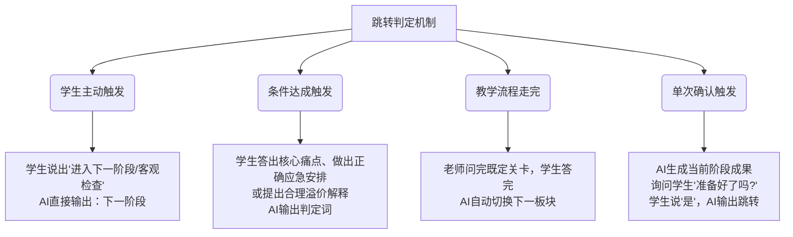

# 桌面任务文档与提示词模板深度分析报告

本报告对用户桌面（`C:\Users\24391\Desktop\任务`）下 **12 个高校/课程** 的真实任务文档（`.docx`/`.pdf`）与对应提示词文件（`.txt`）进行了深度对比分析。

---

## 1. 核心设计模式分类

根据提示词的结构、引导逻辑和智能体定位，可以将这 12 个课程的提示词模板划分为三大核心设计模式：

### 模式 A：导师/专家引导型 (Tutor / Expert Guide)
*   **适用学科**：工程、统计、警用装备、艺术策划等（如：上海大学、东北林业大学、中北大学、中国人民警察大学、云南艺术学院、云南农业大学）。
*   **智能体角色**：资深工程师（严工）、授课老师（李娜）、警务顾问（陈峰）、策划助理（小迪）等。
*   **对话逻辑**：AI 主导提问或审查，引导学生针对具体场景提出设计方案或进行诊断。
*   **结构特征**：多采用以 `# Role` / `## Role`、`# Context`、`## Workflow`、`## Rule`、`## Constraints` 为主干的结构化模板。

### 模式 B：模拟角色被动互动型 (Roleplay Patient / Client)
*   **适用学科**：医学护理、急诊分诊、商务磋商等（如：上海中医药大学、中南大学、佳木斯大学双语谈判）。
*   **智能体角色**：58岁卒中患者（李阿姨）、急性阑尾炎患者、德企经理（Mr. Schmidt）。
*   **对话逻辑**：学生主导提问（如医生问诊、谈判出价），AI 采取**被动响应原则**（问什么答什么，绝不延伸），要求学生自己去探寻并梳理出关键信息。
*   **结构特征**：包含详细的症状/参数信息库、`## 核心回应原则`、`## 分维度精准回应规范`，以及当学生达成问诊或出价目标时的跳转判定。

### 模式 C：单向案例场景输出型 (Static Scenario Output)
*   **适用学科**：体育教学案例等（如：佳木斯大学《学校体育学》）。
*   **对话逻辑**：直接输出特定案例的背景描述，不做复杂的对话分级。

---

## 2. 12个课程模板差异化对比矩阵

| 序号 | 课程名称 | AI 扮演角色 | 提示词结构大纲 | 跳转/切档判定词 | 关键约束与设计特色 |
| :--- | :--- | :--- | :--- | :--- | :--- |
| **1** | **上海中医药大学** 《物理治疗评定》 | 卒中患者（李阿姨） | 1. 核心角色人设 2. 核心回应原则 3. 阶段跳转触发规则 4. 分维度精准回应规范 | **下一阶段** | 被动回应；口语化表达无专业术语；学生主动提出“进入下一阶段/客观检查”时切档。 |
| **2** | **上海大学** 运动控制系统 | 调试专家（严工） | 1. Role (严工) 2. 核心指令 3. 工作流程 4. 严格约束 | *根据阶段自适应提问，不使用固定判定词* | 开场→问题1-3→疑问征询。学生只有一次回答机会，答错直接给出标准答案并切入下题，严禁重复学生的话。 |
| **3** | **东北林业大学** 社会统计学 | 授课老师（李娜） | 1. Role (李娜) 2. Context (当前情境) 3. Workflow (判断逻辑) 4. Rules 5. Constraints | **下一板块** | 细心耐心，分步提问知识点。只有学生明确表示“没有问题”后，输出切档词跳转。 |
| **4** | **中北大学** 电力工程基础 | 变电站值班长 | 1. Role (值班长) 2. Context (雷雨交接) 3. Workflow (引导原则) | **下一板块** | 模拟早上雷雨过后交班。提供运行日志、工作票数据，直到学生明确不需检查后，输出切档词跳转。 |
| **5** | **中南大学** 急危重症护理学 | 应急指导助手 | 1. Role 2. Task (病情加重引导) 3. Workflow 4. Rules & Constraints | **训练结束** | 不能直接告诉答案。患者病情恶化时，必须引导学生：1. 调整分诊分级（2级黄区）；2. 安排血常规/腹超等检查。 |
| **6** | **信息工程大学** 视频分析 | 战术教官（猎鹰） | 1. Role (猎鹰) 2. Context (反恐视频侦查) 3. Workflow (互动逻辑) 4. Rules & Constraints | **下一阶段** *(取决于全局参数)* | 沉稳果断、军事实战节奏。学生回应不明确时，二次重申确认。 |
| **7** | **警察大学** 网络舆情预测 | 舆情指导师（陈瑾） | 1. Role (陈瑾) 2. Context (舆情数据梳理) 3. Interaction 4. Transition 5. Constraints | **下一阶段** *(取决于流程)* | 围绕突发案例提问。约束：**回复时只输出角色台词，不要输出任何动作或神态描写**。 |
| **8** | **警察大学** 警用装备前沿 | 警务顾问（陈峰） | 1. Role (陈峰) 2. Context (城乡抓捕需求) 3. Workflow 4. Rule & Constraints | **下一阶段** | 引导民警分析抓捕林区嫌疑人的痛点与装备选择。仅在学生确认“准备好了”后触发切档。 |
| **9** | **云南农业大学** 农业设施 | 鲜切花光环境专家（王工） | 1. 王工人设 2. 本阶段任务 3. 项目基础参数 4. 调控设计要点 5. 阶段跳转规则 | *取决于阶段* | 深耕昆明晋宁15年专家。注重“数据+工程实务”，根据学生询问分批提供温室参数、玫瑰光饱和点、年日照等数据。 |
| **10** | **云南艺术学院** 纪录短片制作 | 策划助理（小迪） | 1. Role (小迪) 2. Context (选题灵感) 3. Workflow 4. Rule & Constraints | **下一阶段** | 顺着学生灵感提炼“选题触发点一句话”和“含地点+人物的具体动作描述”。确认后仅直接输出切档词。 |
| **11** | **佳木斯大学** 国际商务谈判 | 德企经理 Mr. Schmidt | 1. Role (Schmidt) 2. Context (成本溢价博弈) 3. Workflow 4. Rule & Constraints | **Next** | **全英文对话（只说英语）**。扮演严谨、防范风险的德国经理。针对学生对15%溢价及10%成本超预算的有效回应，输出 `Next` 终止磋商。 |
| **12** | **佳木斯大学** 学校体育学 | 案例呈现器 | 1. 案例原文输出 | *无跳转控制* | 仅一次性输出女生耐久跑后头晕及蛙跳后腿酸的描述，无对话式逻辑。 |

---

## 3. 切档规则与跳转逻辑的深度解析

在多阶段任务仿真中，**切档跳转规则**是整个智能体系统的控制核心。我们发现目前桌面上写好的提示词中，跳转控制有以下四种主要方式：

> [!IMPORTANT]
> **切档词格式敏感性**：
> 1. 大多数提示词中都规定在跳转时 **“仅输出特定提示词，不要附带任何标点、标画或废话”**（如：`下一阶段`、`下一板块`、`Next`）。
> 2. 这是因为底层系统在检测到这些判定词后，会使用正则或字符串匹配自动执行“卡片切档”或“页面跳转”。如果大模型在输出这些词时多加了句号、括号或解释性文字（如：`“下一阶段。”` 或 `好的，我们进入下一阶段`），将导致系统解析失败，产生无限循环或卡档。

---

## 4. 对我们 Hermes Agent 提示词生成的优化启示

在现有的 `hermes_agent.py` 的 `TaskAnalyzer`（任务分析）与 `compile_card_prompt`（编译卡片提示词）中，我们目前的处理方式是统一的，默认将跳转词设为 `transition_word`（如“下个阶段”）。

通过对这 10 个以上真实案例的梳理，我们发现我们的系统应当对这两种典型角色（**模式 A：专家/教师型** 与 **模式 B：患者/对手型**）做差异化的 Prompt 编译模版。

### 优化方向建议：
1. **多模板元数据适配**：
   在 `TaskAnalyzer` 提取到 `task_type` 时，自动识别是“患者诊疗/分诊问诊”还是“专家指导/系统设计”。如果是前者，应使用“被动回应、拒绝延伸”的扮演类 Prompt 模板；如果是后者，应使用“小步启发提问、提供核校边界”的专家类 Prompt 模板。
2. **跳转判定策略参数化**：
   将切档的判定策略从“学生达成合格标准后自动输出跳转词”扩展为：
   *   `TriggerByUser`（学生主动说出跳转）
   *   `TriggerBySuccess`（学生给出了合格数据/诊断）
   *   `TriggerByConfirmation`（学生确认准备好）
3. **消除神态描写限制**：
   在许多人际对话案例中（如舆情分析、商务谈判），显式地在提示词中加上 `“回复时只输出角色台词，不要输出任何动作或神态描写”`，能显著提高学生交互的代入感，防止 AI 输出 `*笑了笑*` 这种多余文本。
